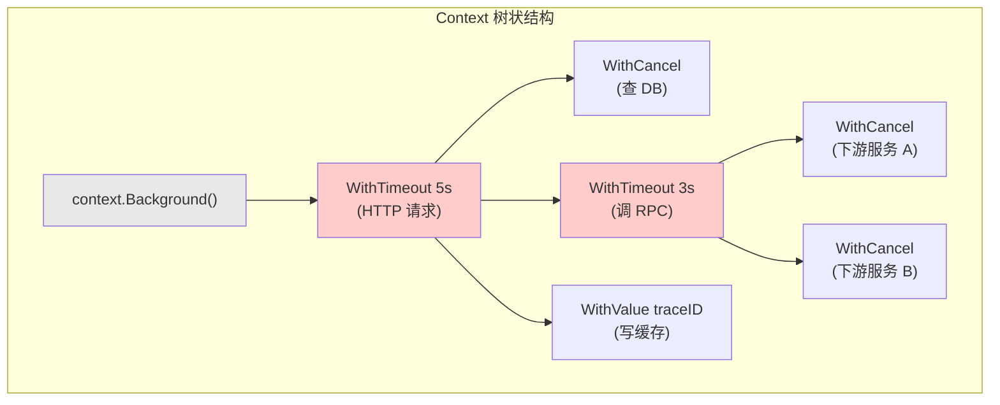
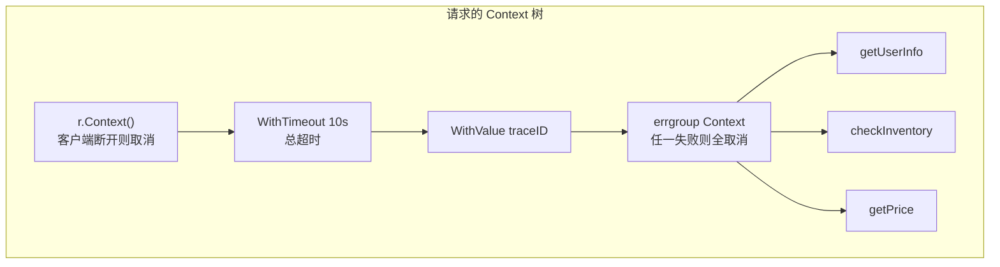
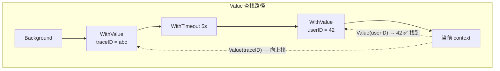

*这是「Go 并发原理实战」系列的第三篇。[第一篇：GMP 调度模型](/collections/go-concurrency/go-goroutine-gmp/) | [第二篇：Channel 底层原理](/collections/go-concurrency/go-channel/)*

---

## 一个线上事故

你的团队维护一个 Kubernetes admission webhook，用于在 Pod 创建时做合规审查。上一篇我们修复了 channel 泄漏的问题，加了缓冲区，也加了 `context.WithTimeout` 做超时控制。代码大概长这样：

```go
func (w *Webhook) validate(ctx context.Context, pod *corev1.Pod) (bool, error) {
    // 给每个检查 5 秒超时
    tCtx, cancel := context.WithTimeout(ctx, 5*time.Second)
    // 注意：这里没有 defer cancel()

    ch := make(chan checkResult, 3)

    go func() { ch <- w.checkImage(tCtx, pod) }()
    go func() { ch <- w.checkResources(tCtx, pod) }()
    go func() { ch <- w.checkSecurity(tCtx, pod) }()

    for i := 0; i < 3; i++ {
        select {
        case result := <-ch:
            if !result.allowed {
                return false, result.reason
            }
        case <-tCtx.Done():
            return false, fmt.Errorf("validation timeout: %w", tCtx.Err())
        }
    }
    return true, nil
}
```

上线后一切正常，没有 goroutine 泄漏了。但运维同学发现一个新问题：**webhook 进程的内存在缓慢但持续地增长**，大约每小时涨 10MB。不像上次那样暴涨，而是温水煮青蛙，几天后最终 OOMKilled。

### pprof 看到了什么？

```bash
kubectl port-forward deploy/webhook 6060:6060
go tool pprof http://localhost:6060/debug/pprof/heap
```

内存 profile 显示大量分配来自 `time.NewTimer`。再看 goroutine profile：

```
goroutine profile: total 287

goroutine 1 [running]:
...

(没有大量阻塞的 goroutine，看起来很正常)
```

goroutine 数量正常，但内存在涨。问题出在哪？

**出在 `context.WithTimeout` 创建的 timer 上。**

---

## 被遗忘的 cancel()

`context.WithTimeout(parent, 5*time.Second)` 内部会创建一个 `time.Timer`，5 秒后自动触发取消。这个 timer 被注册到 Go runtime 的定时器堆中。

正常流程：调用 `cancel()` 时，timer 会被停止并从定时器堆中移除。

但上面的代码**没有调用 `cancel()`**。如果三个检查都在 5 秒内完成（正常情况），函数直接 return 了，timer 还活着。它会在定时器堆里待满 5 秒才被触发，触发后才被清理。

问题是：**每次请求都创建一个 timer，每个 timer 都要等 5 秒才清理**。高峰期每秒几百个请求，同一时刻有上千个不需要的 timer 挂在定时器堆上。这些 timer 引用着整条 context 链——子 context、父 context、关联的 goroutine 信息——都无法被 GC 回收。

### 修复：一行 defer

```go
func (w *Webhook) validate(ctx context.Context, pod *corev1.Pod) (bool, error) {
    tCtx, cancel := context.WithTimeout(ctx, 5*time.Second)
    defer cancel()  // ← 就这一行

    // ... 后续代码不变
}
```

`defer cancel()` 保证无论函数怎么退出（正常 return、提前 return、panic），cancel 都会被调用。cancel 会立即停止 timer 并从定时器堆中移除，context 链上的资源可以被 GC 回收。

**经验法则：`WithCancel`、`WithTimeout`、`WithDeadline` 返回的 cancel 函数，永远用 `defer cancel()` 调用。没有例外。**

---

## 先搞清楚：为什么需要 Context？

上一篇我们用 channel 解决了 goroutine 之间的通信和同步问题。但还有一类问题 channel 解决不了——**跨 goroutine 的生命周期管理**。

一个 HTTP 请求进来，你的处理函数可能 spawn 多个 goroutine：查数据库、调 RPC、写缓存。如果客户端断开连接了，这些 goroutine 都应该立即停止，否则就是资源浪费。

你可以给每个 goroutine 传一个 `quit chan struct{}`，但问题很快变复杂：

- 查数据库的 goroutine 又 spawn 了子 goroutine 做连接池管理
- 调 RPC 的 goroutine 又调了下游服务，下游服务又调了更下游
- 你需要把 quit channel 一路传下去，每一层都要 select 监听
- 如果要加超时控制，你还需要额外的 timer
- 如果还要传请求级别的元数据（比如 trace ID），又要加参数

**Context 就是这个问题的统一解决方案：取消信号 + 超时控制 + 请求级元数据，一个接口搞定。**

---

## Context 的核心接口

```go
type Context interface {
    Deadline() (deadline time.Time, ok bool)  // 截止时间（如果有的话）
    Done() <-chan struct{}                     // 取消信号的 channel
    Err() error                               // 取消原因
    Value(key any) any                        // 附加的 KV 元数据
}
```

四个方法，分别对应四个能力：

| 方法 | 能力 | 说明 |
|---|---|---|
| `Deadline()` | 超时控制 | 返回截止时间。没设过 deadline 就返回 ok=false |
| `Done()` | 取消信号 | 返回一个 channel，context 被取消时这个 channel 会被 close |
| `Err()` | 取消原因 | 取消前返回 nil，取消后返回 `context.Canceled` 或 `context.DeadlineExceeded` |
| `Value()` | 元数据传递 | 查找 key 对应的 value，找不到返回 nil |

关键设计：`Done()` 返回的是一个 **`<-chan struct{}`**——和上一篇讲的 channel 知识完全衔接。取消信号的本质就是 close 这个 channel，利用了"close 会唤醒所有等待者"的广播特性。

---

## 四种派生函数

Context 是一棵树。树的根节点是 `context.Background()`，每个派生函数创建一个子节点。

### context.Background() — 根节点

```go
ctx := context.Background()
```

永不取消，没有 deadline，没有 value。通常在 `main` 函数、init 函数或测试中使用，作为整棵 context 树的根。

### context.WithCancel — 手动取消

```go
ctx, cancel := context.WithCancel(parentCtx)
defer cancel()
```

创建一个子 context，调用 `cancel()` 时子 context 被取消，`Done()` 返回的 channel 被 close。

典型场景：你启动了一个后台 goroutine 做周期性任务，想在某个条件满足时停止它。

```go
ctx, cancel := context.WithCancel(context.Background())

go func() {
    ticker := time.NewTicker(1 * time.Second)
    defer ticker.Stop()
    for {
        select {
        case <-ctx.Done():
            fmt.Println("stopped:", ctx.Err())
            return
        case <-ticker.C:
            doWork()
        }
    }
}()

// 某个条件满足后
cancel()  // 后台 goroutine 会收到信号并退出
```

### context.WithTimeout — 超过指定时长自动取消

```go
ctx, cancel := context.WithTimeout(parentCtx, 5*time.Second)
defer cancel()
```

等价于 `WithDeadline(parentCtx, time.Now().Add(5*time.Second))`。5 秒后自动取消，也可以提前调 cancel 手动取消。

这就是事故中用到的函数。内部创建一个 timer，到时间后自动触发取消。

### context.WithDeadline — 到达绝对时间自动取消

```go
deadline := time.Date(2026, 4, 18, 23, 59, 59, 0, time.Local)
ctx, cancel := context.WithDeadline(parentCtx, deadline)
defer cancel()
```

和 WithTimeout 的区别：WithTimeout 是相对时间（"5 秒后"），WithDeadline 是绝对时间（"今天 23:59:59"）。底层实现完全一样，WithTimeout 只是帮你算了一下 `time.Now().Add(dur)`。

**面试追问：WithTimeout 和 WithDeadline 什么区别？** 答案就是一个相对一个绝对，底层一样。选哪个取决于你的场景——大多数情况用 WithTimeout 更直观。

### context.WithValue — 附加 KV 元数据

```go
ctx := context.WithValue(parentCtx, traceIDKey, "abc-123")

// 下游函数取值
traceID := ctx.Value(traceIDKey).(string)
```

给 context 附加一个键值对。注意：这不是用来传业务数据的，后面会展开说。

---

## 传播机制：树状结构

Context 的核心设计是**树状传播**——父取消，所有子孙自动取消。



### 规则一：父取消 → 所有子孙自动取消

当节点 A（HTTP 请求的 5s 超时）到期取消时，B、C、D、E、F **全部自动取消**。不需要你手动通知每一个子节点。

这是通过内部的 `children` map 实现的。每创建一个子 context，就会把自己注册到父 context 的 children 中。父 context 取消时，遍历 children，逐个取消。

### 规则二：子取消 → 不影响父和兄弟

如果节点 C（RPC 的 3s 超时）到期取消，只有 E 和 F 会被取消。A、B、D 不受影响。

### 规则三：子的 deadline 不能晚于父的 deadline

```go
parentCtx, _ := context.WithTimeout(context.Background(), 5*time.Second)
childCtx, _ := context.WithTimeout(parentCtx, 10*time.Second)  // 想要 10 秒
```

你想给子 context 10 秒，但父 context 5 秒后就取消了。父取消时子也会被取消——所以 **子 context 实际最多活 5 秒**。Go 的实现会检测到这种情况，直接用父的 deadline。

这其实是一个安全机制：防止子任务比父任务活得更久。

---

## 一个完整的 K8s 场景

让我们用一个更复杂的场景把这些知识串起来。假设你的微服务收到一个请求，需要调三个下游服务：

```go
func (s *Server) HandleRequest(w http.ResponseWriter, r *http.Request) {
    // r.Context() 是 HTTP server 提供的 context
    // 客户端断开连接时，这个 context 会被取消
    ctx := r.Context()

    // 给整个请求设一个 10 秒的总超时
    ctx, cancel := context.WithTimeout(ctx, 10*time.Second)
    defer cancel()

    // 附加 trace ID
    ctx = context.WithValue(ctx, traceIDKey, generateTraceID())

    // 并发调三个下游
    g, gCtx := errgroup.WithContext(ctx)

    var userInfo *UserInfo
    g.Go(func() error {
        var err error
        userInfo, err = s.getUserInfo(gCtx, r)  // 内部可能再派生子 context
        return err
    })

    var inventory *Inventory
    g.Go(func() error {
        var err error
        inventory, err = s.checkInventory(gCtx, r)
        return err
    })

    var price *Price
    g.Go(func() error {
        var err error
        price, err = s.getPrice(gCtx, r)
        return err
    })

    if err := g.Wait(); err != nil {
        // 任何一个失败或超时，errgroup 会取消 gCtx
        // 其他两个通过 gCtx.Done() 收到取消信号，停止工作
        http.Error(w, err.Error(), http.StatusInternalServerError)
        return
    }

    // 三个都成功，组装响应
    resp := buildResponse(userInfo, inventory, price)
    json.NewEncoder(w).Encode(resp)
}
```

这段代码的 context 树长这样：



**级联取消**的威力在这里体现得淋漓尽致：

| 触发条件 | 取消路径 |
|---|---|
| 客户端断开连接 | r.Context() 取消 → 整棵树全部取消 |
| 10 秒总超时 | WithTimeout 取消 → errgroup 和三个下游全部取消 |
| getUserInfo 返回 error | errgroup 取消 gCtx → checkInventory 和 getPrice 收到取消信号 |

如果没有 context，你需要手动管理每一条取消路径，代码量和出错概率都会成倍增加。

---

## context.Value：用对了是利器，用错了是灾难

### 查找机制

`context.Value(key)` 的查找方式是**从当前节点沿着父链向上逐个查找**，直到找到或到根节点返回 nil。



**面试追问：context.Value 的查找复杂度是多少？** 答案是 **O(n)**，n 是 context 链的深度。每次 Value 调用都要从当前节点往上遍历。所以不要用 WithValue 存大量数据——它不是 map，没有 O(1) 的查找。

### 什么该放 Value，什么不该

**适合放的**（请求级别的元数据，跨 API 边界传递）：
- Trace ID / Request ID
- 认证信息（token、user identity）
- 请求来源标记

**不适合放的**（业务数据、控制流）：
- 数据库连接、配置对象 → 用函数参数或依赖注入
- 错误信息 → 用 error 返回值
- 控制 flag → 用函数参数

```go
// ❌ 错误用法：用 Value 传业务数据
ctx = context.WithValue(ctx, "orderID", orderID)
ctx = context.WithValue(ctx, "amount", amount)
ctx = context.WithValue(ctx, "currency", currency)
// 下游函数里到处 ctx.Value("orderID").(string)
// 编译器无法检查类型，重构时找不到引用

// ✅ 正确用法：业务数据走函数参数
func processOrder(ctx context.Context, orderID string, amount float64, currency string) error
```

### 用自定义类型做 key

```go
// ❌ 用字符串做 key，可能和其他包冲突
ctx = context.WithValue(ctx, "traceID", "abc")

// ✅ 用未导出的自定义类型做 key，包级别隔离
type contextKey struct{}
var traceIDKey = contextKey{}
ctx = context.WithValue(ctx, traceIDKey, "abc")
```

**为什么字符串做 key 会出问题？**

`context.WithValue` 底层用 `==` 比较 key，比较的是 **（类型, 值）** 这个组合。字符串的类型都是 `string`，所以只要值相同就会匹配。

假设有两个完全无关的包，各自往 context 里存了 `"traceID"`：

```go
// 包 A：logging 包
ctx = context.WithValue(ctx, "traceID", "abc-from-logging")

// 包 B：monitoring 包，后执行，也用了同样的 key
ctx = context.WithValue(ctx, "traceID", "xyz-from-monitoring")
```

`context.WithValue` 不会"覆盖"旧值，而是在链表头部再包一层。但 `context.Value` 查找时从最新的节点往回找，**找到第一个匹配就返回**。所以：

```go
ctx.Value("traceID") // → "xyz-from-monitoring"
// 包 A 存进去的 "abc-from-logging" 被"遮蔽"了，永远拿不到
```

包 A 以为自己能读到 `"abc-from-logging"`，实际拿到的却是包 B 写的值——这就是**跨包 key 冲突**。

**自定义类型如何解决？**

Go 的 `==` 比较会同时检查 **类型** 和 **值**。即使两个包都定义了空 struct，它们是不同的类型：

```go
// 包 A：logging/context.go
type contextKey struct{}                  // 完整类型名：logging.contextKey
var traceIDKey = contextKey{}

// 包 B：monitoring/context.go
type contextKey struct{}                  // 完整类型名：monitoring.contextKey
var traceIDKey = contextKey{}
```

虽然两个 key 看起来一模一样，但 `logging.contextKey` 和 `monitoring.contextKey` 是两个不同的类型，`==` 比较结果为 false，互不干扰。再加上 `type contextKey struct{}` 首字母小写未导出，包外根本无法引用这个类型，彻底实现了**包级别的 key 隔离**。

**怎么取值？——提供导出的访问函数**

空 struct 做 key，外部确实拿不到这个 key，所以标准做法是：**每个包提供一对导出的存取函数**。

```go
package logging

// 未导出的 key 类型，外部不可见
type contextKey struct{}
var traceIDKey = contextKey{}

// 导出的存取函数 —— 这是外部唯一的访问方式
func WithTraceID(ctx context.Context, id string) context.Context {
    return context.WithValue(ctx, traceIDKey, id)
}

func TraceIDFrom(ctx context.Context) (string, bool) {
    id, ok := ctx.Value(traceIDKey).(string)
    return id, ok
}
```

使用方式：

```go
// 存
ctx = logging.WithTraceID(ctx, "abc")

// 取
if id, ok := logging.TraceIDFrom(ctx); ok {
    fmt.Println(id) // "abc"
}
```

这样 key 被封装在包内部，外部只通过函数访问，既安全又清晰。这也是 Go 标准库和社区的通用模式。

---

## 最佳实践与常见陷阱

### ✅ context 作为函数第一个参数

```go
// ✅ Go 社区约定：ctx 是第一个参数
func DoSomething(ctx context.Context, arg1 string, arg2 int) error

// ❌ 不要放在中间或最后
func DoSomething(arg1 string, ctx context.Context, arg2 int) error
```

这是 Go 官方的 code review 建议。整个标准库和生态都遵循这个约定。

### ✅ 用 select 监听 ctx.Done()

```go
func worker(ctx context.Context) {
    for {
        select {
        case <-ctx.Done():
            // 清理资源，退出
            return
        default:
            // 做一轮工作
            doWork()
        }
    }
}
```

上一篇讲过 select 的底层实现——goroutine 会同时挂到 ctx.Done() 的 channel 和其他 case 的等待队列上。一旦 context 被取消，Done() 的 channel 被 close，select 立即走取消分支。

### ❌ 不要把 context 存在 struct 里

```go
// ❌ context 存在 struct 里
type Service struct {
    ctx context.Context  // 危险！
}

// ✅ 每次调用传入 context
type Service struct{}
func (s *Service) Do(ctx context.Context) error
```

为什么？因为 context 的生命周期是**每个请求独立的**。存在 struct 里意味着所有请求共享一个 context——一个请求取消了，所有请求的 context 都取消了。

### ❌ 不要忘记调用 cancel()

这就是本文开头事故的根因。再强调一次：

```go
ctx, cancel := context.WithTimeout(parentCtx, 5*time.Second)
defer cancel()  // 永远不要忘记这一行
```

不调 cancel 会怎样？

1. timer 在定时器堆中待到超时才清理，浪费资源
2. 子 context 一直挂在父 context 的 children map 中，无法被 GC
3. 高并发场景下累积效应导致内存泄漏

**`go vet` 会检查这个问题**——如果 WithCancel/WithTimeout/WithDeadline 返回的 cancel 没有在任何执行路径上被调用，vet 会报警告。养成习惯：写完 WithXxx 立刻写 defer cancel()。

---

## 和前两篇的联系

Context 的取消机制建立在前两篇的基础之上：

| 概念 | 底层依赖 | 出自 |
|---|---|---|
| `ctx.Done()` 返回 channel | Channel 的 close 广播机制 | [Channel 篇](/collections/go-concurrency/go-channel/) |
| cancel 后 goroutine 退出 | goroutine 从 `_Gwaiting` 变回 `_Grunnable` | [GMP 篇](/collections/go-concurrency/go-goroutine-gmp/) |
| timer 泄漏影响 GC | GC 需要扫描定时器堆引用的所有对象 | [GMP 篇](/collections/go-concurrency/go-goroutine-gmp/) |
| select 监听 ctx.Done() | select 多路复用底层 `selectgo` | [Channel 篇](/collections/go-concurrency/go-channel/) |

三篇连起来看：**GMP 管调度，Channel 管通信，Context 管生命周期**。它们共同构成了 Go 并发编程的三大支柱。

---

## 面试常问

> **Q1：WithTimeout 和 WithDeadline 什么区别？**
> 功能完全一样，WithTimeout 是相对时间（"5 秒后"），WithDeadline 是绝对时间（"某个具体时刻"）。`WithTimeout(parent, d)` 内部就是调 `WithDeadline(parent, time.Now().Add(d))`。

> **Q2：context.Value 的查找复杂度是多少？**
> O(n)，n 是 context 链的深度。从当前节点沿父链向上逐个比较 key。所以不要滥用 WithValue，层数越多查找越慢。

> **Q3：cancel 忘记调用会怎样？**
> 内存泄漏。WithTimeout/WithDeadline 创建的 timer 不会被及时释放，子 context 引用一直挂在父 context 的 children map 中。高并发时累积效应明显。`go vet` 可以检测这个问题。

> **Q4：如何实现一个请求级别的超时控制？**
> 用 `context.WithTimeout` 创建带超时的 context，传给所有下游调用。下游函数用 `select` 监听 `ctx.Done()` 或将 ctx 传给支持 context 的标准库函数（如 `http.NewRequestWithContext`、`db.QueryContext`）。超时后整条调用链自动取消。

> **Q5：父 context 设了 5s 超时，子 context 设了 10s 超时，实际超时是多久？**
> 5 秒。父 context 5 秒后取消，子 context 跟着取消。子的 deadline 不能晚于父的 deadline——这是 context 树状传播的核心规则。

---

## 总结

| 概念 | 一句话 |
|---|---|
| Context 本质 | 取消信号 + 超时控制 + 请求级元数据的树状传播机制 |
| WithCancel | 手动取消，返回 cancel 函数 |
| WithTimeout | 相对时间超时，内部创建 timer |
| WithDeadline | 绝对时间超时，和 WithTimeout 底层一样 |
| WithValue | 附加 KV 元数据，O(n) 查找，别滥用 |
| 树状传播 | 父取消 → 子孙全取消；子取消 → 不影响父和兄弟 |
| Done() | 返回 channel，取消时 close（广播） |
| 最常见的坑 | 忘记调 cancel() → timer 泄漏 → 内存缓慢增长 |

---

*这是「Go 并发原理实战」系列的第三篇。回顾：[第一篇：GMP 调度模型](/collections/go-concurrency/go-goroutine-gmp/) | [第二篇：Channel 底层原理](/collections/go-concurrency/go-channel/)*
