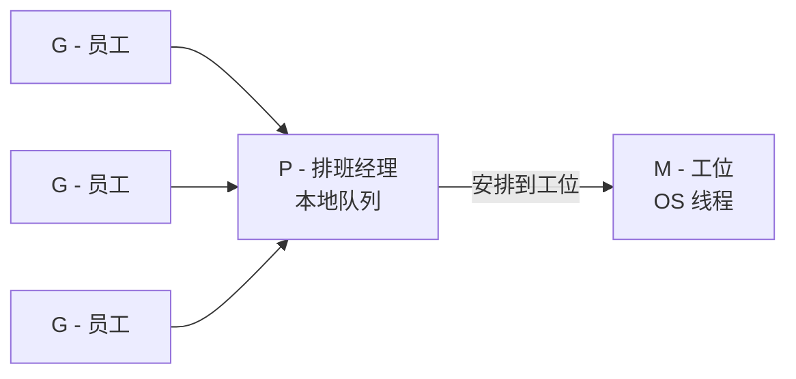
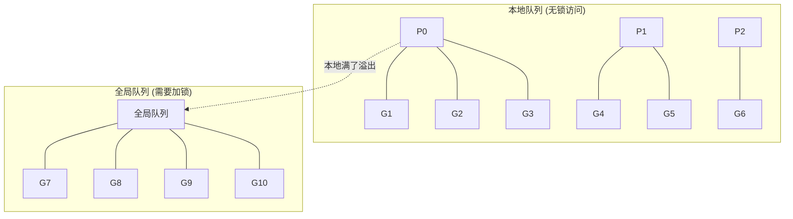

## 一个线上事故

你维护一个 Kubernetes 自定义 controller，负责 watch 集群中的 CRD 资源并做 reconcile。

某天凌晨，你被告警叫醒：

- controller Pod 内存从 200MB 涨到 2GB
- P99 延迟从 50ms 飙到 5s
- 最终 OOMKilled，Pod 反复重启

你 `kubectl logs` 一看，没有明显错误。CPU 使用率也不高。但内存一直在涨，请求越来越慢。

**到底发生了什么？** 要回答这个问题，我们需要理解 Go 程序运行时内部到底在干什么。这就要从 GMP 调度模型说起。

---

## 先搞清楚一个问题：为什么需要 GMP？

你写 Go 代码时会这样启动一个并发任务：

```go
go func() {
    // 做一些事
}()
```

一行 `go` 创建了一个 goroutine。你可以创建几万、几十万个。

**但操作系统不认识 goroutine。** 操作系统只认识**线程**（thread）。而线程很重——每个默认占 1-8MB 内存，创建和切换都需要内核参与。你不可能创建几十万个线程。

所以问题就是：**几十万个 goroutine，怎么在有限的几个线程上跑起来？**

答案就是 Go runtime 内置的调度器——GMP 模型。它不是一个库，不是一个框架，是 **Go 语言运行时的核心组件**，每个 Go 程序启动时就在运行。

### 用大楼比喻理解"内核参与"

把操作系统想象成一栋大楼：**内核态**是大楼的中控室，只有管理员（内核）能进；**用户态**是普通办公室，应用程序在这里办公。

**线程的创建**，就像在大楼里新开一个工位：你得打电话给中控室（内核），管理员要登记工位信息、分配办公桌椅和门禁卡（分配内核栈、创建 `task_struct`、设置寄存器上下文）。这套流程走下来，开销不小。

**线程的切换**，本质是决定谁能坐到工位上干活。工位（CPU 核心）就那么几个，但有几百个人排着队要用。中控室管理员定了规矩——每人坐 10 分钟就得换人（时间片用完），或者你去等快递了（I/O 阻塞）就先让别人坐。每次换人，管理员要记下你做到哪一页了（保存寄存器），再把下一个人的进度翻出来（恢复寄存器）。这个"记进度、换人、翻进度"的过程就是上下文切换，每次都要经过中控室（内核态），开销显著。

而 goroutine 的切换，相当于同一间办公室里几个同事自己商量换谁来用电脑，根本不用打电话给管理员——完全在用户态完成，快得多。

### 用排班制度理解 GMP

继续这个大楼比喻，GMP 三个角色可以这样对应：

- **M（线程）** = 办公室里的一张**工位**（真正能干活的物理资源）
- **G（Goroutine）** = **员工**（要完成的任务/人）
- **P（Processor）** = **排班经理**，手里有一个排班表（本地队列），负责安排哪个员工去哪个工位干活

以前（线程模型）是一人一个工位，100 个人就要 100 个工位，太浪费。现在排班经理说："工位就这么几个，你们排队，谁的活到了谁上去干，干完或者等东西（比如等 IO）就先下来让别人上。"而且换人过程排班经理自己就能搞定（用户态调度），不用打电话给中控室（内核）。

---

## GMP 三个角色

### G — Goroutine

每次你写 `go func()`，就创建了一个 G。它包含：

- 一个函数的代码和参数
- 自己的栈（初始只有 **2KB**，对比线程的 1-8MB）
- 当前执行到哪一行（程序计数器）
- 状态标记（正在运行？等待中？可以运行？）

G 就是一份"待处理的任务"。

### M — Machine（OS 线程）

M 对应一个操作系统线程，是**真正能执行代码的东西**。

M 的数量是**动态的**，Go runtime 按需创建，有空闲的就复用，上限默认 10000。

### P — Processor（逻辑处理器）

P 是 Go runtime **自己发明的抽象层**，其他语言没有这个概念。

P 不是 CPU，不是线程，它是一个数据结构，持有：

- 一个**本地 goroutine 队列**（最多 256 个 G）
- 执行 goroutine 所需的运行环境

P 的数量 = `GOMAXPROCS`，默认等于 CPU 核数。你可以手动修改：

```go
runtime.GOMAXPROCS(4)  // 不管机器几个核，P 就是 4 个
```

### 核心规则

**M 必须绑定一个 P 才能执行 G。**

用前面的大楼比喻来说：员工（G）排在排班经理（P）的排班表上，排班经理把员工安排到工位（M）上干活。工位必须有排班经理管着才能运转。如果一个工位上的员工去等快递被卡住了（系统调用阻塞），排班经理可以换一个工位继续安排其他员工。



### 两级队列



为什么分两级？**本地队列不用加锁**。P 从自己的队列取 G 是最快的操作。全局队列是溢出区——本地队列满了（256 个），新 G 就放到全局队列。

---

## 调度机制

### 调度循环

M 绑定 P 后，不断循环：


### Work Stealing（工作窃取）

当一个 P 的本地队列空了：

1. 先查**全局队列**（需加锁，取一批 G）
2. 再去**偷别的 P 的任务**（随机选一个 P，偷走它本地队列的一半）
3. 检查网络轮询器（netpoller）有没有就绪的 G
4. 都没有 → M 休眠

为什么偷一半？偷太少还得再偷，偷太多别人又没活干。一半是实践验证的最优策略。

### sysmon 监控线程

sysmon 是一个特殊的 M，**不需要绑定 P，独立运行**，是整个调度器的"看门狗"：

- 运行超过 **10ms** 的 G → 标记为需要抢占
- M 在系统调用中阻塞太久 → **把 P 抢走**给其他 M
- 定期检查网络轮询器 → 唤醒等待 I/O 的 G
- 需要时触发 GC

### 抢占式调度

**Go 1.14 之前（协作式）**：G 只在函数调用时检查是否需要让出。一个 `for {}` 死循环会卡死整个 P。

**Go 1.14 之后（基于信号的异步抢占）**：

1. sysmon 发现某个 G 运行超过 10ms
2. 向该 G 所在的 M 发送 `SIGURG` 信号
3. 信号处理函数注入抢占点
4. G 保存现场，让出 P

这解决了死循环卡死的问题。

> 冷知识：为什么是 `SIGURG`？SIGURG（Signal Urgent）本来是 Unix 中用于 TCP 带外数据的信号，实际中几乎没有程序使用。Go 团队选它正是因为**没人用**——不会和用户程序自己注册的信号处理冲突。如果用 `SIGUSR1` 之类常见信号，很可能和业务代码打架。

### Goroutine 栈管理

这是 goroutine 能创建几百万个的核心原因：

- **初始栈 2KB**（OS 线程 1-8MB）
- 函数调用时检查栈空间，不够就分配 2 倍大小的新栈，把旧内容拷贝过去（**连续栈**）
- GC 时检查，如果栈使用不到 1/4，就缩小

100 万个 goroutine × 2KB = 2GB。100 万个线程 × 1MB = 1TB。**数量级差了 500 倍。**

---

## 回到那个事故

现在我们有足够的知识来调查了。

### 第一步：抓 pprof 数据

Controller 暴露了 pprof 端口（`import _ "net/http/pprof"`），在 OOM 之前抓数据：

```bash
# 端口转发
kubectl port-forward deploy/my-controller 6060:6060

# 抓 goroutine 数据
curl http://localhost:6060/debug/pprof/goroutine?debug=2 > goroutine.txt

# 抓内存数据
go tool pprof http://localhost:6060/debug/pprof/heap
```

### 第二步：读懂 goroutine dump

打开 goroutine.txt：

```
goroutine profile: total 183742
```

**18 万个 goroutine。** 一个正常的 K8s controller 通常几十到几百个（informer、worker、runtime 后台线程加起来）。18 万是几百倍的异常。

继续看具体内容：

```
goroutine 58923 [chan receive, 47 minutes]:
main.(*Reconciler).reconcile(...)
    /app/controller.go:89

goroutine 58924 [chan receive, 47 minutes]:
main.(*Reconciler).reconcile(...)
    /app/controller.go:89

... (重复几万个)
```

### 第三步：用 GMP 知识解读 pprof

pprof 的 goroutine dump 格式是固定的：

`goroutine <ID> [<状态>, <等待时长>]: <调用栈>`

方括号里的状态是 **Go runtime 自动标记的**，对应 G 在 GMP 中的状态：

| pprof 状态 | GMP 含义 |
|---|---|
| `running` | G 绑定在 P 上执行 |
| `runnable` | G 在队列中排队 |
| `chan receive` | G 在等 `<-ch`，挂在 channel 的 recvq 上 |
| `chan send` | G 在等 `ch <-`，挂在 channel 的 sendq 上 |
| `syscall` | M 在做系统调用，P 可能已被抢走 |
| `semacquire` | G 在等 Mutex / WaitGroup |
| `IO wait` | G 在等网络 I/O |
| `select` | G 阻塞在 select 语句 |

所以 `[chan receive, 47 minutes]` 的含义是：

- **chan receive** → 这个 goroutine 执行到一个 `<-ch` 操作，channel 里没数据，阻塞了
- **47 minutes** → 已经等了 47 分钟，没人往这个 channel 发数据

结合 GMP 知识：

| 观察 | GMP 层面 |
|---|---|
| 18 万个 goroutine | 18 万个 G 对象，每个至少 2KB 栈 → 光栈就 400MB+ |
| 状态 `chan receive` | G 处于 `_Gwaiting`，从 P 的队列移出，不占 CPU |
| 47 分钟没被唤醒 | 没人往 channel 发数据，这些 G **永远不会醒** |
| CPU 不高但延迟飙升 | G 虽然不占 P，但 **GC 需要扫描所有 G 的栈**。G 越多 GC 越慢，STW 时间增加 |

### 第四步：定位代码

调用栈指向 controller.go:89，打开看：

```go
func (r *Reconciler) reconcile(ctx context.Context, obj *MyResource) error {
    ch := make(chan result)  // 无缓冲 channel

    go func() {
        res, err := r.client.Get(ctx, obj.Name)  // 调外部 API
        ch <- result{res, err}  // 发送结果
    }()

    select {
    case res := <-ch:        // 正常：收到结果
        return r.process(res)
    case <-ctx.Done():       // 超时：直接返回
        return ctx.Err()     // ← 问题在这里
    }
}
```

看到了吗？当 `ctx` 超时时，`select` 走了 `ctx.Done()` 分支直接返回。但 go func 里的那个 goroutine **还活着**——它在调完外部 API 后，试图往 `ch` 发送数据。

问题是 `ch` 是**无缓冲 channel**，发送必须有人接收。但 reconcile 函数已经返回了，没人再读 `ch`。于是这个 goroutine **永远卡在 `ch <- result{res, err}` 这一行**。

每次超时就泄漏一个 goroutine。集群中有大量资源频繁 reconcile，几万个 goroutine 就这样堆积起来。

### 第五步：修复

```go
func (r *Reconciler) reconcile(ctx context.Context, obj *MyResource) error {
    ch := make(chan result, 1)  // ← 改成缓冲为 1 的 channel

    go func() {
        res, err := r.client.Get(ctx, obj.Name)
        select {
        case ch <- result{res, err}:  // 尝试发送
        default:                       // ← 没人收就丢弃，goroutine 正常退出
        }
    }()

    select {
    case res := <-ch:
        return r.process(res)
    case <-ctx.Done():
        return ctx.Err()
    }
}
```

两个改动：

1. `make(chan result, 1)` — 缓冲为 1，即使没人接收，发送也不会阻塞
2. `select + default` — 双保险，如果 channel 满了也不会卡住

---

## 总结：GMP 知识的实战价值

GMP 不是面试八股文，它是你排查 Go 并发问题时的"X 光片"。

| 线上问题 | 你需要的 GMP 知识 |
|---|---|
| goroutine 泄漏导致 OOM | G 的状态机：`_Gwaiting` 的 G 不占 CPU 但占内存，channel 持有 G 引用导致 GC 无法回收 |
| GOMAXPROCS 设错导致性能差 | P 的数量决定并行度，容器中要手动设置避免读到宿主机核数 |
| 大量系统调用拖慢服务 | M 阻塞时 P 被抢走给新 M，但 M 数量会膨胀，要限制并发数 |
| 死循环卡死程序 | Go 1.14 前协作式抢占的局限性，sysmon + SIGURG 信号抢占 |
| GC 停顿导致延迟毛刺 | G 越多 GC 扫描越慢，减少 goroutine 数量 = 减少 GC 压力 |

**不懂 GMP 的人看到 pprof 输出只能看到数字，懂 GMP 的人看到的是每个 goroutine 在调度器里的生死状态。**

---

*这是「Go 并发原理实战」系列的第一篇。下一篇我们从一个 channel 死锁的案例出发，聊 channel 的底层原理。*

---

## 补充阅读

### GMP 中的"魔法数字"：工程经验值而非数学最优解

你可能会好奇：为什么本地队列是 256？为什么偷一半？为什么抢占阈值是 10ms？初始栈为什么是 2KB？

这些数字都是**工程经验值，而非数学最优解**。Work stealing 中"偷一半"的策略最早来自 MIT 的 Cilk 项目，直觉上是个平衡点，但并没有严格的数学证明说它在所有场景下最优。256、10ms、2KB 也都是 Go 团队在大量真实 workload 上跑 benchmark 调出来的。

这在系统软件中很常见——Linux 内核的时间片长度、调度权重等参数也是类似的经验调参。真实 workload 太复杂多变，数学建模很难覆盖所有场景，最终靠 **"benchmark + 实践反馈"** 收敛到一个"够好"的值。

### 为什么 Linux 线程栈不能像 goroutine 那样小？

goroutine 初始栈只有 2KB，而 Linux 线程栈默认 1-8MB。既然 Go 能做到这么小，为什么 Linux 不学？

核心原因是**线程栈必须在内核态也能用，而 goroutine 栈只在用户态用**。

**1. 内核栈不能动态扩展。** 当线程陷入内核态（syscall、中断），内核要用这个线程的内核栈。内核代码路径不允许"栈不够了暂停一下去扩容"——中断处理、锁持有期间如果栈溢出就是内核 panic。所以必须一次性分配够。

**2. 用户态栈扩容需要语言层面配合。** goroutine 能动态扩栈，是因为 Go 编译器在每个函数入口插入了栈检查代码，不够就拷贝到更大的新栈。但 C/C++ 编译出的代码没有这个机制，Linux 也不可能要求所有用户态程序都配合。而且拷贝栈意味着所有栈上指针都要修正——Go 有 GC 知道哪些是指针，C 语言做不到。

**3. 2KB 对 C 程序真的不够。** C 程序的栈上经常有大数组、大结构体，一个 `char buf[4096]` 就超了。Go 的栈小是因为大对象分配在堆上，语言层面配合了这个设计。

用大楼比喻来说：**线程栈就像工位自带的固定储物柜**，中控室管理员（内核）也要往里放东西，所以必须一开始就造够大，不能用的时候再扩建。**goroutine 栈是员工自带的可伸缩文件夹**，反正只有自己用，不够了换个大的就行，排班经理（Go runtime）还帮你搬文件。
