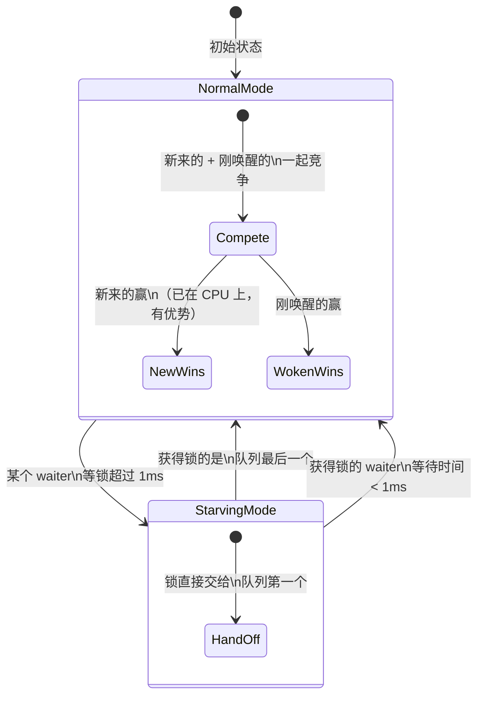
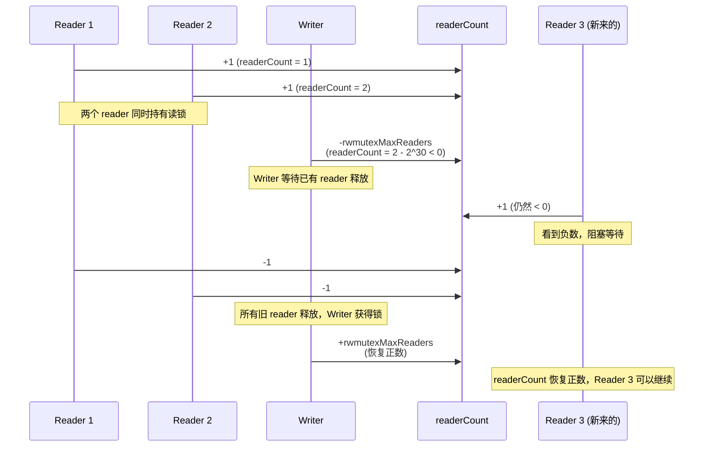
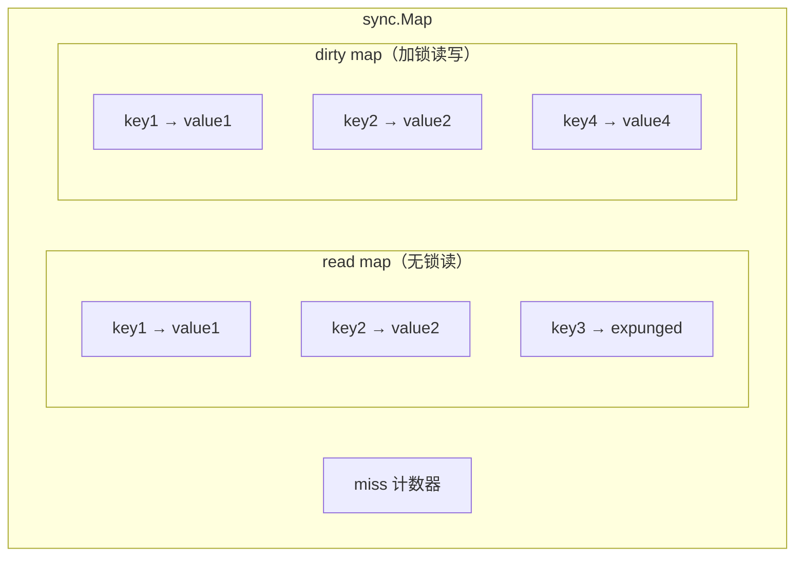

*这是「Go 并发原理实战」系列的第四篇。*
- *[第一篇：从一次 K8s Controller OOM 聊起——彻底搞懂 Go GMP 调度模型](/collections/go-concurrency/go-goroutine-gmp/)*
- *[第二篇：从一次 K8s Webhook 超时聊起——彻底搞懂 Go Channel 底层原理](/collections/go-concurrency/go-channel/)*
- *[第三篇：从一次 K8s 级联超时聊起：彻底搞懂 Go Context 的传播机制](/collections/go-concurrency/go-context/)*

---

## 一个线上事故

你的团队维护一个 Kubernetes operator，负责管理集群中的自定义网络策略。operator 内部维护了一个**策略缓存**——一个普通的 `map[string]*NetworkPolicy`，用来加速 reconcile 时的策略查找，避免每次都打 API server。

架构看起来很合理：informer 监听到策略变更时更新缓存，reconciler 并发处理多个资源时从缓存读取。平时运行得好好的。

某天集群规模扩大，节点数从 50 涨到 200，网络策略从几十条涨到上千条。运维团队开始收到告警：

```
fatal error: concurrent map read and map write

goroutine 847 [running]:
runtime.throw({0x1a2b3c, 0x23})
    /usr/local/go/src/runtime/panic.go:1077
...
main.(*Reconciler).reconcile(0xc0001a2000, {0x1f3a40, 0xc000234000}, ...)
    /app/controller.go:156
```

**进程直接崩溃，不是 panic，是 fatal error——无法 recover。** Pod 反复重启，每次跑几分钟就 crash。

### 问题出在哪？

看代码：

```go
type Reconciler struct {
    cache map[string]*NetworkPolicy  // 策略缓存
}

// informer 的 event handler，收到变更就更新缓存
func (r *Reconciler) onPolicyUpdate(obj interface{}) {
    policy := obj.(*NetworkPolicy)
    r.cache[policy.Name] = policy  // 写 map
}

// reconcile 逻辑，多个 worker 并发调用
func (r *Reconciler) reconcile(ctx context.Context, name string) error {
    policy, ok := r.cache[name]  // 读 map
    if !ok {
        return fmt.Errorf("policy %s not found", name)
    }
    return r.applyPolicy(ctx, policy)
}
```

问题一目了然：**informer 的回调在写 map，reconciler 的多个 worker 在并发读 map**。Go 的 map 不是线程安全的——并发读写会触发 runtime 的竞态检测，直接 `fatal error`，连 `recover` 的机会都不给你。

这不是 panic，是 runtime 层面的 `throw`——它认为程序的内存状态已经不可信了，继续跑下去可能造成数据损坏，所以直接终止。

### Go 的数据类型，哪些是线程安全的？

map 不是线程安全的，那 Go 的其他基础类型呢？**简单来说，Go 的内置类型几乎都不是线程安全的。** 这是 Go 的设计哲学——不在语言层面为所有类型加锁（代价太大），而是把并发控制交给开发者。

| 类型 | 线程安全？ | 说明 |
|------|-----------|------|
| `int`, `float64`, `bool` 等基础类型 | ❌ | 并发读写是数据竞争（data race）。虽然在某些 CPU 架构上"看起来没问题"，但 Go 内存模型不保证原子性，race detector 会报错 |
| `string` | ❌ | string 底层是 `(ptr, len)` 两个字段，并发读写可能读到不一致的指针和长度，导致访问非法内存 |
| `slice` | ❌ | 底层是 `(ptr, len, cap)` 三个字段，并发 append 可能丢数据、panic、或读到脏数据 |
| `map` | ❌ | 并发读写直接 fatal error（runtime 主动检测并终止），不是 panic，无法 recover |
| `struct` | ❌ | 多字段的复合类型，并发读写可能读到"半新半旧"的状态 |
| `interface` | ❌ | 底层是 `(type, value)` 两个指针，并发赋值可能读到类型和值不匹配的组合 |
| `channel` | ✅ | **唯一线程安全的内置类型。** channel 内部自带锁，多个 goroutine 可以安全地并发收发 |

需要并发安全时，Go 提供了以下工具：

- **`sync.Mutex` / `sync.RWMutex`** —— 保护任意共享数据（本文重点）
- **`sync/atomic`** —— 对基础类型做原子操作，无锁，性能最高
- **`sync.Map`** —— 官方提供的并发安全 map，适用于读多写少的场景
- **`channel`** —— 通过通信共享数据，而不是通过共享数据来通信

### 为什么以前没事？

小规模时 informer 的更新频率低，reconciler 的并发度也低，读写撞上的概率极小。规模一上来，并发度增大，概率从"几乎不会"变成"几分钟一次"。

**这就是竞态 bug 的阴险之处——它不是"有就一定触发"，而是"条件够了才触发"。** `go test -race` 能在测试阶段发现，但很多团队没有在 CI 中开启 race detector。

---

## 最直接的修复：加锁

解决并发读写 map 的最直接方式就是加锁。Go 的 `sync` 包提供了一系列并发原语，其中最基础的就是 **Mutex（互斥锁）**。

```go
type Reconciler struct {
    mu    sync.Mutex
    cache map[string]*NetworkPolicy
}

func (r *Reconciler) onPolicyUpdate(obj interface{}) {
    policy := obj.(*NetworkPolicy)
    r.mu.Lock()
    r.cache[policy.Name] = policy
    r.mu.Unlock()
}

func (r *Reconciler) reconcile(ctx context.Context, name string) error {
    r.mu.Lock()
    policy, ok := r.cache[name]
    r.mu.Unlock()
    if !ok {
        return fmt.Errorf("policy %s not found", name)
    }
    return r.applyPolicy(ctx, policy)
}
```

问题解决了。但你立刻意识到一个性能问题：**reconcile 只是读 map，多个 reader 之间不冲突，为什么要互斥？** 每次读都要等锁，高并发下 reconciler 的吞吐量会大幅下降。

这引出了 sync 包的核心问题：**什么时候用什么锁？底层到底怎么实现的？** 搞清楚这些，你才能在正确性和性能之间做出合理的选择。

---

## Mutex：正常模式 vs 饥饿模式

### 底层结构

```go
type Mutex struct {
    state int32   // 状态位：locked、woken、starving + waiter 计数
    sema  uint32  // 信号量，用于阻塞/唤醒 goroutine
}
```

就两个字段。`state` 是一个 int32，通过位运算同时存储四个信息：

- **bit 0**：是否已上锁（locked）
- **bit 1**：是否有 goroutine 被唤醒（woken）
- **bit 2**：是否处于饥饿模式（starving）
- **bit 3~31**：等待锁的 goroutine 数量（waiter count）

把多个状态塞进一个 int32，是为了能用**原子操作**一次性读写，避免用额外的锁来保护锁本身的状态——否则就陷入"谁来保护保护者"的无限递归。

### 加锁流程

当你调用 `mu.Lock()` 时，Go runtime 按优先级走三步。在看代码之前，先介绍一个贯穿本文的底层操作——**CAS**。

**什么是 CAS？**

CAS 是 **Compare-And-Swap**（比较并交换）的缩写，是 CPU 提供的一条原子指令。它的逻辑是：

```
CAS(addr, old, new)：
  读取 addr 的当前值
  如果 == old → 替换成 new，返回 true（成功）
  如果 != old → 不做任何操作，返回 false（失败，说明被别人改过了）
```

**整个过程是原子的**——CPU 硬件保证这三步不会被其他核心打断。这就让多个 goroutine 可以在不加锁的情况下安全地竞争修改同一个变量：谁 CAS 成功谁就"抢到了"，失败的再重试或走其他路径。

Go 的 `sync/atomic` 包提供了 CAS 的封装，比如 `atomic.CompareAndSwapInt32`。下面马上就会看到 Mutex 是怎么用它的。

**第一步：Fast path — CAS 尝试直接获取**

```go
// 伪代码
if atomic.CompareAndSwapInt32(&m.state, 0, locked) {
    return  // 锁没人持有，一步到位
}
```

锁没人用？CAS 直接拿到，最快路径，一条原子指令的事。

**第二步：自旋（Spin）**

CAS 失败了（锁被别人持有），但不急着阻塞——先原地转几圈，赌持有者很快就会释放。自旋比阻塞便宜，因为阻塞需要把 goroutine 挂到等待队列、调用 `gopark` 让出 P、之后还要被唤醒恢复，开销大得多。

但不是所有情况都适合自旋。**自旋的条件非常严格**：

- 多核 CPU（单核自旋没有意义，持有锁的线程也跑不了）
- `GOMAXPROCS > 1`（至少有两个 P）
- 当前 P 的本地队列为空（不要因为自旋耽误其他 goroutine 运行）
- 最多自旋 4 次

**第三步：信号量阻塞**

自旋也没等到？调用 `runtime_SemacquireMutex`，goroutine 被挂到信号量的等待队列上，状态变成 `_Gwaiting`——和 channel 阻塞一样，让出 P，休眠。

### 两种模式

这是 Mutex 最精妙的设计——在**吞吐量**和**公平性**之间动态切换。



**正常模式（Normal）**

解锁时唤醒等待队列中的第一个 goroutine，但这个刚被唤醒的 goroutine 不是直接拿到锁——它要和**新来的 goroutine 竞争**。

新来的 goroutine 有天然优势：它已经在 CPU 上跑着了，而刚被唤醒的还要经过调度才能上 CPU。结果就是**新来的经常赢，等了很久的反而继续等**。

这种设计的好处是**吞吐量高**——锁大概率被正在 CPU 上的 goroutine 拿到，减少调度开销。坏处是可能**饿死**长期等待的 goroutine。

**饥饿模式（Starving）**

当一个 goroutine 等锁超过 **1ms**，Mutex 切换到饥饿模式。此时解锁不再竞争，而是**直接把锁交给等待队列的第一个**（FIFO）。新来的 goroutine 看到饥饿模式，直接排到队尾，不参与竞争。

退出饥饿模式的条件（满足任一）：
- 获得锁的 goroutine 是队列中的**最后一个**（没人等了，不需要保护公平性）
- 获得锁的 goroutine 的等待时间 **< 1ms**（饥饿问题已经缓解）

**一句话总结：正常模式拼速度，饥饿模式保公平。Runtime 根据等待时间自动切换，你不需要手动控制。**

---

## RWMutex：读多写少的优化

回到我们的 operator。加了 Mutex 之后 crash 没了，但 reconciler 的吞吐量下降了——因为多个 reader 之间也在互斥。这时候需要 **RWMutex**：

```go
type Reconciler struct {
    mu    sync.RWMutex                // 改用读写锁
    cache map[string]*NetworkPolicy
}

func (r *Reconciler) onPolicyUpdate(obj interface{}) {
    policy := obj.(*NetworkPolicy)
    r.mu.Lock()                       // 写锁：独占
    r.cache[policy.Name] = policy
    r.mu.Unlock()
}

func (r *Reconciler) reconcile(ctx context.Context, name string) error {
    r.mu.RLock()                      // 读锁：共享
    policy, ok := r.cache[name]
    r.mu.RUnlock()
    if !ok {
        return fmt.Errorf("policy %s not found", name)
    }
    return r.applyPolicy(ctx, policy)
}
```

多个 `RLock` 可以同时持有，互不阻塞。但 `Lock`（写锁）和任何 `RLock`/`Lock` 互斥。

### 底层原理

RWMutex 内部有一个 `readerCount`（int32），核心技巧在写锁的实现上：

**读锁（RLock）**：原子加 1

```go
atomic.AddInt32(&rw.readerCount, 1)
// 如果结果 < 0，说明有写锁在等待，当前 reader 阻塞
```

**写锁（Lock）**：

1. 先获取底层的 Mutex（和其他写者互斥）
2. 把 `readerCount` **减去一个极大值**（`rwmutexMaxReaders = 1 << 30`），使其变成**负数**
3. 新来的 reader 调用 `RLock` 时看到 `readerCount < 0`，知道有 writer 在等，于是阻塞
4. 等已有的 reader 全部释放后，writer 才真正获得锁



这个设计的精妙之处：**不用遍历所有 reader 就能知道有没有人在读，只靠一个原子变量和一次减法。**

### Mutex vs RWMutex 怎么选？

| 场景 | 选择 | 原因 |
|---|---|---|
| 读多写少（如缓存） | RWMutex | 多个 reader 不互斥，吞吐量高 |
| 读写均衡 | Mutex | RWMutex 内部逻辑比 Mutex 复杂，overhead 更大 |
| 写多读少 | Mutex | RWMutex 的读写分离收益小，反而增加复杂度 |
| 锁持有时间极短 | Mutex | 自旋几次就拿到了，不需要读写分离 |

我们的 operator 场景是典型的"读多写少"——informer 更新偶尔发生，reconciler 读取非常频繁。用 RWMutex 是正确的选择。

---

## WaitGroup：协调多个并发任务

修复了缓存的竞态问题后，你发现 reconciler 还有一个需求：**批量处理策略更新时，需要等所有策略都应用完毕再上报状态**。这需要 WaitGroup。

```go
func (r *Reconciler) batchApply(ctx context.Context, policies []*NetworkPolicy) error {
    var wg sync.WaitGroup
    errCh := make(chan error, len(policies))

    for _, p := range policies {
        wg.Add(1)
        go func(policy *NetworkPolicy) {
            defer wg.Done()
            if err := r.applyPolicy(ctx, policy); err != nil {
                errCh <- err
            }
        }(p)
    }

    wg.Wait()       // 等所有 goroutine 完成
    close(errCh)    // 安全关闭（所有发送方都已退出）

    // 收集错误
    var errs []error
    for err := range errCh {
        errs = append(errs, err)
    }
    return errors.Join(errs...)
}
```

### 底层原理

WaitGroup 的核心就是一个**计数器**：

- `Add(n)` → 计数器 += n
- `Done()` → 计数器 -= 1（就是 `Add(-1)`）
- `Wait()` → 计数器 > 0 时阻塞，计数器 = 0 时释放所有等待者

底层使用原子操作维护计数器，信号量实现阻塞/唤醒。

### 常见陷阱

**陷阱 1：Add 必须在 Wait 之前调用**

```go
// ❌ 错误：Add 在 goroutine 里面
go func() {
    wg.Add(1)   // 可能在 wg.Wait() 之后才执行
    defer wg.Done()
    doWork()
}()
wg.Wait()       // 可能在 Add 之前就执行了，直接返回

// ✅ 正确：Add 在启动 goroutine 之前
wg.Add(1)
go func() {
    defer wg.Done()
    doWork()
}()
wg.Wait()
```

**陷阱 2：WaitGroup 可以重用，但有条件**

WaitGroup 可以重用——上一轮 `Wait` 返回后（计数器归零），可以再次 `Add`。但**不能在 `Wait` 还没返回时调用 `Add`**，否则行为未定义。

```go
// ✅ 安全重用
wg.Wait()        // 第一轮结束，计数器 = 0
wg.Add(5)        // 第二轮开始
// ...
wg.Wait()        // 第二轮结束

// ❌ 危险：Wait 还没返回时 Add
// 如果另一个 goroutine 还在 Wait，此时 Add 可能导致 panic
```

---

## Once：只执行一次的保证

operator 中经常需要做一些初始化操作——比如建立到外部系统的连接、加载配置文件。这些操作只需要做一次，但可能有多个 goroutine 同时触发。

```go
type Reconciler struct {
    once       sync.Once
    externalClient *ExternalClient
}

func (r *Reconciler) getClient() *ExternalClient {
    r.once.Do(func() {
        // 只会执行一次，即使 100 个 goroutine 同时调用 getClient
        r.externalClient = NewExternalClient()
    })
    return r.externalClient
}
```

### 底层原理

Once 的实现看似简单但暗藏玄机：

```go
type Once struct {
    done atomic.Uint32  // 是否已执行
    m    Mutex          // 保护首次执行
}

func (o *Once) Do(f func()) {
    // Fast path：原子读 done，已执行就直接返回
    if o.done.Load() == 0 {
        o.doSlow(f)
    }
}

func (o *Once) doSlow(f func()) {
    o.m.Lock()
    defer o.m.Unlock()
    if o.done.Load() == 0 {  // Double-checking
        defer o.done.Store(1)
        f()
    }
}
```

**为什么不直接用 CAS？**

你可能会想：直接 CAS 把 `done` 从 0 改成 1，成功的那个 goroutine 执行 `f()`，不就行了？

```go
// ❌ 有问题的实现
if atomic.CompareAndSwapUint32(&o.done, 0, 1) {
    f()  // 只有一个 goroutine 会进来
}
// 其他 goroutine 直接返回
```

问题在于：CAS 成功的 goroutine 还在执行 `f()`，但其他 goroutine 看到 `done == 1` 就直接返回了。它们拿到的是**还没初始化完的对象**。

正确的实现是：`f()` **执行完之后**才设置 `done = 1`。加锁 + double-checking 保证了**所有 goroutine 要么等 `f()` 完成再返回，要么看到 `done == 1` 直接走 fast path**。

---

## sync.Map：专为特定场景优化的并发 map

回到最初的问题——并发读写 map。我们用了 RWMutex + map，还有一个选择是 `sync.Map`：

```go
type Reconciler struct {
    cache sync.Map  // 不需要额外的锁
}

func (r *Reconciler) onPolicyUpdate(obj interface{}) {
    policy := obj.(*NetworkPolicy)
    r.cache.Store(policy.Name, policy)  // 写
}

func (r *Reconciler) reconcile(ctx context.Context, name string) error {
    val, ok := r.cache.Load(name)  // 读
    if !ok {
        return fmt.Errorf("policy %s not found", name)
    }
    policy := val.(*NetworkPolicy)
    return r.applyPolicy(ctx, policy)
}
```

看起来更简洁？但 `sync.Map` 不是万能的。

### 底层架构：两个 map



sync.Map 内部维护两个 map：

- **read**：无锁读取（通过 `atomic.Value` 存储），大多数读操作直接命中这里
- **dirty**：加锁读写，新写入的 key 先进 dirty

**读流程**：
1. 先查 read（无锁）
2. miss → 加锁查 dirty
3. miss 计数 +1

**写流程**：
1. key 已在 read 中 → CAS 原子更新 value（无锁）
2. key 不在 read 中 → 加锁写入 dirty

**dirty 提升**：
- miss 次数 >= dirty 的长度 → dirty 提升为 read（直接指针交换），dirty 置空
- 下次有新 key 写入时，把 read 复制到新 dirty

### 什么时候用 sync.Map？

sync.Map 的文档明确说了，它针对**两种场景**优化：

1. **key 稳定、读多写少**：大多数操作命中 read map，无锁完成
2. **多个 goroutine 读写不相交的 key 集合**：各读各的，不竞争

其他场景下，**RWMutex + 普通 map 通常更快**。原因：
- sync.Map 内部有两个 map，内存占用更高
- dirty → read 的提升过程需要复制数据
- 接口是 `interface{}`，没有泛型，有类型断言的开销

我们的 operator 场景——key 是策略名称，相对稳定；读远多于写——恰好适合 sync.Map。但如果你的场景是频繁新增删除 key，用 RWMutex + map 更合适。

---

## 回到那个事故：最终方案

结合所有知识，我们的 operator 最终的缓存方案：

```go
type PolicyCache struct {
    mu       sync.RWMutex
    policies map[string]*NetworkPolicy

    // 连接初始化只做一次
    initOnce sync.Once
    client   *ExternalClient
}

func NewPolicyCache() *PolicyCache {
    return &PolicyCache{
        policies: make(map[string]*NetworkPolicy),
    }
}

// 读操作：RLock，多个 reader 不互斥
func (c *PolicyCache) Get(name string) (*NetworkPolicy, bool) {
    c.mu.RLock()
    defer c.mu.RUnlock()
    p, ok := c.policies[name]
    return p, ok
}

// 写操作：Lock，独占
func (c *PolicyCache) Set(name string, policy *NetworkPolicy) {
    c.mu.Lock()
    defer c.mu.Unlock()
    c.policies[name] = policy
}

// 批量应用：WaitGroup 协调
func (c *PolicyCache) BatchApply(ctx context.Context, names []string) error {
    var wg sync.WaitGroup
    errCh := make(chan error, len(names))

    for _, name := range names {
        policy, ok := c.Get(name)
        if !ok {
            continue
        }
        wg.Add(1)
        go func(p *NetworkPolicy) {
            defer wg.Done()
            client := c.getClient()  // Once 保证只初始化一次
            if err := client.Apply(ctx, p); err != nil {
                errCh <- err
            }
        }(policy)
    }

    wg.Wait()
    close(errCh)

    var errs []error
    for err := range errCh {
        errs = append(errs, err)
    }
    return errors.Join(errs...)
}

func (c *PolicyCache) getClient() *ExternalClient {
    c.initOnce.Do(func() {
        c.client = NewExternalClient()
    })
    return c.client
}
```

四个 sync 原语各司其职：
- **RWMutex**：保护缓存的并发读写
- **WaitGroup**：等待批量操作全部完成
- **Once**：外部连接的懒初始化
- 如果后续 key 集合稳定下来，可以考虑替换为 **sync.Map**

---

## 面试常问

> **Q1：Mutex 可以被复制吗？**
> 不行。Mutex 内部有状态（state、sema），复制后两个 Mutex 各自独立，锁不住同一个临界区。`go vet` 会检测这个问题。常见的错误是把包含 Mutex 的结构体作为值传递给函数——应该传指针。

> **Q2：读写锁和互斥锁怎么选？**
> 看读写比。读多写少 → RWMutex；读写均衡或写多 → Mutex。RWMutex 内部比 Mutex 复杂（多了 readerCount 管理），如果读写比不够悬殊，RWMutex 的额外开销会抵消并发读的收益。实际中建议用 benchmark 验证。

> **Q3：sync.Pool 了解吗？**
> sync.Pool 是对象池，用于**复用临时对象**，减少 GC 压力。Get 从池中取一个对象，用完 Put 放回去。注意：Pool 里的对象在 GC 时可能被清理，不能用来存需要持久化的数据。典型场景：HTTP handler 中复用 buffer、JSON encoder 等。Kubernetes 的 `staging/src/k8s.io/apimachinery` 中大量使用。

> **Q4：WaitGroup 能重用吗？**
> 可以，但有条件。Wait 返回后（计数器归零），可以再次 Add 开启新一轮。但不能在 Wait 还未返回时调用 Add，否则可能 panic。

---

## 关键结论

- 默认假设所有共享状态都不安全——看到 struct 里有 map、slice 或多字段被并发访问，第一反应是加锁，而不是"先跑跑看"。
- 拿不准用 Mutex 还是 RWMutex 时，先用 Mutex；只在 benchmark 证明读锁能带来明显收益后才换 RWMutex。
- `wg.Add(1)` 永远写在 `go func()` 的上一行，绝不放进 goroutine 内部——否则 `Wait` 可能在 `Add` 之前返回。
- 不要用 CAS 自己造 Once——CAS 成功的 goroutine 还在执行初始化时，其他 goroutine 已经拿到了半成品。
- 包含 Mutex 的 struct 必须传指针；值传递会复制锁状态，`go vet` 能查但运行时不会报错，bug 极隐蔽。
- 竞态 bug 在低并发时几乎不出现，CI 里加 `go test -race` 是唯一可靠的防线。

---

## 总结

| 原语 | 一句话 | 底层机制 |
|---|---|---|
| Mutex | 互斥锁，同一时间只有一个 goroutine 进入临界区 | CAS → 自旋 → 信号量阻塞；正常/饥饿模式自动切换 |
| RWMutex | 读写锁，多读不互斥，写独占 | readerCount 原子加减；写锁通过减去极大值使 readerCount 变负 |
| WaitGroup | 等待一组 goroutine 全部完成 | 原子计数器 + 信号量；Add 必须在 Wait 之前 |
| Once | 保证函数只执行一次 | 原子读 fast path + 加锁 double-checking；保证 f() 完成后才放行 |
| sync.Map | 并发安全的 map | 双 map（read 无锁 + dirty 加锁）；适合读多写少、key 稳定 |

### atomic 和 Mutex 怎么选？

上面的表格全是 `sync` 包里的锁和协调原语，但前面提到还有一个 `sync/atomic`。它们解决的问题不同：

**`sync/atomic`** 是 CPU 级别的原子指令（CAS、Load、Store、Add），不需要锁，不会阻塞 goroutine，**只能操作单个变量**。

```go
var counter int64

// 多个 goroutine 安全地 +1，无需加锁
atomic.AddInt64(&counter, 1)

// 安全地读取
val := atomic.LoadInt64(&counter)
```

**Mutex** 保护的是一个**临界区**——一段代码里可以操作多个变量、做复杂逻辑。

```go
mu.Lock()
// 临界区：可以同时操作多个变量，保证它们的一致性
balance -= amount
transactions = append(transactions, tx)
lastUpdated = time.Now()
mu.Unlock()
```

选择标准很简单：

| 场景 | 选择 | 原因 |
|------|------|------|
| 单个计数器的加减 | `atomic.AddInt64` | 无锁，性能最高 |
| 单个标志位的读写 | `atomic.LoadInt32` / `StoreInt32` | 无锁，比如"是否已关闭" |
| 单个指针/值的替换 | `atomic.Value` | 无锁读，适合配置热更新 |
| 同时修改多个字段 | `Mutex` / `RWMutex` | atomic 只能保证单个变量的原子性，多个变量之间的一致性必须靠锁 |
| 需要条件判断再修改 | `Mutex` | 比如 "if balance >= amount then balance -= amount"，check-then-act 必须在锁内完成 |

一句话总结：**能用 atomic 解决的就用 atomic（快），需要保护多个变量或复杂逻辑就用 Mutex（安全）。**

实际上 sync 包自身就大量使用了 atomic——本文分析过的 `Once` 用 `atomic.Load` 做 fast path，`Mutex` 用 `CAS` 尝试快速获取锁，`RWMutex` 用 `atomic.Add` 管理 readerCount。**atomic 是底层积木，Mutex 是上层工具**，两者是互补关系。

前三篇文章讲了 goroutine 怎么调度（GMP）、goroutine 之间怎么通信（Channel）、怎么传递取消信号和超时（Context）。这一篇讲的是另一个维度的问题：**多个 goroutine 访问共享状态时，怎么保证正确性。**

Channel 和 Mutex 是 Go 并发的两条路线：

- **Channel**："不要通过共享内存来通信，而是通过通信来共享内存"——数据通过 channel 传递，不存在共享状态
- **Mutex**：直接保护共享状态，让多个 goroutine 安全地读写同一份数据

两者不是替代关系，而是互补。简单的共享状态用 Mutex 更直接；复杂的协调流程用 Channel 更清晰。像我们这个 operator 案例——缓存就是一份共享数据，用 Mutex/RWMutex 保护比用 channel 传来传去自然得多。

---

*这是「Go 并发原理实战」系列的第四篇。本系列从真实的 Kubernetes 线上事故出发，深入剖析 Go 并发模型的底层原理。*
