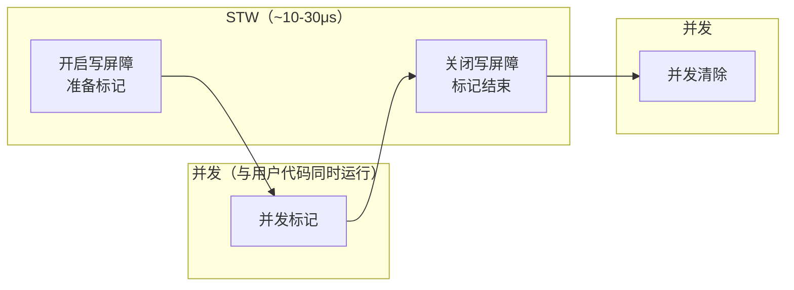
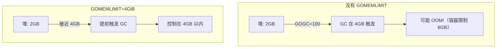

## 一个反复重启的 Operator

你维护的 K8s Operator 管理着集群中上千个 CRD 资源。最近监控告警频繁：Pod 每隔几分钟就被 kubelet 杀掉重启。

查看 Pod 事件：

```
Warning  Unhealthy  Liveness probe failed: Get "http://10.244.1.5:8080/healthz": context deadline exceeded
Warning  Unhealthy  Liveness probe failed: Get "http://10.244.1.5:8080/healthz": context deadline exceeded
Normal   Killing    Container my-operator failed liveness probe, will be restarted
```

`/healthz` 端点只是返回 200，不可能超过 3 秒超时。你在 Operator 里加了 runtime metrics，发现了关键线索：

```
# GC 停顿时间
go_gc_duration_seconds{quantile="1"} 4.2  # 最大 GC 停顿 4.2 秒！

# 堆内存
go_memstats_heap_alloc_bytes 3.8e+09  # 3.8GB 堆内存
```

**GC 停顿 4.2 秒，超过了健康检查的 3 秒超时。** 因为 Operator 在内存中缓存了上千个 CRD 资源的完整对象树，堆越大，GC 扫描时间越长。

---

## GC 在做什么

Go 的 GC 是**并发标记-清除**——从根（全局变量、栈上变量）出发，沿着引用链找到所有"活的"对象，没被找到的就是垃圾，回收其内存。

关键点：**标记阶段和你的代码同时运行**（并发标记），不需要完全暂停程序。但有两个短暂的 STW（Stop The World）阶段：



**正常情况下，每次 STW 只有几十微秒。** 那为什么我们的 Operator 会停顿 4.2 秒？

### Mark Assist — 真正的性能杀手

并发标记时，GC 和用户代码同时运行。但如果用户代码分配内存的速度**快于** GC 标记的速度，堆就会无限增长。

Go 的解决方案：**Mark Assist**。当一个 goroutine 尝试分配内存时，如果 GC 正在进行且标记进度落后，runtime 会强制这个 goroutine **先帮忙做一些标记工作**，然后才允许分配。

在我们的 Operator 中：3.8GB 的堆意味着 GC 需要扫描大量对象。Reconcile 函数不断创建临时对象，触发大量 Mark Assist，每个 goroutine 都被"征召"去做标记工作，响应时间急剧增加。

---

## GC 什么时候触发

### GOGC — 控制堆增长比例

```bash
GOGC=100  # 默认值
```

`GOGC=100` 意味着：当堆内存增长到**上次 GC 后的 2 倍**时，触发新一轮 GC。

```
上次 GC 后堆大小: 1GB
下次 GC 触发阈值: 1GB × (1 + 100/100) = 2GB
```

- `GOGC=50` → 增长 50% 就触发（更频繁，单次停顿短，CPU 开销大）
- `GOGC=200` → 增长 200% 就触发（更少，单次停顿可能长，CPU 开销小）
- `GOGC=off` → 关闭自动 GC

### GOMEMLIMIT — 软内存上限（Go 1.19+）

```bash
GOMEMLIMIT=4GiB
```

当堆内存接近这个上限时，runtime 会更积极地触发 GC，即使按 GOGC 计算还没到阈值。



### 定时触发

即使程序空闲、没有分配内存，runtime 也会每 **2 分钟**强制触发一次 GC。

---

## 回到事故：调优方案

问题链条：3.8GB 的堆 + 默认 GOGC=100 → 堆增长到 ~7.6GB 才触发 GC → 标记阶段需要扫描巨大的堆 → Mark Assist 拖慢所有 goroutine → 健康检查超时。

### 方案一：减少堆上的对象（最根本）

- 减少 in-memory 缓存的数据量（只缓存关键字段而不是完整对象）
- 用 `sync.Pool` 复用临时对象
- 减少 Reconcile 中的临时分配（预分配 slice、复用 buffer）

### 方案二：调整 GOGC

```bash
GOGC=50
```

让 GC 更频繁运行，每次标记增量更小，单次停顿更短。代价是 CPU 开销增加。

### 方案三：使用 GOMEMLIMIT（推荐）

```bash
# 容器内存限制 6Gi，给 Go 堆设 4Gi 上限（留 2Gi 给栈、goroutine、OS 等）
GOMEMLIMIT=4GiB
GOGC=100  # 保持默认
```

更激进的策略——`GOGC=off + GOMEMLIMIT`：

```bash
GOMEMLIMIT=4GiB
GOGC=off
```

含义是"不要按增长比例触发 GC，只在快要超内存限制时才 GC"。对于内存使用稳定的长期运行服务（如 controller），可以显著减少 GC 次数和 CPU 开销。

> GOMEMLIMIT 推荐设置为容器内存限制的 **70-80%**，留出空间给栈、goroutine 运行时结构和 OS 开销。

### 方案四：调大健康检查超时（临时缓解）

```yaml
livenessProbe:
  httpGet:
    path: /healthz
    port: 8080
  timeoutSeconds: 10  # 从 3 秒改到 10 秒
  failureThreshold: 3  # 连续 3 次失败才杀
  periodSeconds: 10
```

### 实际采用的组合方案

```yaml
env:
- name: GOMEMLIMIT
  value: "4GiB"
- name: GOGC
  value: "50"

livenessProbe:
  timeoutSeconds: 10
  failureThreshold: 3
```

上线后效果：
- GC 最大停顿从 4.2 秒降到 200 毫秒
- 堆内存稳定在 3.5-4GB
- 健康检查不再超时
- CPU 使用率增加 ~10%

---

## 如何排查 GC 问题

```bash
# 查看 GC 详细日志
GODEBUG=gctrace=1 ./your-program
```

输出示例：
```
gc 1 @0.012s 2%: 0.026+1.2+0.015 ms clock, 0.21+0.4/1.0/0+0.12 ms cpu, 4->4->2 MB, 5 MB goal, 8 P
```

各字段含义：`STW1时间 + 并发标记时间 + STW2时间`，`GC前堆 -> GC中堆 -> GC后堆`。

也可以通过 Prometheus 暴露的 Go runtime metrics（如 `go_gc_duration_seconds`、`go_memstats_heap_alloc_bytes`）来监控。

---

## 总结

| 知识点 | 核心要点 |
|---|---|
| GC 类型 | 并发标记-清除，标记阶段和用户代码同时运行 |
| STW | 两个短暂阶段，各 ~10-30μs，通常无感 |
| Mark Assist | 高分配场景的性能杀手，分配内存时被征召做标记 |
| GOGC | 控制堆增长触发比例，默认 100 |
| GOMEMLIMIT | Go 1.19+，软内存上限，容器化应用必配 |
| 推荐策略 | 容器中用 `GOMEMLIMIT=容器限制×0.7` + `GOGC=off` 或适当降低 GOGC |
| 排查 | `GODEBUG=gctrace=1` 或 Prometheus metrics |

---

*这是「Go 底层原理实战」系列的第四篇。本系列从 slice、map、interface 到 GC，覆盖了 Go 语言面试和实战中最核心的知识点。*
