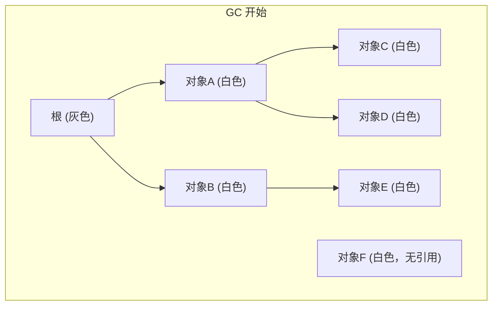
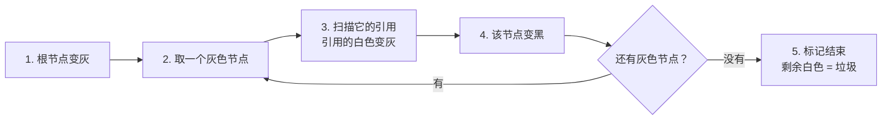
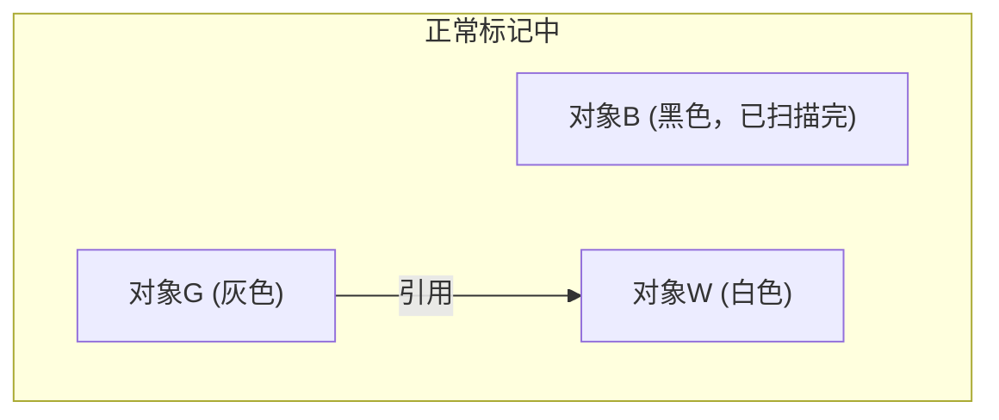
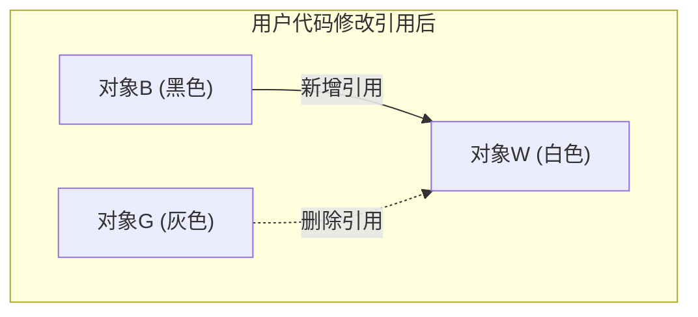
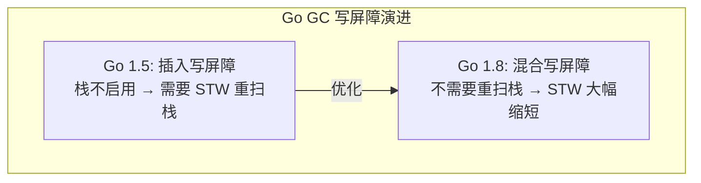
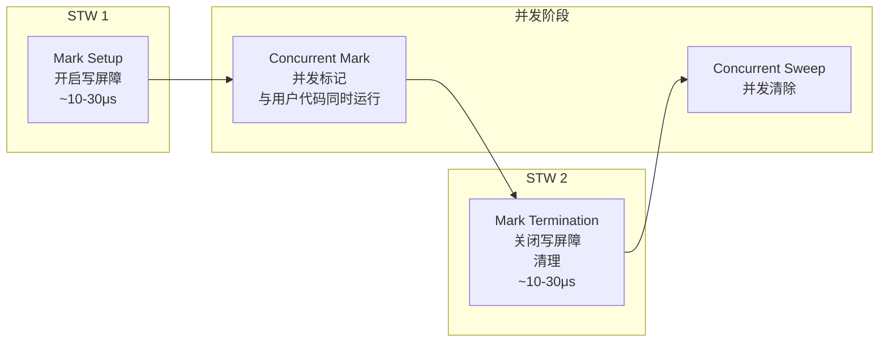
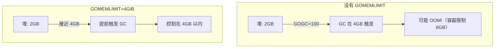

## 一个反复重启的 Operator

你维护的 K8s Operator 管理着集群中上千个 CRD 资源。最近监控告警频繁：Pod 每隔几分钟就被 kubelet 杀掉重启。

查看 Pod 事件：

```
Warning  Unhealthy  Liveness probe failed: Get "http://10.244.1.5:8080/healthz": context deadline exceeded
Warning  Unhealthy  Liveness probe failed: Get "http://10.244.1.5:8080/healthz": context deadline exceeded
Normal   Killing    Container my-operator failed liveness probe, will be restarted
```

健康检查超时了。你的 liveness probe 配置是 3 秒超时：

```yaml
livenessProbe:
  httpGet:
    path: /healthz
    port: 8080
  timeoutSeconds: 3
  periodSeconds: 10
```

`/healthz` 端点非常简单，只是返回 200。不可能超过 3 秒。

你在 Operator 里加了 runtime metrics 暴露到 Prometheus，发现了关键线索：

```
# GC 停顿时间
go_gc_duration_seconds{quantile="1"} 4.2  # 最大 GC 停顿 4.2 秒！

# 堆内存
go_memstats_heap_alloc_bytes 3.8e+09  # 3.8GB 堆内存

# GC 频率
go_gc_duration_seconds_count 847  # 启动以来 GC 了 847 次
```

**GC 停顿 4.2 秒，超过了健康检查的 3 秒超时。** GC 在停顿期间冻结了所有 goroutine，包括处理 `/healthz` 请求的那个。

为什么堆内存这么大？因为 Operator 在内存中缓存了上千个 CRD 资源的完整对象树，每次 reconcile 都产生大量临时对象。堆越大，GC 扫描时间越长。

**要解决这个问题，我们需要理解 Go GC 到底在做什么，哪些阶段会 STW，以及如何调优。**

---

## 标记-清除：GC 的基本思想

所有垃圾回收器的核心问题都是：**哪些内存还在用，哪些可以回收？**

最直觉的方法——**标记-清除**（Mark and Sweep）：

1. **标记阶段**：从"根"出发（全局变量、栈上的变量、寄存器），沿着指针引用一路往下走，走到的对象标记为"活的"
2. **清除阶段**：遍历堆上所有对象，没被标记的就是"垃圾"，回收其内存

问题是：如果标记阶段暂停整个程序（Stop The World），堆越大，停顿越长。3.8GB 的堆，停顿几秒是完全可能的。

Go 的解决方案：**并发标记**——标记阶段和用户代码同时运行。但这引入了新的问题：在标记过程中，用户代码可能修改了引用关系。

---

## 三色标记法

Go GC 使用**三色标记法**来管理并发标记的状态：

- **白色**：未访问。GC 结束后，仍为白色的对象会被回收
- **灰色**：已发现但未完全扫描。本身已标记，但它引用的对象还没看
- **黑色**：已完全扫描。本身和它引用的所有对象都已标记



标记过程就像 BFS（广度优先搜索）：



标记结束后：黑色 = 活的，白色 = 垃圾，灰色 = 不应该存在（如果存在就是 Bug）。

---

## 并发标记的漏标问题

三色标记在 STW 下是正确的。但 Go 的标记阶段和用户代码**并发运行**，就可能出现**漏标**——活着的对象被错误地标记为白色，导致被回收。

漏标发生的条件（同时满足才会出问题）：

1. **一个黑色对象**新增了一个指向**白色对象**的引用
2. 所有从灰色对象到该白色对象的路径都被切断





此时：
- B 是黑色，已扫描完，不会再扫了
- G 到 W 的引用被删了，G 扫完后也不会发现 W
- W 保持白色 → **被错误回收！但 B 还在用它！**

这就是经典的**悬挂指针**问题。Go 用**写屏障**来解决。

---

## 写屏障（Write Barrier）

写屏障是一段在 **GC 标记阶段**、每次指针写入时自动插入的额外代码。它的作用是：告诉 GC"有引用关系变了，你得注意"。

### 三种写屏障策略

**插入写屏障（Dijkstra）**：

当黑色对象 B 新增一个指向白色对象 W 的引用时，把 W 标记为灰色。

```go
// 伪代码
func writePointer(slot *unsafe.Pointer, ptr unsafe.Pointer) {
    shade(ptr)  // 被引用的对象标灰
    *slot = ptr
}
```

问题：栈上的写操作太频繁，如果每次都加屏障性能开销太大。所以 Go 早期的插入写屏障**不在栈上启用**，导致标记结束时需要 STW 重新扫描所有 goroutine 栈。

**删除写屏障（Yuasa）**：

当灰色对象 G 删除对白色对象 W 的引用时，把 W 标记为灰色。

```go
// 伪代码
func writePointer(slot *unsafe.Pointer, ptr unsafe.Pointer) {
    shade(*slot)  // 旧值（被删除的引用）标灰
    *slot = ptr
}
```

问题：保守标记，会有更多的"浮动垃圾"（本该回收但被标灰保住了），到下一轮 GC 才能回收。

**混合写屏障（Go 1.8+，当前使用）**：

```go
// 伪代码
func writePointer(slot *unsafe.Pointer, ptr unsafe.Pointer) {
    shade(*slot)  // 旧值标灰
    shade(ptr)    // 新值也标灰
    *slot = ptr
}
```

混合写屏障结合了两者的优点：

- **不需要在栈上启用写屏障**（栈上的新指针在 GC 开始时已经被扫描，栈上新分配的对象默认标黑）
- **不需要在标记结束时重新扫描栈**（这是最大的优势，消除了最长的 STW）
- 代价是有少量浮动垃圾



---

## GC 的完整流程

Go GC 的一次完整周期分为这几个阶段：



### STW 阶段详解

Go GC 有两个 STW（Stop The World）阶段：

**STW 1 — Mark Setup**：

- 开启写屏障
- 准备好根对象集合
- 扫描所有 goroutine 栈（标记栈上的根指针）
- 持续时间：通常 **10-30 微秒**

**STW 2 — Mark Termination**：

- 确保所有标记工作完成
- 关闭写屏障
- 清理内部数据结构
- 持续时间：通常 **10-30 微秒**

**正常情况下，每次 STW 只有几十微秒，用户几乎感受不到。** 那我们的 Operator 为什么会停顿 4.2 秒？

### Mark Assist — 隐藏的性能杀手

并发标记阶段，GC 的标记 goroutine 和用户 goroutine 同时运行。但如果用户代码分配内存的速度**快于** GC 标记的速度，堆就会无限增长。

Go 的解决方案：**Mark Assist**（标记辅助）。当一个 goroutine 尝试分配内存时，如果 GC 正在进行且标记进度落后，runtime 会强制这个 goroutine **先帮忙做一些标记工作**，然后才允许分配。

```go
// runtime/malloc.go (简化)
func mallocgc(size uintptr, typ *_type, needzero bool) unsafe.Pointer {
    // ...
    if gcBlackenEnabled != 0 {
        // GC 正在标记，且这个 goroutine 欠了"标记债务"
        gcAssistAlloc(size)  // ← 被迫先做标记工作
    }
    // ... 然后才分配内存
}
```

在我们的 Operator 中：3.8GB 的堆意味着 GC 需要扫描大量对象。并发标记阶段，Reconcile 函数不断创建临时对象，触发大量 Mark Assist。每个 Reconcile goroutine 不时被"征召"去做标记工作，响应时间急剧增加。当堆足够大、对象足够多时，整个系统的吞吐量都在 Mark Assist 中被拖垮。

---

## GC 的触发条件

GC 不是随时都在跑。有三个触发条件：

### 1. 堆增长（GOGC）

```bash
GOGC=100  # 默认值
```

`GOGC=100` 意味着：当堆内存增长到**上次 GC 后的 2 倍**时，触发新一轮 GC。

```
上次 GC 后堆大小: 1GB
下次 GC 触发阈值: 1GB × (1 + 100/100) = 2GB
```

- `GOGC=50` → 增长 50% 就触发（GC 更频繁，停顿更短，CPU 开销更大）
- `GOGC=200` → 增长 200% 就触发（GC 更少，停顿可能更长，CPU 开销更小）
- `GOGC=off` → 关闭 GC（永远不触发，直到 OOM）

### 2. 定时触发

如果程序一直没有分配内存（比如空闲状态），GC 也不会长期不运行。runtime 的 sysmon 每 **2 分钟**强制触发一次 GC。

### 3. 手动触发

```go
runtime.GC()  // 手动触发一次完整 GC
```

一般不建议在生产代码中使用。

### 4. GOMEMLIMIT（Go 1.19+）

```bash
GOMEMLIMIT=4GiB  # 内存上限
```

`GOMEMLIMIT` 设置了一个**软内存上限**。当堆内存接近这个上限时，runtime 会更积极地触发 GC，即使按 GOGC 计算还没到阈值。



---

## 回到事故：调优方案

现在我们理解了问题：3.8GB 的堆 + 默认 GOGC=100 → 堆增长到 ~7.6GB 才触发 GC → 标记阶段需要扫描巨大的堆 → Mark Assist 拖慢所有 goroutine → 健康检查超时。

### 方案一：减少堆上的对象

这是**最根本的解决方案**，但通常改动最大：

- 减少 in-memory 缓存的数据量（只缓存关键字段而不是完整对象）
- 用 sync.Pool 复用临时对象
- 减少 Reconcile 中的临时分配（预分配 slice、复用 buffer）

### 方案二：调整 GOGC

```bash
GOGC=50
```

让 GC 更频繁地运行，每次需要标记的增量更小，单次停顿更短。代价是 GC 占用更多 CPU。

### 方案三：使用 GOMEMLIMIT（推荐）

```bash
# 容器内存限制 6Gi，给 Go 堆设 4Gi 上限（留 2Gi 给栈、goroutine、OS 等）
GOMEMLIMIT=4GiB
GOGC=100  # 保持默认
```

配合 GOMEMLIMIT 使用更激进的策略：

```bash
# 主要依赖 GOMEMLIMIT 控制内存，关闭 GOGC 的自动触发
# 只在接近内存上限时才 GC，减少不必要的 GC 次数
GOMEMLIMIT=4GiB
GOGC=off
```

> 注意：`GOGC=off + GOMEMLIMIT` 的组合在 Go 1.19+ 是推荐的容器化应用 GC 策略。它的含义是"不要按增长比例触发 GC，只在快要超内存限制时才 GC"。对于内存使用稳定的长期运行服务（如 controller），这可以显著减少 GC 次数和 CPU 开销。

### 方案四：调大健康检查超时

```yaml
livenessProbe:
  httpGet:
    path: /healthz
    port: 8080
  timeoutSeconds: 10  # 从 3 秒改到 10 秒
  failureThreshold: 3  # 连续 3 次失败才杀
  periodSeconds: 10
```

这是临时缓解方案，不解决根本问题，但能避免不必要的重启。

### 实际采用的组合方案

```yaml
# Deployment 环境变量
env:
- name: GOMEMLIMIT
  value: "4GiB"
- name: GOGC
  value: "50"

# 调宽健康检查
livenessProbe:
  timeoutSeconds: 10
  failureThreshold: 3
```

上线后效果：
- GC 最大停顿从 4.2 秒降到 200 毫秒
- 堆内存稳定在 3.5-4GB
- 健康检查不再超时
- CPU 使用率增加 ~10%（更频繁的 GC 的代价）

---

## 为什么 Go 不分代？

几乎所有主流语言的 GC 都是分代的（Java、C#、Python、JavaScript）。分代 GC 基于一个经验假设——**大多数对象很快死亡**（弱代际假说），所以把堆分为新生代和老年代，新生代频繁回收，老年代少回收。

Go 为什么不分代？

1. **写屏障的代价**：分代 GC 需要**跨代引用写屏障**（老年代引用新生代时要记录下来），Go 已经有了 GC 写屏障，再加分代写屏障，开销叠加
2. **编译器优化减少了短命对象**：Go 的逃逸分析非常激进，很多短命对象直接分配在**栈**上，根本不进堆。分代 GC 的收益被大幅削弱
3. **Go 的 GC 已经足够快**：并发标记 + 混合写屏障 + GOMEMLIMIT，对于大多数场景 STW 在微秒级别

不过 Go 团队并没有完全排除分代的可能性。`runtime/debug` 中预留了一些接口，未来版本可能会引入某种形式的分代策略。

---

## 总结

| 知识点 | 核心要点 |
|---|---|
| 基本算法 | 三色标记法（白灰黑），BFS 遍历 |
| 并发标记 | 和用户代码同时运行，通过写屏障保证正确性 |
| 写屏障 | Go 1.8+ 混合写屏障，不需要重扫栈 |
| STW 阶段 | Mark Setup + Mark Termination，各 ~10-30μs |
| Mark Assist | 分配内存时被征召做标记工作，高分配场景是性能杀手 |
| GOGC | 控制堆增长触发比例，默认 100（增长 100% 触发） |
| GOMEMLIMIT | Go 1.19+，软内存上限，接近时积极 GC |
| 不分代 | 逃逸分析 + 写屏障代价 + 当前 GC 已足够快 |

---

## FAQ

**Q: 如何查看 GC 的详细日志？**

```bash
GODEBUG=gctrace=1 ./your-program
```

输出示例：
```
gc 1 @0.012s 2%: 0.026+1.2+0.015 ms clock, 0.21+0.4/1.0/0+0.12 ms cpu, 4->4->2 MB, 5 MB goal, 8 P
```

各字段含义：`STW1时间 + 并发标记时间 + STW2时间`，`GC前堆 -> GC中堆 -> GC后堆`。

**Q: `runtime.GC()` 和自动 GC 有什么区别？**

`runtime.GC()` 强制触发一次完整 GC 周期并等待其完成。自动 GC 由 runtime 根据 GOGC/GOMEMLIMIT 条件在后台触发。一般不需要手动调用，除非在特殊场景（如启动预热后释放初始化临时对象）。

**Q: Finalizer（`runtime.SetFinalizer`）和 GC 的关系？**

Finalizer 是在对象被 GC 回收前调用的回调函数。带 Finalizer 的对象需要**至少两轮 GC** 才能被回收：第一轮发现无引用 → 执行 Finalizer → 第二轮才真正释放内存。尽量避免依赖 Finalizer 做资源清理，用 `defer` 或显式 `Close()` 更可靠。

**Q: 容器中如何设置 GOMEMLIMIT？**

推荐设置为容器内存限制的 70-80%，留出空间给栈、goroutine 运行时结构和 OS 开销。比如容器限制 4Gi，设 `GOMEMLIMIT=3GiB`。Go 1.19+ 可以用 `automaxprocs` 自动读取 cgroup 限制配合 GOMEMLIMIT 使用。

---

*这是「Go 底层原理实战」系列的第四篇。本系列从 slice、map、interface 到 GC，覆盖了 Go 语言最核心的底层数据结构和运行时机制。掌握这些原理，你就能在面试和线上排障中游刃有余。*
