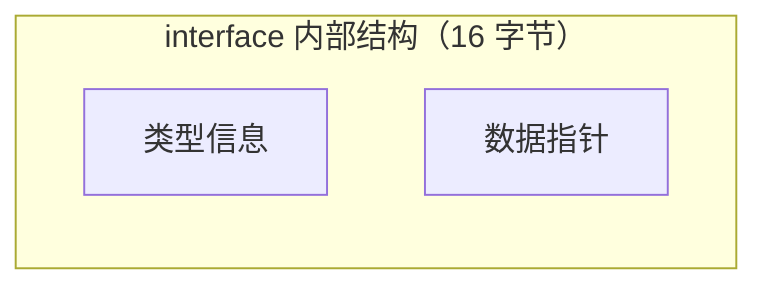
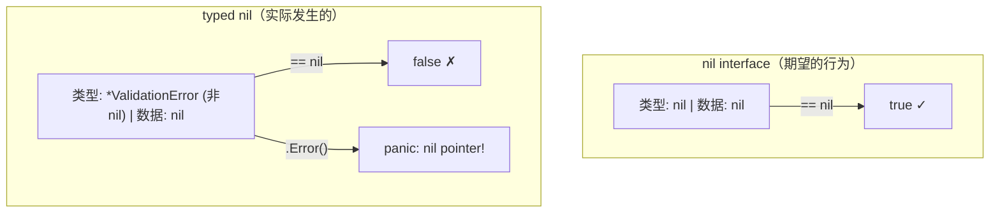

## 一个"不可能"的 Bug

你在 K8s 集群中部署了一个 admission webhook，用来校验 CRD 资源的字段。代码大致是这样的：

```go
func (w *Webhook) validate(obj *MyResource) error {
    var validationErr *ValidationError

    if obj.Spec.Replicas < 0 {
        validationErr = &ValidationError{Field: "replicas", Msg: "cannot be negative"}
    }

    if obj.Spec.Name == "" {
        validationErr = &ValidationError{Field: "name", Msg: "cannot be empty"}
    }

    return validationErr  // ← 问题在这里
}
```

上线后，你发现一个诡异现象：**即使资源的所有字段都合法，webhook 也拒绝了请求**。日志输出：

```
validation failed: err is not nil, but error message is: <nil>
```

调用方的代码：

```go
err := w.validate(obj)
if err != nil {
    log.Printf("validation failed: err is not nil, but error message is: %v", err)
    return admission.Denied(err.Error())  // panic: nil pointer dereference!
}
```

`err != nil` 是 `true`，但 `err.Error()` 崩了，因为底层的指针确实是 nil。

**一个 error 怎么可能既不是 nil，又是 nil？**

---

## nil Interface vs Typed Nil

这是 Go 面试的经典问题。要理解它，只需要知道一件事：**interface 在内存中是两个字段——类型信息和数据指针。**



**Go 判断 interface 是否为 nil 的规则：类型信息和数据指针都为 nil 才算 nil。**

回到那个 Bug。当 `validate` 函数执行到 `return validationErr` 时：

**所有字段合法的情况：**

```go
var validationErr *ValidationError  // nil 指针
return validationErr                // 赋值给 error 接口
```

返回的 `error` 接口内部：

```
类型信息: *ValidationError（非 nil！Go 知道你放了个 *ValidationError 进来）
数据指针: nil
```



只要类型信息非 nil（即接口"知道"自己持有什么类型），即使数据指针是 nil，接口本身也不是 nil。

### 修复方案

```go
func (w *Webhook) validate(obj *MyResource) error {
    // 方案一：直接返回 nil（不要通过 typed 指针中转）
    if obj.Spec.Replicas < 0 {
        return &ValidationError{Field: "replicas", Msg: "cannot be negative"}
    }
    if obj.Spec.Name == "" {
        return &ValidationError{Field: "name", Msg: "cannot be empty"}
    }
    return nil  // ← 直接返回 nil，不经过 typed nil 变量

    // 方案二：如果必须用变量，显式判断后再返回
    // if validationErr != nil {
    //     return validationErr
    // }
    // return nil
}
```

**黄金法则：返回 error 接口时，要么返回一个非 nil 的具体值，要么直接返回 `nil`。永远不要返回一个 typed nil 变量。**

---

## 值接收者 vs 指针接收者实现接口

这是面试第二高频的 interface 问题。

```go
type Stringer interface {
    String() string
}

type MyStruct struct {
    Name string
}
```

**值接收者——值和指针都能满足接口：**

```go
func (m MyStruct) String() string { return m.Name }

var s Stringer
s = MyStruct{Name: "a"}   // ✓
s = &MyStruct{Name: "b"}  // ✓
```

**指针接收者——只有指针能满足接口：**

```go
func (m *MyStruct) String() string { return m.Name }

var s Stringer
s = MyStruct{Name: "a"}   // ✗ 编译错误！
s = &MyStruct{Name: "b"}  // ✓
```

**为什么值接收者更"宽容"？**

用值接收者定义方法时，Go 自动生成一个对应的指针接收者包装方法。所以 `*MyStruct` 的方法集既包含值接收者方法也包含指针接收者方法。

但反过来不行——Go **不会**为指针接收者生成值接收者包装方法。因为值可能是不可寻址的（比如 map 中的元素、函数返回值），无法安全地取地址。

| 场景 | 值接收者 | 指针接收者 |
|---|---|---|
| 值类型赋值给接口 | ✓ | ✗ |
| 指针类型赋值给接口 | ✓ | ✓ |
| 方法能否修改接收者 | 不能（拷贝） | 能 |

**经验法则：** 如果结构体较大或方法需要修改状态，用指针接收者。如果结构体小且不可变（如坐标点、时间值），用值接收者。但一旦选了指针接收者，注意只有指针类型才能满足接口。

---

## 类型断言和 Type Switch

面试偶尔会问用法，不会问底层实现。知道怎么用就够了：

```go
var i interface{} = "hello"

// 类型断言——必须用两个返回值，否则断言失败会 panic
s, ok := i.(string)    // s="hello", ok=true
n, ok := i.(int)       // n=0, ok=false

// type switch——多类型判断的优雅写法
switch v := i.(type) {
case string:
    fmt.Println("string:", v)
case int:
    fmt.Println("int:", v)
default:
    fmt.Println("unknown type")
}
```

常见用法是对 `error` 接口做类型判断，区分不同的错误类型：

```go
if err != nil {
    var netErr *net.OpError
    if errors.As(err, &netErr) {
        // 网络错误，重试
    }
    // 其他错误，直接返回
}
```

> `errors.As` 是 Go 1.13+ 推荐的方式，比直接类型断言更好，因为它能穿透 `fmt.Errorf("%w", err)` 包装的错误链。

---

## `interface{}` 和 `any`

Go 1.18 引入了 `any` 作为 `interface{}` 的别名（`type any = interface{}`）。两者完全等价，`any` 只是写起来更短。

空接口可以持有任何类型的值，但使用时必须通过类型断言取出具体类型。泛型（Go 1.18+）在编译时确定类型，更安全；空接口在运行时确定类型，更灵活。两者解决不同问题，不是替代关系。

---

## 总结

| 知识点 | 核心要点 |
|---|---|
| nil 判断 | 类型信息和数据指针都为 nil 才是 nil interface |
| typed nil 陷阱 | 返回 error 时永远不要经过 typed nil 变量中转 |
| 值/指针接收者 | 值接收者更宽容，指针接收者只有指针能满足接口 |
| 类型断言 | 用两个返回值避免 panic，推荐 `errors.As` 处理错误链 |
| `any` | `interface{}` 的别名，完全等价 |

---

*这是「Go 底层原理实战」系列的第三篇。下一篇我们从一个 GC 导致 Pod 健康检查超时的案例出发，聊 Go GC 的调优实战。*
