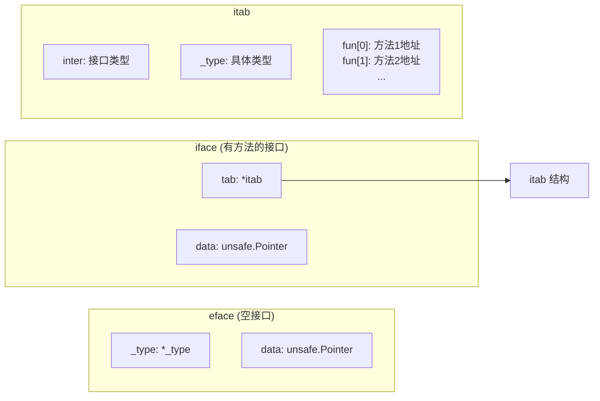
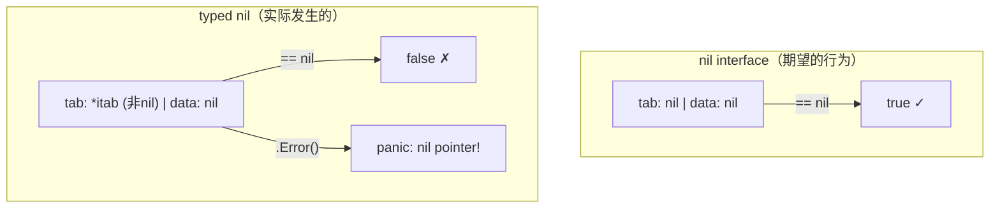
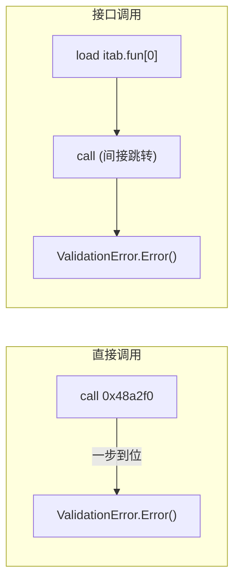
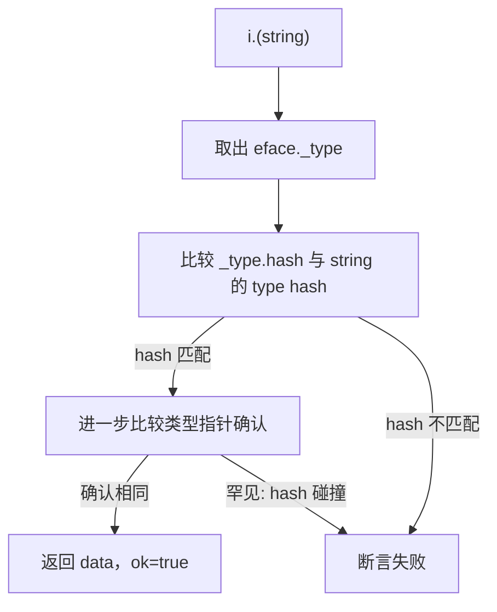
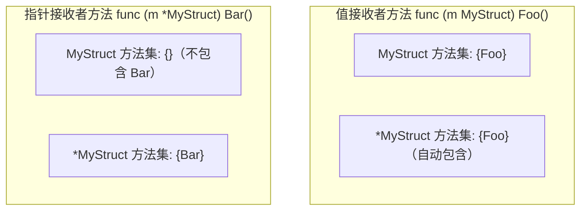

## 一个"不可能"的 Bug

你在 K8s 集群中部署了一个 admission webhook，用来校验 CRD 资源的字段。代码大致是这样的：

```go
func (w *Webhook) validate(obj *MyResource) error {
    var validationErr *ValidationError

    if obj.Spec.Replicas < 0 {
        validationErr = &ValidationError{Field: "replicas", Msg: "cannot be negative"}
    }

    if obj.Spec.Name == "" {
        validationErr = &ValidationError{Field: "name", Msg: "cannot be empty"}
    }

    return validationErr  // ← 问题在这里
}
```

上线后，你发现一个诡异现象：**即使资源的所有字段都合法，webhook 也拒绝了请求**。日志输出：

```
validation failed: err is not nil, but error message is: <nil>
```

调用方的代码：

```go
err := w.validate(obj)
if err != nil {
    log.Printf("validation failed: err is not nil, but error message is: %v", err)
    return admission.Denied(err.Error())  // panic: nil pointer dereference!
}
```

`err != nil` 是 `true`，但 `err.Error()` 崩了，因为底层的指针确实是 nil。

**一个 error 怎么可能既不是 nil，又是 nil？** 要回答这个问题，我们必须理解 interface 在内存中到底长什么样。

---

## Interface 的两种底层结构

Go 中有两种 interface 的内部表示：

### eface — 空接口 (`interface{}` / `any`)

```go
// runtime/runtime2.go
type eface struct {
    _type *_type          // 类型信息
    data  unsafe.Pointer  // 数据指针
}
```

### iface — 有方法的接口

```go
// runtime/runtime2.go
type iface struct {
    tab  *itab            // 类型 + 方法表
    data unsafe.Pointer   // 数据指针
}
```

两者都是 **16 字节**（两个指针），区别在第一个字段：eface 只存类型信息，iface 存 itab（包含类型信息 + 方法表）。



### itab 结构详解

`itab` 是 interface 机制的核心：

```go
// runtime/runtime2.go
type itab struct {
    inter *interfacetype  // 接口的类型描述（有哪些方法）
    _type *_type          // 具体类型的类型描述
    hash  uint32          // _type.hash 的拷贝，用于快速类型断言
    _     [4]byte
    fun   [1]uintptr      // 方法地址表（变长数组，实际长度 = 接口方法数）
}
```

`fun` 数组存的是**具体类型实现接口方法的函数地址**。当你通过接口调用方法时，runtime 就是从这里找到函数地址进行调用的。

### itab 全局缓存

每一对 `(接口类型, 具体类型)` 组合的 itab 只会创建一次，然后缓存在一个**全局哈希表**中：

```go
// runtime/iface.go
func getitab(inter *interfacetype, typ *_type, canfail bool) *itab {
    // 先查全局缓存
    if m := (*itabTableType)(atomic.Loadp(unsafe.Pointer(&itabTable))).find(inter, typ); m != nil {
        return m
    }
    // 没有就创建，加锁写入缓存
    // ...
}
```

这意味着同一个 `(error, *ValidationError)` 的 itab 在整个程序生命周期中只会分配一次。后续所有将 `*ValidationError` 赋值给 `error` 接口的操作，都复用同一个 itab 指针。

---

## 回到那个 Bug：nil interface vs typed nil

现在我们有足够的知识来解释那个 Bug 了。

当 `validate` 函数执行到 `return validationErr` 时：

**情况 A：`validationErr` 被赋了值**

```go
validationErr = &ValidationError{Field: "name", Msg: "..."}
```

返回的 `error` 接口内部：

```
iface{tab: *itab(error, *ValidationError), data: 0xc000...（指向 ValidationError 实例）}
```

`tab` 和 `data` 都非 nil → `err != nil` 为 true ✓ → `err.Error()` 正常 ✓

**情况 B：`validationErr` 没被赋值（所有字段合法）**

```go
var validationErr *ValidationError  // nil 指针
return validationErr                // 赋值给 error 接口
```

返回的 `error` 接口内部：

```
iface{tab: *itab(error, *ValidationError), data: nil}
```

**`tab` 非 nil！** 因为 Go 知道具体类型是 `*ValidationError`，它需要记录这个类型信息。只有 `data` 是 nil。



**Go 判断 interface 是否为 nil 的规则：`tab` 和 `data` 都为 nil 才算 nil。**

只要 `tab` 非 nil（即接口"知道"自己持有什么类型），即使 `data` 是 nil，接口本身也不是 nil。

### 修复方案

```go
func (w *Webhook) validate(obj *MyResource) error {
    // 方案一：直接返回 nil（不要通过 typed 指针中转）
    if obj.Spec.Replicas < 0 {
        return &ValidationError{Field: "replicas", Msg: "cannot be negative"}
    }
    if obj.Spec.Name == "" {
        return &ValidationError{Field: "name", Msg: "cannot be empty"}
    }
    return nil  // ← 直接返回 nil，不经过 typed nil 变量

    // 方案二：如果必须用变量，显式判断后再返回
    // if validationErr != nil {
    //     return validationErr
    // }
    // return nil
}
```

**黄金法则：返回 error 接口时，要么返回一个非 nil 的具体值，要么直接返回 `nil`。永远不要返回一个 typed nil 变量。**

---

## 动态派发（Dynamic Dispatch）

通过接口调用方法，和直接调用具体类型的方法有什么区别？

```go
// 直接调用（编译时确定地址）
var v ValidationError
v.Error()  // 编译器直接写入 ValidationError.Error 的函数地址

// 接口调用（运行时查表）
var err error = &v
err.Error()  // 从 iface.tab.fun[0] 读取函数地址，间接跳转
```

接口调用多了一次**间接寻址**（indirection）——先从 `itab.fun` 数组取函数指针，再跳转。这就是**动态派发**的开销。



实际性能差异：

- 单次调用：几纳秒，可以忽略
- 热路径上的高频调用：可能有 5-10% 的开销，因为间接跳转影响 CPU 分支预测和指令缓存

在绝大多数场景下，不需要为了避免动态派发而放弃接口的灵活性。只有在 benchmark 证明是瓶颈时才考虑优化。

---

## 类型断言的实现

```go
var i interface{} = "hello"

// 类型断言
s, ok := i.(string)

// type switch
switch v := i.(type) {
case string:
    // ...
case int:
    // ...
}
```

类型断言的底层实现依赖 `_type` 中的 `hash` 字段：



先比 hash（uint32 比较，很快），再比类型指针确认。两步完成，非常高效。

对于 iface 的类型断言（如 `err.(*ValidationError)`），流程类似，但比较的是 `itab._type.hash`。如果目标也是接口类型，则需要查找对应的 itab（走 `getitab` 缓存）。

---

## 值接收者 vs 指针接收者实现接口

```go
type Stringer interface {
    String() string
}

type MyStruct struct {
    Name string
}

// 值接收者
func (m MyStruct) String() string {
    return m.Name
}
```

```go
var s Stringer

s = MyStruct{Name: "a"}   // ✓ 值类型可以赋值
s = &MyStruct{Name: "b"}  // ✓ 指针类型也可以赋值
```

```go
type Stringer interface {
    String() string
}

type MyStruct struct {
    Name string
}

// 指针接收者
func (m *MyStruct) String() string {
    return m.Name
}
```

```go
var s Stringer

s = MyStruct{Name: "a"}   // ✗ 编译错误！
s = &MyStruct{Name: "b"}  // ✓ 只有指针可以赋值
```

**为什么值接收者更"宽容"？**

当你用**值接收者**定义方法时，Go 自动生成一个对应的**指针接收者包装方法**。所以 `*MyStruct` 的方法集既包含值接收者方法也包含指针接收者方法。

但反过来不行——Go **不会**为指针接收者生成值接收者包装方法。为什么？因为值接收者包装需要对指针解引用，而值可能是不可寻址的（比如 map 中的元素、函数返回值），无法安全地取地址。



### 实际影响

| 场景 | 值接收者 | 指针接收者 |
|---|---|---|
| 值类型赋值给接口 | ✓ | ✗ |
| 指针类型赋值给接口 | ✓ | ✓ |
| 存入 map/slice 后调用 | ✓ | 需要存指针 |
| 方法能否修改接收者 | 不能（拷贝） | 能 |

**经验法则：** 如果结构体较大或方法需要修改状态，用指针接收者。如果结构体小且不可变（如坐标点、时间值），用值接收者。但一旦选了指针接收者，注意只有指针类型才能满足接口。

---

## Interface 赋值时的内存分配

将具体值赋给接口时，可能发生堆分配：

```go
var i interface{}

x := 42
i = x  // x 的值被拷贝到堆上，i.data 指向堆上的副本
```

但 Go 编译器做了很多优化来避免不必要的分配：

- **小整数缓存**：对于小的整数值（0~255），runtime 有预分配的缓存，不需要新分配
- **逃逸分析**：如果接口变量没有逃逸出函数，数据可以分配在栈上
- **内联优化**：编译器可能将接口调用内联为直接调用，完全消除接口开销

可以用 `go build -gcflags='-m'` 查看逃逸分析结果，确认哪些接口赋值导致了堆分配。

---

## 总结

| 知识点 | 核心要点 |
|---|---|
| 两种底层结构 | eface（空接口）= type + data；iface（有方法）= itab + data |
| itab | 存接口类型、具体类型、方法表；全局缓存，只创建一次 |
| nil 判断 | tab 和 data 都为 nil 才是 nil interface |
| typed nil 陷阱 | 返回 error 时永远不要经过 typed nil 变量中转 |
| 动态派发 | 多一次间接寻址，通常可忽略 |
| 类型断言 | hash 快速比较 + 类型指针确认 |
| 值/指针接收者 | 值接收者更宽容，指针接收者只有指针能满足接口 |
| 内存分配 | 赋值可能堆分配，编译器有优化 |

---

## FAQ

**Q: `interface{}` 和 `any` 有什么区别？**

Go 1.18 引入了 `any` 作为 `interface{}` 的别名（`type any = interface{}`）。两者完全等价，`any` 只是写起来更短。

**Q: 如何安全地比较两个 interface 值？**

两个 interface 值比较时，先比较类型，再比较值。如果底层类型不支持比较（如 slice），运行时会 panic。用 `reflect.DeepEqual` 做深度比较更安全，但有性能开销。

**Q: 为什么 Go 不支持泛型之后废弃 `interface{}`？**

泛型（type parameters）和空接口解决的是不同问题。泛型在编译时确定类型，有类型安全保证；空接口在运行时确定类型，更灵活但需要类型断言。很多场景（如 `json.Unmarshal` 的返回值、反射）仍然需要空接口。

**Q: 接口嵌套会影响性能吗？**

```go
type ReadWriter interface {
    Reader
    Writer
}
```

接口嵌套是纯编译时行为。嵌套后的接口在运行时就是一个包含所有方法的 itab，没有额外的间接层。方法查找不会因为嵌套而变慢。

---

*这是「Go 底层原理实战」系列的第三篇。下一篇我们从一个 GC 导致 Pod 健康检查超时的案例出发，聊 Go GC 的底层原理。*
