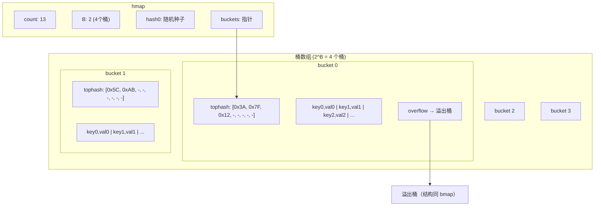
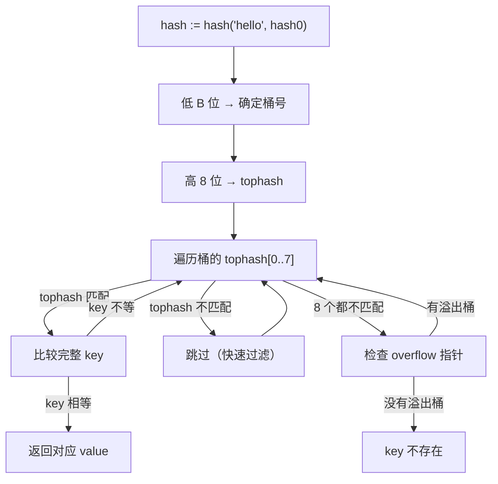
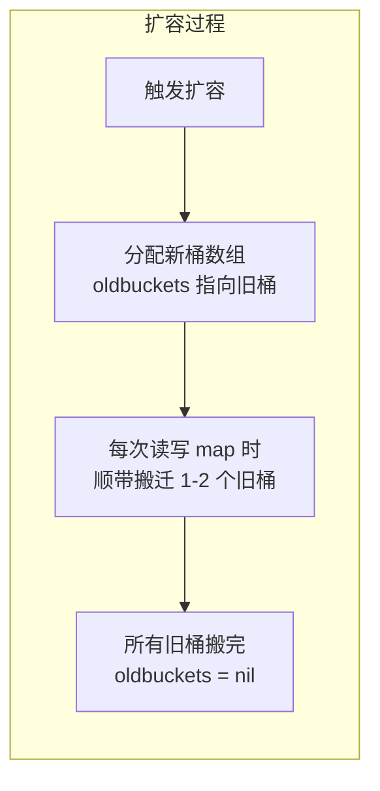

## 一个半夜的 Fatal 崩溃

你维护的 Kubernetes controller 稳定运行了几个月，突然半夜开始频繁崩溃。日志里只有一行：

```
fatal error: concurrent map read and map write

goroutine 847 [running]:
runtime.throw({0x1a2b3c, 0x23})
    /usr/local/go/src/runtime/panic.go:1077 +0x48
runtime.mapaccess1_faststr(...)
    /usr/local/go/src/runtime/map_faststr.go:21 +0x42c
main.(*Controller).getCache(...)
    /app/controller.go:156 +0x84
```

你马上加了 `recover`，重新部署。结果——**还是崩**。

因为这不是 `panic`，这是 `fatal error`。**Go runtime 检测到并发 map 操作后，直接调用 `throw` 终止进程，`recover` 拦不住。**

这是 Go 设计者的**故意选择**：并发操作 map 会破坏内部数据结构，与其让程序在损坏的数据上继续运行产生不可预测的结果，不如直接崩溃，让你修 Bug。

问题代码长这样：

```go
type Controller struct {
    cache map[string]*Resource  // 缓存最近处理过的资源
}

func (c *Controller) Reconcile(ctx context.Context, req Request) error {
    // 读缓存
    if res, ok := c.cache[req.Name]; ok {
        return c.processFromCache(res)
    }

    // 从 API server 获取
    res, err := c.client.Get(ctx, req.Name)
    if err != nil {
        return err
    }

    // 写缓存
    c.cache[req.Name] = res

    return c.process(res)
}
```

Controller-runtime 默认用多个 worker goroutine 并发调用 `Reconcile`。多个 goroutine 同时读写 `c.cache` 这个 map，触发了 fatal error。

**为什么 Go 不给 map 加锁？为什么要搞成 fatal 而不是 panic？** 要理解这些设计决策，我们需要深入 map 的底层结构。

---

## Map 的底层结构：hmap + bmap

Go 的 map 底层是一个**哈希表**，核心数据结构是 `hmap`：

```go
// runtime/map.go (简化)
type hmap struct {
    count     int    // 当前元素个数（len() 返回这个值）
    flags     uint8  // 状态标志位（包括并发写检测标志）
    B         uint8  // 桶数量的对数（桶数 = 2^B）
    hash0     uint32 // 哈希种子（每个 map 实例不同）
    buckets   unsafe.Pointer  // 桶数组的指针
    oldbuckets unsafe.Pointer // 扩容时指向旧桶数组
    nevacuate uintptr         // 扩容进度
    // ...
}
```

桶（bucket）的结构是 `bmap`：

```go
// runtime/map.go (简化)
type bmap struct {
    tophash [8]uint8  // 每个槽位存 key 哈希值的高 8 位
    // 后面紧跟着 8 个 key 和 8 个 value（编译时确定布局）
    // 最后是一个 overflow 指针，指向溢出桶
}
```

**每个桶固定存 8 个键值对。**



### 内存布局的巧妙设计

注意 bmap 中的 key 和 value 是**分开存放**的：

```
| tophash[0] | tophash[1] | ... | tophash[7] |
| key0 | key1 | ... | key7 |
| val0 | val1 | ... | val7 |
| overflow pointer |
```

为什么不是 `key0|val0|key1|val1|...`？因为**内存对齐**。比如 `map[int8]int64`，如果 key-value 交替存放，每个 key 后面要填充 7 字节对齐；分开存放后 8 个 key 紧挨着（都是 int8），8 个 value 紧挨着（都是 int64），没有浪费。

---

## Key 的定位过程

当你写 `v := m["hello"]` 时，runtime 经历这些步骤：



**两级定位**：

1. **低 B 位**：`hash & (2^B - 1)` 确定在哪个桶。如果 B=4，就是取 hash 的低 4 位，范围 0~15
2. **高 8 位**：存在 `tophash` 数组中，用来**快速过滤**。遍历桶时先比 tophash（1 字节比较），不匹配直接跳过，避免完整的 key 比较（可能是很长的字符串）

这个设计让大部分 miss 的情况在 tophash 比较阶段就能跳过，减少了昂贵的 key 比较次数。

---

## 渐进式扩容

### 什么时候扩容？

两个条件，满足任意一个就扩容：

1. **负载因子 > 6.5** — `count / (2^B) > 6.5`，即平均每个桶超过 6.5 个元素
2. **溢出桶太多** — 溢出桶数量超过常规桶数量

这两个条件对应两种不同的扩容方式：

| 条件 | 扩容方式 | 新桶数量 |
|---|---|---|
| 负载因子 > 6.5 | **翻倍扩容** | 2^(B+1) |
| 溢出桶太多 | **等量扩容** | 2^B（不变） |

**等量扩容**看起来很奇怪——桶数量不变，扩了个寂寞？

其实它解决的是**碎片化问题**。当大量插入和删除交替发生时，很多桶的 tophash 标记为"已删除"，元素散落在大量溢出桶中。等量扩容把所有元素重新紧凑排列到新桶中，消除碎片，减少溢出桶数量。

### 为什么负载因子是 6.5？

每个桶能装 8 个元素，6.5/8 = 81.25% 的填充率。这是 Go 团队做 benchmark 得出的经验值——平衡了**空间利用率**和**查找效率**：

- 太小（如 2.0）→ 桶很空，浪费内存，但查找快
- 太大（如 8.0）→ 桶全满，溢出桶多，查找慢
- 6.5 是在两者之间找到的甜蜜点

### 渐进式搬迁

扩容不是一次性完成的。如果一次性搬几十万个键值对，会造成严重的延迟毛刺。

Go 的做法是**渐进式搬迁**：



每次对 map 进行读写操作时，runtime 都会检查是否正在扩容，如果是，就**顺带搬迁一两个旧桶**。这把搬迁成本分摊到了后续的每次操作中，避免了一次性大停顿。

在扩容过程中，读操作需要同时检查旧桶和新桶。这也是 map 操作不是严格 O(1) 的原因之一。

---

## 为什么 Map 非并发安全？

### hashWriting 标志

Go runtime 用 `hmap.flags` 中的一个位来检测并发写：

```go
// runtime/map.go (简化)
func mapaccess1(t *maptype, h *hmap, key unsafe.Pointer) unsafe.Pointer {
    // ...
    if h.flags&hashWriting != 0 {
        throw("concurrent map read and map write")
    }
    // ...
}

func mapassign(t *maptype, h *hmap, key unsafe.Pointer) unsafe.Pointer {
    // ...
    if h.flags&hashWriting != 0 {
        throw("concurrent map writes")
    }
    h.flags ^= hashWriting  // 设置写标志
    // ... 执行写操作 ...
    h.flags ^= hashWriting  // 清除写标志
}
```

注意这是 `throw` 不是 `panic`——**不可恢复**。

### 为什么不内置并发安全？

Go 团队的设计哲学：**不为所有人买单**。

大多数 map 的使用场景是**单 goroutine 访问**。如果内置 mutex：

- 每次读写都要加锁/解锁，即使只有一个 goroutine
- 性能损失 10-30%（mutex 本身有 atomic 操作开销）
- 无法根据场景选择最优的并发策略（mutex、RWMutex、sync.Map、分片 map）

所以 Go 选择了：**默认不加锁，检测到并发直接崩溃，让开发者自己选择并发策略。**

### 并发方案选择

```go
// 方案一：sync.Mutex（通用方案）
type SafeCache struct {
    mu    sync.RWMutex
    items map[string]*Resource
}

func (c *SafeCache) Get(key string) (*Resource, bool) {
    c.mu.RLock()
    defer c.mu.RUnlock()
    v, ok := c.items[key]
    return v, ok
}

// 方案二：sync.Map（读多写少场景）
var cache sync.Map
cache.Store("key", value)
v, ok := cache.Load("key")

// 方案三：分片 map（高并发场景）
type ShardedMap struct {
    shards [256]struct {
        mu    sync.RWMutex
        items map[string]*Resource
    }
}
```

| 方案 | 适用场景 | 特点 |
|---|---|---|
| `sync.Mutex` / `RWMutex` | 通用 | 简单可靠，读多用 RWMutex |
| `sync.Map` | 读多写少、key 稳定 | 读接近无锁，写较慢 |
| 分片 map | 高并发读写 | 减少锁竞争，实现稍复杂 |

回到我们的 controller bug，最简单的修复是用 `sync.RWMutex`：

```go
type Controller struct {
    mu    sync.RWMutex
    cache map[string]*Resource
}

func (c *Controller) Reconcile(ctx context.Context, req Request) error {
    c.mu.RLock()
    res, ok := c.cache[req.Name]
    c.mu.RUnlock()
    if ok {
        return c.processFromCache(res)
    }

    res, err := c.client.Get(ctx, req.Name)
    if err != nil {
        return err
    }

    c.mu.Lock()
    c.cache[req.Name] = res
    c.mu.Unlock()

    return c.process(res)
}
```

---

## Map 遍历为什么是随机顺序？

```go
m := map[string]int{"a": 1, "b": 2, "c": 3}
for k, v := range m {
    fmt.Println(k, v)  // 每次运行顺序可能不同
}
```

这是 Go 的**故意设计**。map 遍历的起始位置是随机选择的：

```go
// runtime/map.go (简化)
func mapiterinit(t *maptype, h *hmap, it *hiter) {
    // 随机选一个起始桶
    r := uintptr(fastrand())
    it.startBucket = r & bucketMask(h.B)
    it.offset = uint8(r >> h.B & (bucketCnt - 1))
    // ...
}
```

为什么？因为 **map 的内部元素顺序本身就不稳定**——扩容搬迁会改变元素所在的桶。如果不随机化，开发者可能在某个版本测试发现遍历顺序碰巧稳定，就依赖了这个顺序。等 Go 版本升级、map 内部实现调整，代码就莫名其妙地坏了。

随机化是在**教育层面防御**——让你在开发阶段就发现顺序不稳定，而不是在生产环境。

---

## 其他重要细节

### Key 必须是 comparable 类型

map 的 key 必须支持 `==` 比较。以下类型不能做 key：

- `slice`
- `map`
- `func`

常用 key 类型：`string`、`int`、`struct`（所有字段都 comparable）。

### Delete 不会缩容

```go
m := make(map[string]int)
// 插入 100 万个 key
for i := 0; i < 1000000; i++ {
    m[fmt.Sprintf("key-%d", i)] = i
}
// 删除 99 万个 key
for i := 0; i < 990000; i++ {
    delete(m, fmt.Sprintf("key-%d", i))
}
// 此时 map 只有 1 万个 key，但内存占用和 100 万时差不多！
```

`delete` 只是把 tophash 标记为 `emptyOne`，不会释放桶的内存，也不会收缩桶数量。如果你的场景中 map 会经历"暴增→大量删除→只剩少量"的生命周期，要么定期创建新 map 替换旧的，要么考虑用其他数据结构。

---

## 总结

| 知识点 | 核心要点 |
|---|---|
| 底层结构 | hmap + bmap，每桶 8 个槽位，tophash 快速过滤 |
| 定位机制 | 低 B 位选桶，高 8 位比 tophash，命中后比完整 key |
| 扩容 | 翻倍扩容（负载高）+ 等量扩容（碎片化），渐进式搬迁 |
| 并发安全 | 不安全，hashWriting 检测，fatal 不是 panic |
| 遍历顺序 | 故意随机化，防止依赖顺序 |
| 负载因子 | 6.5 是经验值，平衡空间和性能 |
| delete | 不缩容，只标记 tophash |

---

## FAQ

**Q: map 的 key 用 string 还是 int 性能更好？**

int 更快。string key 需要计算字符串的哈希（遍历每个字节），而 int 的哈希计算几乎是一条指令。如果你的 key 可以用 int 表示（比如 ID），优先用 int。

**Q: sync.Map 内部是怎么实现的？**

sync.Map 用了两个 map：一个 `read`（atomic 操作，无锁读）和一个 `dirty`（mutex 保护）。读操作先查 read，命中就无锁返回；miss 则加锁查 dirty。新写入的 key 先进 dirty，当 dirty 被查询次数超过其长度时，dirty 提升为 read。适合 key 集合稳定、读多写少的场景。

**Q: 为什么不用开放寻址法（open addressing）？**

Go 选择了链式哈希（桶 + 溢出桶）而不是开放寻址。主要原因是 Go 需要支持渐进式扩容——链式哈希的渐进式搬迁实现更简单（按桶搬迁），而开放寻址的渐进式搬迁需要处理大量 edge case。此外，链式哈希在高负载时性能退化更平缓（只是链变长），而开放寻址在接近满载时性能急剧下降。

**Q: `map[K]V` 大约占多少内存？**

粗略估算：每个桶 = 8 * (sizeof(K) + sizeof(V)) + 8(tophash) + 8(overflow pointer)。桶数量 = `2^B`。加上 hmap 头部（几十字节）和可能的溢出桶。实际内存可以用 `runtime.MemStats` 或 pprof heap 查看。

---

*这是「Go 底层原理实战」系列的第二篇。下一篇我们从一个 interface nil 判断的经典坑出发，聊 interface 的底层原理。*
