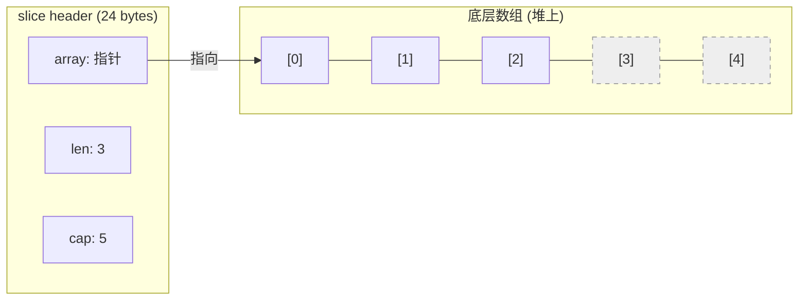
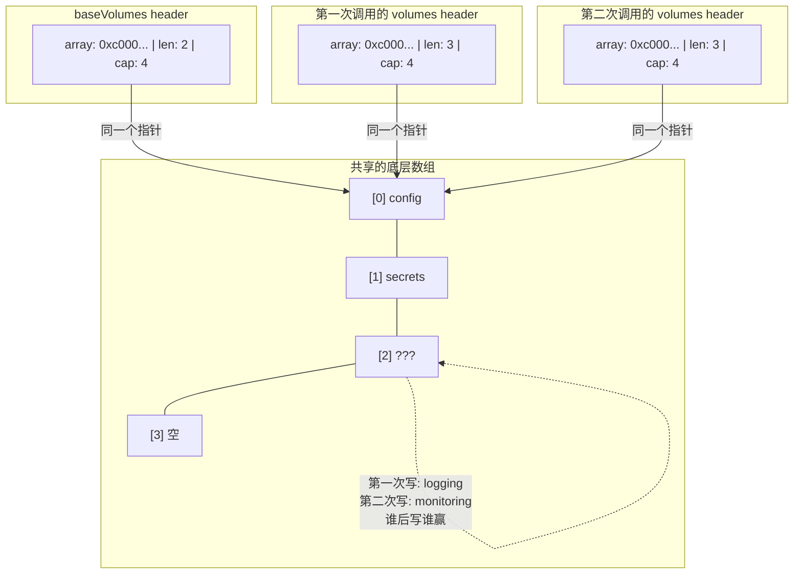
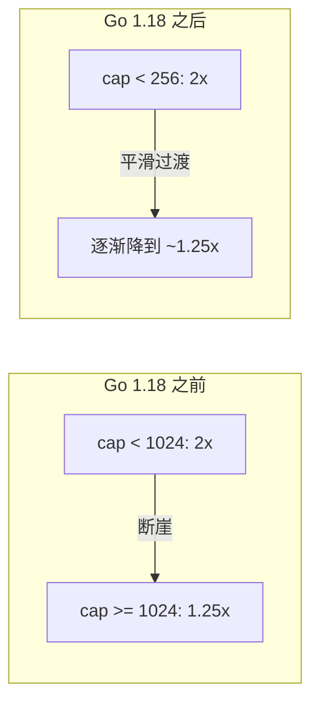
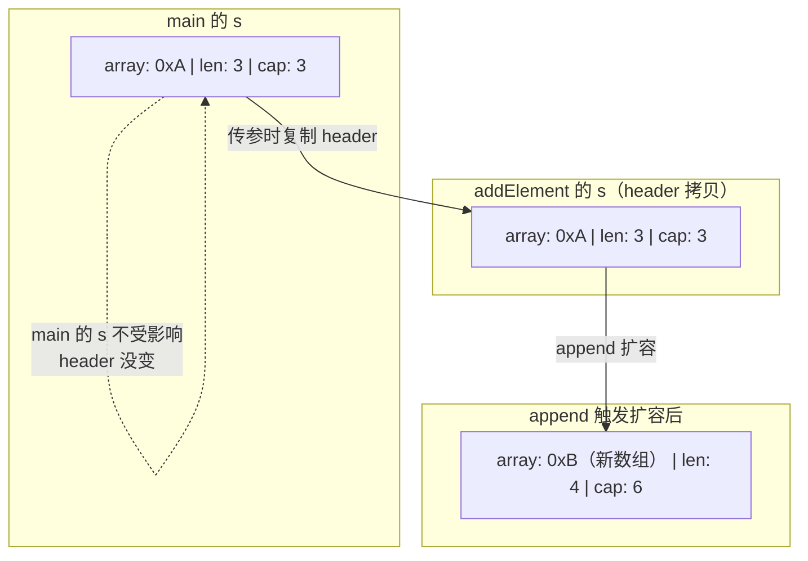
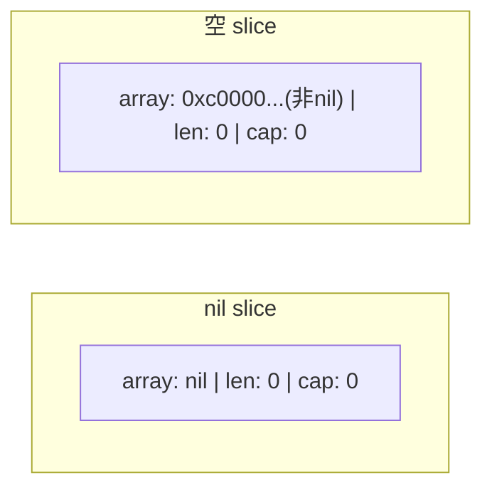
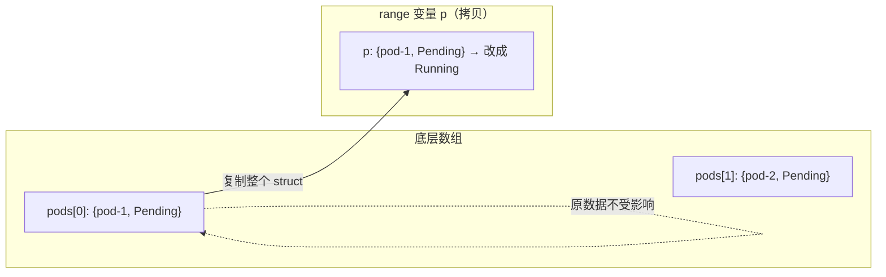
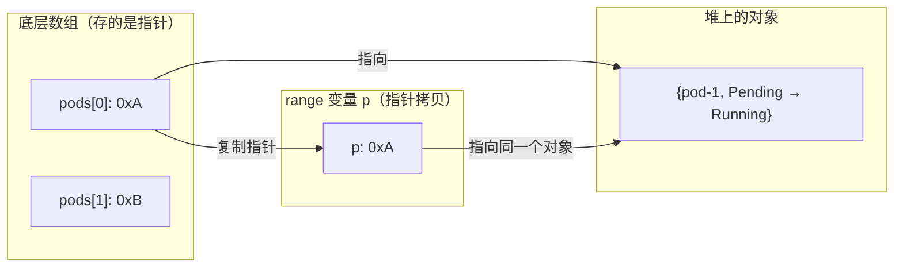

## 一个诡异的线上 Bug

你维护一个 Kubernetes Operator，负责根据不同的 CRD 配置为 Pod 生成资源规格。代码大致是这样的：

```go
// 基础配置，全局复用
var baseVolumes = []corev1.Volume{
    {Name: "config", VolumeSource: corev1.VolumeSource{ConfigMap: &corev1.ConfigMapVolumeSource{...}}},
    {Name: "secrets", VolumeSource: corev1.VolumeSource{Secret: &corev1.SecretVolumeSource{...}}},
}

func buildPodSpec(cr *MyResource) corev1.PodSpec {
    volumes := baseVolumes // "复制"一份基础配置
    if cr.Spec.EnableLogging {
        volumes = append(volumes, loggingVolume)
    }
    if cr.Spec.EnableMonitoring {
        volumes = append(volumes, monitoringVolume)
    }
    return corev1.PodSpec{Volumes: volumes}
}
```

看起来毫无问题：每次调用 `buildPodSpec` 都"复制"了一份 `baseVolumes`，然后按需追加。

但线上出现了诡异现象：

- 某些只开了 logging 的 CR，生成的 Pod 里竟然也有 monitoring volume
- 更离谱的是，这个 Bug **间歇性出现**——有时候正常，有时候错乱
- 重启 Operator 后短暂恢复，过一阵子又出问题

**到底发生了什么？** 要搞清楚这个 Bug，我们需要彻底理解 slice 在内存里到底长什么样。

---

## Slice 的底层结构：一个胖指针

很多人以为 slice 就是一个数组。错了。slice 是一个**描述符**（descriptor），也叫**胖指针**（fat pointer），本质是一个包含三个字段的结构体：

```go
// runtime/slice.go 中的定义
type slice struct {
    array unsafe.Pointer // 指向底层数组的指针
    len   int            // 当前长度
    cap   int            // 总容量
}
```

在 64 位系统上，这个结构体占 **24 字节**（8+8+8）。



**关键洞察：slice 变量本身只是一个 24 字节的 header，真正的数据在堆上的底层数组里。**

当你写 `b := a` 复制一个 slice 时，**复制的只是这个 header**，底层数组是共享的。这就是那个 Bug 的根源。

---

## 回到那个 Bug：共享底层数组

让我们用具体的内存布局重现这个 Bug。

假设 `baseVolumes` 定义时容量为 4（Go 编译器优化，可能分配比 len 大的 cap）：

```go
var baseVolumes = []corev1.Volume{configVol, secretsVol}
// len=2, cap=4（假设）
```

**第一次调用** `buildPodSpec`（CR 开了 logging）：

```go
volumes := baseVolumes        // header 拷贝：array=同一个指针, len=2, cap=4
volumes = append(volumes, loggingVolume)  // len < cap，直接写入底层数组[2]
// volumes: len=3, cap=4
// baseVolumes: len=2, cap=4（len 没变，但底层数组[2]已经被写了！）
```

**第二次调用** `buildPodSpec`（CR 开了 monitoring）：

```go
volumes := baseVolumes        // header 拷贝：array=同一个指针, len=2, cap=4
volumes = append(volumes, monitoringVolume)  // len < cap，写入底层数组[2]
// 但底层数组[2] 刚才被第一次调用写成了 loggingVolume，现在被覆盖成 monitoringVolume！
```



**第一次调用返回的 PodSpec 也被污染了**——因为它的 volumes 的底层数组的 [2] 位置被第二次调用覆盖了。

这就是为什么 Bug 是**间歇性的**：只有当两次调用都在 `cap` 足够的情况下 append，才会出问题。当 `cap` 不够触发扩容，就会分配新数组，反而不会互相影响。

### 修复方案

```go
func buildPodSpec(cr *MyResource) corev1.PodSpec {
    // 方案一：用 full slice expression 截断 cap
    volumes := baseVolumes[:len(baseVolumes):len(baseVolumes)]

    // 方案二：make + copy
    volumes := make([]corev1.Volume, len(baseVolumes))
    copy(volumes, baseVolumes)

    // 方案三（Go 1.21+）：slices.Clone
    volumes := slices.Clone(baseVolumes)

    if cr.Spec.EnableLogging {
        volumes = append(volumes, loggingVolume)
    }
    // ...
}
```

**推荐方案一**，`a[:len(a):len(a)]` 叫 **full slice expression**（三索引切片），第三个索引限制了新 slice 的 cap，使得下一次 append 一定触发扩容，分配独立的底层数组。

---

## 扩容策略：Go 1.18 前后的变化

当 `append` 发现 `len == cap`（容量满了），就必须扩容——分配更大的底层数组，拷贝旧数据。

### Go 1.18 之前：1024 断崖

```
cap < 1024  → 新 cap = 旧 cap × 2（翻倍）
cap >= 1024 → 新 cap = 旧 cap × 1.25（增长 25%）
```

问题是 **1024 这个分界点是个断崖**——cap 从 1023 到 1024，增长率从 100% 骤降到 25%。这导致在 1024 附近，内存分配行为不可预测。

### Go 1.18 之后：平滑过渡

```go
// runtime/slice.go (简化)
func growslice(oldCap, newCap int) int {
    newcap := oldCap
    doublecap := newcap + newcap
    if newCap > doublecap {
        newcap = newCap
    } else {
        const threshold = 256
        if oldCap < threshold {
            newcap = doublecap
        } else {
            for newcap < newCap {
                newcap += (newcap + 3*threshold) / 4
            }
        }
    }
    // 最终还要做内存对齐
    return newcap
}
```

新策略的关键变化：

- 阈值从 1024 降到 **256**
- 大于阈值后，增长公式是 `newcap += (newcap + 3*256) / 4`，随着 cap 增大，增长率从 ~2x **平滑过渡**到 ~1.25x



> 注意：最终分配的 cap 还要经过**内存对齐**（mallocgc 按 size class 分配），所以实际 cap 可能比计算值大。比如你 append 到需要 cap=5，但内存分配器给了 6 或 8 的空间。

---

## Slice 作为函数参数：值传递的陷阱

Go 中一切都是值传递——函数传参永远是把值**复制一份**交给函数，没有 C++ 那种引用传递。但关键在于"复制的值"到底是什么：

| 类型 | 复制的是什么 | 大小 |
|---|---|---|
| `int`, `struct` | 整个数据 | 取决于类型 |
| `slice` | header（pointer + len + cap） | 24 字节 |
| `map`, `channel` | 指针（它们本身就是指针类型） | 8 字节 |
| `*T`（指针） | 指针本身，不是指向的对象 | 8 字节 |

**所以"值传递"和"能在函数里影响外面"并不矛盾**——如果复制的值里包含指针，指针指向的数据是共享的。

理解了这一点，slice 的传参行为就不再让人困惑了。传递 slice 时，复制的是 **header**（24 字节），底层数组不会被复制：

```go
func addElement(s []int) {
    s = append(s, 100)
    fmt.Println("inside:", s) // [1, 2, 3, 100]
}

func main() {
    s := []int{1, 2, 3}
    addElement(s)
    fmt.Println("outside:", s) // [1, 2, 3] — 100 没了！
}
```



函数内部 `append` 如果触发了扩容，会创建新的底层数组，并更新函数内部那份 header 的 `array` 和 `len`。但 main 函数的 header 完全没变。

**但如果没有触发扩容**（cap 够用），函数内部的修改**会**影响外面——因为它们共享底层数组：

```go
func modify(s []int) {
    s[0] = 999  // 直接修改底层数组
}

func main() {
    s := []int{1, 2, 3}
    modify(s)
    fmt.Println(s) // [999, 2, 3] — 被改了！
}
```

**规则总结：**

- **修改元素**（`s[i] = x`）：一定影响调用者（共享底层数组）
- **append**：可能影响也可能不影响（取决于是否扩容）
- 想在函数内修改 slice 长度并让调用者看到 → 传 `*[]int`

---

## nil Slice vs 空 Slice

```go
var s1 []int          // nil slice
s2 := []int{}         // 空 slice
s3 := make([]int, 0)  // 空 slice
```



| 特性 | nil slice | 空 slice |
|---|---|---|
| `== nil` | `true` | `false` |
| `len()` | 0 | 0 |
| `cap()` | 0 | 0 |
| 可以 append | 可以 | 可以 |
| 可以 range | 可以（不执行） | 可以（不执行） |
| JSON 序列化 | `null` | `[]` |

**实战影响最大的是 JSON 序列化**。如果你的 API 返回一个 slice 字段：

```go
type Response struct {
    Items []Item `json:"items"`
}

// nil slice → {"items": null}    ← 前端可能报错！
// 空 slice → {"items": []}       ← 前端期望的格式
```

很多前端框架会在 `items === null` 时崩溃，因为它们期望数组而不是 null。**在 API 响应中，用 `make([]Item, 0)` 或 `[]Item{}` 而不是声明后不初始化。**

---

## for-range 的拷贝陷阱

`for _, v := range s` 中的 `v` 是元素的**拷贝**，不是引用。这和前面讲的值传递是同一个道理——`for range` 每次迭代都会把当前元素**复制**一份赋给 `v`。关键在于复制的是什么：

### 元素是 struct：复制整个 struct，改不到原数据

```go
type Pod struct {
    Name   string
    Status string
}

// []Pod — 元素是值类型
pods := []Pod{
    {Name: "pod-1", Status: "Pending"},
    {Name: "pod-2", Status: "Pending"},
}

for _, p := range pods {
    p.Status = "Running"  // p 是 Pod 的完整拷贝，改的是拷贝
}
fmt.Println(pods[0].Status) // "Pending" — 没改成！
```



### 元素是指针：复制的是指针，指向同一个对象

```go
// []*Pod — 元素是指针类型
pods := []*Pod{
    {Name: "pod-1", Status: "Pending"},
    {Name: "pod-2", Status: "Pending"},
}

for _, p := range pods {
    p.Status = "Running"  // p 是指针的拷贝，但指向同一个 Pod
}
fmt.Println(pods[0].Status) // "Running" — 改成了！
```



### 修复 struct 元素的 range 修改

```go
// 方案一：用索引直接操作原数组
for i := range pods {
    pods[i].Status = "Running"
}

// 方案二：改用指针 slice（[]*Pod），range 自然能改到原对象
```

> Go 1.22 改变了 range 变量的作用域（每次迭代创建新变量，解决闭包捕获问题），但 `v` 仍然是元素的**拷贝**，上述行为不变。

---

## 高效删除中间元素

删除 slice 中间的元素，Go 标准库没有内置方法。常见做法：

### 保持顺序（用 copy 前移）

```go
func remove(s []int, i int) []int {
    copy(s[i:], s[i+1:])  // 后面的元素往前挪一位
    return s[:len(s)-1]
}
```

时间复杂度 O(n)，因为要移动 `i` 后面的所有元素。

### 不保持顺序（和最后一个交换）

```go
func removeUnordered(s []int, i int) []int {
    s[i] = s[len(s)-1]   // 最后一个元素覆盖要删的位置
    return s[:len(s)-1]
}
```

时间复杂度 O(1)。如果你不关心顺序，这是最快的方式。

### Go 1.21+ 的 slices 包

```go
s = slices.Delete(s, i, i+1)  // 保持顺序删除
```

`slices.Delete` 内部做了和手动 `copy` 前移一样的事情，但额外帮你把**尾部被移除的位置清零**了，避免残留的指针引用阻止 GC 回收。所以如果你用的是 `slices.Delete`，不需要自己操心内存泄漏。

> 注意：手动实现的 `remove` 和 `removeUnordered` **不会清零尾部**。如果元素是指针类型（如 `[]*Pod`），原数组末尾会残留一个指向已删除对象的指针，导致 GC 无法回收该对象。手动删除时建议显式清零：
>
> ```go
> func remove(s []*Pod, i int) []*Pod {
>     copy(s[i:], s[i+1:])
>     s[len(s)-1] = nil  // 清零尾部，让 GC 回收
>     return s[:len(s)-1]
> }
> ```
>
> 所有方式都**不会缩容**——底层数组依然是原来的大小。

---

## 关键结论

- 需要从一个 slice 派生新 slice 再 append 时，先用 `s[:len(s):len(s)]` 截断 cap——这一行能杜绝所有"共享底层数组导致数据互相污染"的 Bug。
- 函数里 append 后想让调用者看到变化，要么返回新 slice，要么传 `*[]T`——仅传 `[]T` 时调用者的 header 永远不会更新。
- 需要就地修改 struct 元素时，用 `for i := range s` + `s[i].Field =`，永远不要对 range 变量 `v` 赋值。
- API 响应里的 slice 字段一律用 `make([]T, 0)` 初始化——防止 JSON 序列化输出 `null` 击穿前端。
- 知道大致数量就 `make([]T, 0, n)` 预分配——减少扩容次数是 slice 最容易拿到的性能收益。
- 手动删除指针类型 slice 元素后，把尾部置 `nil`——`slices.Delete` 会自动做这件事，优先用它。

---

## 总结

| 知识点 | 核心要点 |
|---|---|
| 底层结构 | 24 字节 header（array + len + cap），数据在堆上 |
| 赋值 / 传参 | 复制 header，共享底层数组 |
| append 陷阱 | cap 够 → 原地写入（污染共享者）；cap 不够 → 扩容（独立新数组） |
| Full slice expression | `a[:len(a):len(a)]` 截断 cap，强制下次 append 扩容 |
| 扩容策略 | Go 1.18+ 用平滑过渡取代 1024 断崖 |
| nil vs 空 | JSON 序列化行为不同：`null` vs `[]` |
| for-range | `v` 是拷贝，修改 v 不影响原 slice |
| 删除元素 | 不缩容，注意清理指针引用避免内存泄漏 |

---

## FAQ

**Q: slice 的 header 分配在栈上还是堆上？**

取决于**逃逸分析**（escape analysis）——Go 编译器自动决定变量放在栈还是堆上的机制。规则很简单：如果一个变量的生命周期不超出当前函数，就放栈上（函数返回自动回收，零成本）；如果它会被外部引用（比如作为返回值），就必须"逃逸"到堆上，由 GC 回收。

```go
// 没有逃逸 — header 和底层数组都可能在栈上
func noEscape() {
    s := make([]int, 3)
    s[0] = 1
    // 函数结束 s 就没了，编译器知道不需要堆分配
}

// 逃逸了 — 返回了 slice，调用者还要用，必须放堆上
func escape() []int {
    s := make([]int, 3)
    return s  // s 的生命周期超出函数，逃逸到堆上
}
```

对于 slice 来说：header 小（24 字节），容易留在栈上；**底层数组**大概率在堆上（除非非常小且不逃逸）。

**Q: 多个 goroutine 可以同时操作同一个 slice 吗？**

不安全。slice 不是并发安全的。多个 goroutine 同时 append 同一个 slice 会导致数据竞争。需要用 mutex 保护或每个 goroutine 操作独立的 slice 后合并。

**Q: `make([]int, 0)` 和 `make([]int, 0, 100)` 有什么区别？**

`make` 创建 slice 时接受 2 或 3 个参数：`make([]T, len)` 或 `make([]T, len, cap)`。

```go
s1 := make([]int, 5)      // len=5, cap=5  → [0,0,0,0,0]，5 个零值元素已就位
s2 := make([]int, 0, 100)  // len=0, cap=100 → []，空的，但底层数组已分配 100 个位置
s3 := make([]int, 100)     // len=100, cap=100 → 100 个零值元素已就位
```

- **len**：slice 当前有多少个元素（可以直接用 `s[i]` 访问）
- **cap**：底层数组预分配了多少空间（append 在 cap 内不需要扩容）

`make([]int, 0, 100)` 的意思是"我现在还没有元素，但我知道大约会有 100 个，先把空间分配好"。而 `make([]int, 100)` 是"直接给我 100 个零值元素"。

一个常见困惑是：`len=0, cap=100` 既然分配了 100 个位置，为什么不能直接用 `s[3]` 访问？可以把它想象成一个**有围栏的停车场**——cap 是修好的车位数，len 是围栏当前开放的范围。Go 的边界检查只看 `len`，不看 `cap`：

```go
s := make([]int, 0, 100)
// s[3] = 1    // panic: index out of range [3] with length 0

s = append(s, 10)  // len=1，围栏推到第 1 个位置
s = append(s, 20)  // len=2
s = append(s, 30)  // len=3
s = append(s, 40)  // len=4
s[3] = 999         // 现在可以了，len=4，index 3 在范围内
```

只有 `append` 才会把围栏往后推（增加 `len`），同时利用已分配好的 `cap` 空间，不需要扩容。

两种 `make` 写法取决于你的使用方式：

```go
// 场景一：逐个 append → 用 make([]T, 0, n)
results := make([]Pod, 0, len(pods))
for _, p := range pods {
    if p.Status == "Running" {
        results = append(results, p)
    }
}

// 场景二：按索引赋值 → 用 make([]T, n)
results := make([]Pod, len(pods))
for i, p := range pods {
    results[i] = transform(p)
}
```

**如果你知道大致的元素数量，永远预分配 cap**——减少扩容次数 = 减少内存分配 = 减少 GC 压力。

**Q: `string` 和 `[]byte` 的关系是什么？**

`string` 的底层结构也是一个胖指针，但只有两个字段（array + len，没有 cap），且**不可变**。`[]byte(s)` 通常需要拷贝数据（除非编译器优化掉了）。频繁在 string 和 []byte 之间转换会有性能开销。

---

*这是「Go 底层原理实战」系列的第一篇。下一篇我们从一个 map 并发崩溃的案例出发，聊 map 的底层原理。*
