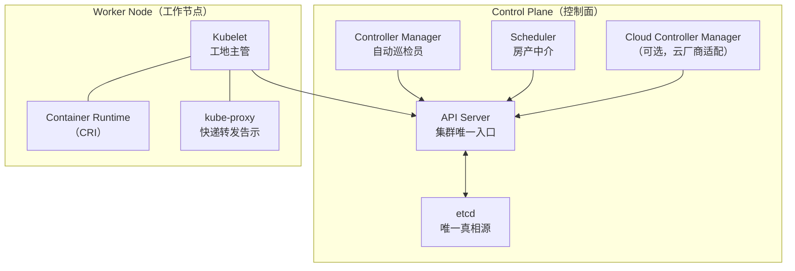
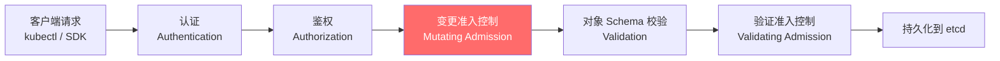
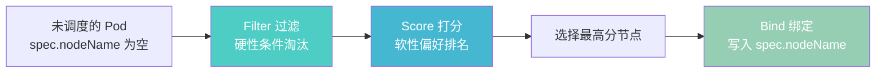
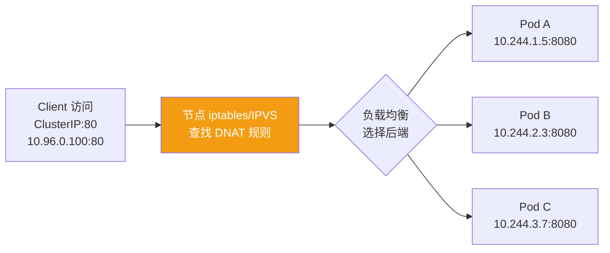
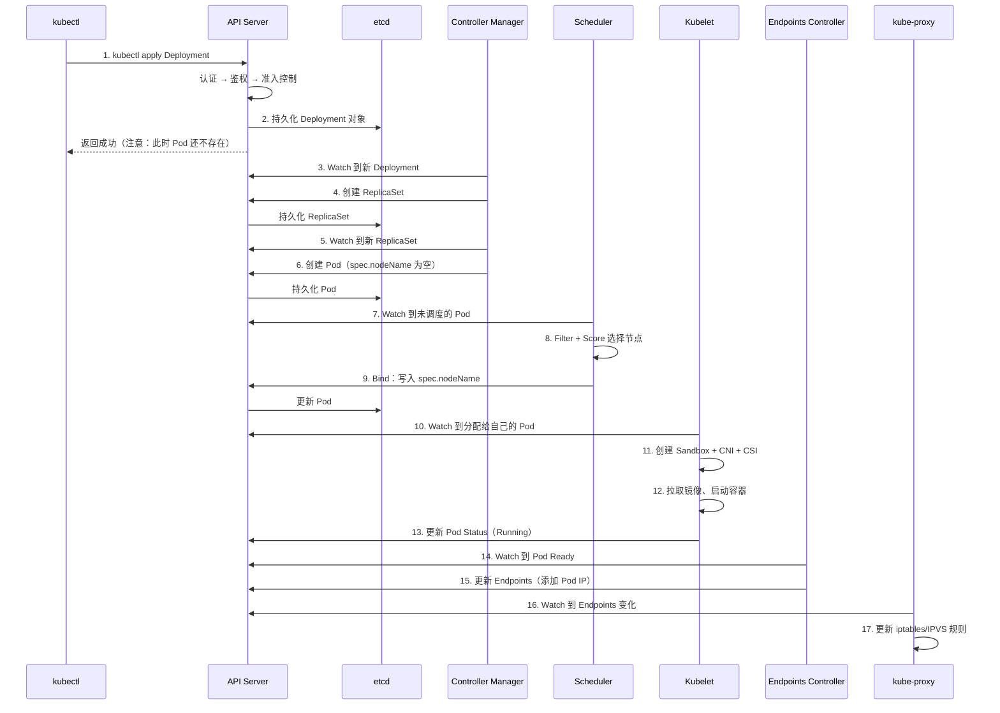

## 引子：一个 Webhook 搞瘫整个集群

### 17:28 — 安全团队的 webhook 后端挂了

安全团队上周部署了一个 `security-scanner` 的 MutatingAdmissionWebhook，用于在资源创建和更新时做安全扫描。它的后端 Pod 因为一次常规节点维护被驱逐后，没有成功重新调度 — 但这时候还没人注意到。

它的关键配置如下：

```yaml
failurePolicy: Fail        # 调不通就拒绝请求
timeoutSeconds: 30          # 每次超时等 30 秒
matchPolicy: Equivalent
rules:
  - apiGroups: ["*"]        # 匹配所有 API Group
    apiVersions: ["*"]      # 匹配所有版本
    resources: ["*"]        # 匹配所有资源
    operations: ["CREATE", "UPDATE"]
```

`rules: ["*"]` 意味着**集群里所有资源的所有写操作**都要经过它。后端一挂，每个写请求都要等 30 秒超时才返回失败。

### 17:29 — 连锁反应开始

API Server 的 goroutine 开始堆积。每个写请求占住一个 goroutine 等 30 秒，新请求不断涌入。请求队列迅速堆满，API Server 开始变慢 — 不只是写请求，**连读请求都受到影响**。

### 17:31 — 告警群炸了

```
CRITICAL: kubectl get pods -n production — timeout after 30s
CRITICAL: New pod creation failed — context deadline exceeded
WARNING: HPA unable to scale deployment/order-service
```

SRE 团队迅速介入。现象很诡异：

- `kubectl` 所有命令超时，包括最简单的 `kubectl get nodes`
- **新 Pod 无法创建**，Deployment 的 rollout 完全卡住
- 但**已经在运行的 Pod 一切正常**，业务流量没有受到影响
- 节点 CPU、内存、磁盘全部正常

已运行的 Pod 正常，说明数据面（data plane）没问题。问题出在控制面（control plane）。

### 17:33 — 定位根因

第一反应是看 API Server。`kubectl` 都超时了，API Server 肯定有问题。但 API Server 进程活着、端口在监听、health check 有时候还能返回 200。

转去看 API Server 的日志：

```
W0424 17:32:15.123456 1 dispatcher.go:142] Failed calling webhook "mutate.security-scanner.io":
  context deadline exceeded (Client.Timeout exceeded while awaiting headers)
W0424 17:32:15.123457 1 dispatcher.go:142] Failed calling webhook "mutate.security-scanner.io":
  context deadline exceeded
```

日志里全是这条 webhook 调用超时的记录。

```bash
kubectl get mutatingwebhookconfigurations
```

找到了元凶 — `security-scanner`，后端 Pod 不在了。

### 17:35 — 修复，集群恢复

```bash
kubectl delete mutatingwebhookconfiguration security-scanner
```

集群瞬间恢复。**从 webhook 后端挂掉到集群完全瘫痪，只用了 3 分钟。从告警到修复，只用了 4 分钟。**

### 复盘

整个过程只有 7 分钟。但这次故障让我重新思考一个问题：**为什么一个小小的 webhook 就能搞瘫整个集群？** 要回答这个问题，必须深入理解 Kubernetes 的架构设计。

这篇文章将从这个故障出发，系统梳理 K8s 每个核心组件的职责、协作方式和设计哲学。看完之后，你遇到类似问题时，不用猜，直接就知道去查什么。

---

## 整体架构：声明式 + 最终一致性

Kubernetes 的核心哲学可以用一句话概括：

> **你告诉系统你要什么（声明式），系统自己想办法达到那个状态（Reconcile 循环），并且保证最终会达到（最终一致性）。**

这和传统的命令式系统（"先创建容器、再配置网络、再挂载存储"）有本质区别。你只需要写一份 YAML 描述期望状态，剩下的事情交给 K8s 各个组件协作完成。

一个关键推论：**`kubectl apply` 返回成功，只意味着"etcd 里记下来了"**。至于 Pod 是否真的跑起来了、Service 是否真的通了 — 那是"最终"会发生的事，不是"立刻"发生的事。

### 架构全景图



几个核心设计原则：

1. **API Server 是唯一的入口** — 所有组件只和 API Server 通信，组件之间不直接对话
2. **etcd 是唯一的存储（Single Source of Truth）** — 只有 API Server 直接读写 etcd，其他组件通过 API Server 间接访问。严格来说，K8s 架构要求的是"API Server 背后有且只有一个存储后端"，etcd 是默认实现。K3s 通过 [kine](https://github.com/k3s-io/kine) 适配层支持 SQLite/PostgreSQL/MySQL 替代 etcd，但上层接口不变
3. **控制面组件都是无状态的** — 它们的状态全在 etcd 里，挂了重启就行
4. **Watch 机制驱动一切** — 组件不是轮询，而是 watch API Server 的变化事件，实时响应

理解了这些原则，回头看 webhook 故障就很清楚了：API Server 是唯一入口，它一旦阻塞，所有组件（Scheduler、Controller Manager、Kubelet）全都"失联"，但已经在运行的 Pod 不受影响，因为它们不需要和控制面通信就能继续工作。

---

## API Server：集群的唯一入口

### 要解决的问题

Kubernetes 有几十个组件（Controller Manager、Scheduler、Kubelet、各种 Operator），还有外部用户通过 kubectl 操作集群。**如果让这些组件自由互相通信，系统的复杂度会爆炸，安全性和一致性都无法保证。**

### 解决方式

API Server 充当**集群的唯一入口**。所有对集群状态的读写都必须经过它，它提供统一的 RESTful API、认证鉴权、准入控制和 Watch 机制。

### 请求处理链

每个到达 API Server 的请求都要经过一条完整的处理链。这条链就是理解开头 webhook 故障的关键：



**各阶段详解：**

**1. 认证（Authentication）**

确认"你是谁"。支持多种认证方式：

- X.509 客户端证书（kubelet 常用）
- Bearer Token（ServiceAccount 常用）
- OpenID Connect（企业 SSO 常用）
- Webhook Token 认证（自定义认证服务器）

认证是按顺序尝试的，任何一种方式认证通过即可。

**2. 鉴权（Authorization）**

确认"你能不能做这件事"。主要使用 RBAC（Role-Based Access Control）：

```yaml
# 这个 ClusterRole 允许读取所有 namespace 的 Pod
apiVersion: rbac.authorization.k8s.io/v1
kind: ClusterRole
metadata:
  name: pod-reader
rules:
  - apiGroups: [""]
    resources: ["pods"]
    verbs: ["get", "list", "watch"]
```

**3. 准入控制（Admission Control）**

这就是 webhook 故障发生的地方。准入控制分两种：

- **Mutating Admission**：可以修改请求对象（比如自动注入 sidecar、添加 label）
- **Validating Admission**：只能拒绝或放行请求，不能修改

内置的准入控制器有几十个（LimitRanger、DefaultStorageClass、PodSecurity 等），还可以通过 Webhook 扩展。

回到故障场景：`security-scanner` 是一个 MutatingAdmissionWebhook。它在处理链的第 4 步。每个写请求到了这一步，API Server 都要 HTTP 调用 webhook 后端，后端挂了就超时等待 30 秒。大量 goroutine 被阻塞，请求队列溢出，最终连读请求都受影响。

**4. 持久化到 etcd**

通过所有准入控制后，对象被序列化并写入 etcd。

### Watch 机制

Watch 是 K8s 架构的灵魂。它让所有组件能实时感知集群状态变化，而不需要轮询。

```
客户端 ──HTTP/1.1 chunked transfer──> API Server ──gRPC Watch──> etcd
```

注意这里的协议差异：

- **客户端 → API Server**：HTTP/1.1 chunked transfer encoding（长连接，服务端不断推送事件）
- **API Server → etcd**：gRPC 双向流

客户端（比如 Controller Manager）发起 Watch 请求后，API Server 维持一个长连接，每当 etcd 中对应资源发生变化，就通过这个连接推送事件。

为什么不用 gRPC 到客户端？因为 HTTP/1.1 更通用，兼容各种语言的 HTTP 客户端、代理、负载均衡器。而 etcd 是内部组件，用 gRPC 效率更高。

### Informer 机制

Informer 是 client-go 对 Watch 能力的上层封装。三者的层级关系：

| 层级 | 是什么 | 解决什么问题 |
|------|--------|-------------|
| **Watch** | API Server 提供的底层能力 | 长连接，服务端推送资源变化事件 |
| **List-Watch** | 一种使用模式 | 先 List 拿全量，再 Watch 拿增量，解决初始数据获取 |
| **Informer** | client-go 的封装 | 在 List-Watch 之上加本地缓存、索引、断线重连、事件分发 |

直接 Watch API Server 会有问题：如果连接断开再重连，中间的事件可能丢失。Informer 解决了这个问题：

1. 首次启动时，执行 **List** 获取全量数据，缓存到本地
2. 然后执行 **Watch**，实时同步增量变化
3. 连接断开时，基于 `resourceVersion` 重新 Watch，不会丢事件。`resourceVersion` 是每个 K8s 对象 `metadata` 中的一个字段，本质上是 etcd 的全局递增修订号（revision），每次对象被修改它都会变。Informer 记住断开前最后收到的 `resourceVersion`，重连时告诉 API Server"从这个版本之后的变化给我"，从而实现断线续传
4. 本地维护一个 **索引缓存**，读操作直接查本地缓存，不需要请求 API Server

这意味着 Controller Manager 中的几十个 Controller 读取集群状态时，大部分读的是本地缓存，不会给 API Server 施加压力。

### API Server 的无状态特性

API Server 自身不存储任何状态，所有状态都在 etcd 里。这意味着：

- 可以运行多个 API Server 实例做高可用
- 任何一个实例挂了，直接重启，不丢数据
- 前面挂个负载均衡器就能水平扩展

> **面试追问：** 为什么 API Server 用 HTTP/1.1 chunked transfer 而不是 gRPC 作为 Watch 协议？
>
> 答：兼容性。K8s 的客户端生态非常广泛 — Go 有 [client-go](https://github.com/kubernetes/client-go)，Python 有 [kubernetes-client/python](https://github.com/kubernetes-client/python)，Java 有 [fabric8io/kubernetes-client](https://github.com/fabric8io/kubernetes-client)；Operator 方面，Prometheus Operator、Istio、ArgoCD 等都通过 HTTP 与 API Server 通信。HTTP/1.1 是最通用的协议，几乎所有语言都有成熟的 HTTP 客户端库。
>
> 而且 HTTP/1.1 能穿透大多数网络中间层：企业内部的 Nginx/HAProxy 反向代理、云厂商的 L7 负载均衡器（AWS ALB、GCP HTTP LB）都原生支持 HTTP/1.1 长连接。gRPC 基于 HTTP/2，而很多企业代理、老旧防火墙、以及部分云厂商的负载均衡器不支持或需要额外配置 HTTP/2 的流式传输，会导致连接被中断或降级。
>
> etcd 是内部组件，控制面内部的通信链路可控（没有外部代理和防火墙），所以用 gRPC 获取更好的性能。

---

## etcd：集群的唯一真相源

### 要解决的问题

分布式系统需要一个所有节点都认可的"真相源"。在网络分区、节点故障的情况下，如何保证数据的一致性和可用性？

### 解决方式

etcd 是一个基于 Raft 共识算法的分布式键值存储。它保证了**强一致性** — 任何一次读操作都能读到最新的已提交数据。

### Raft 共识

Raft（发音同英文单词 raft /ræft/，"木筏"）由斯坦福大学的 Diego Ongaro 和 John Ousterhout 于 2014 年提出（论文：[*In Search of an Understandable Consensus Algorithm*](https://raft.github.io/raft.pdf)）。名字来自 **R**eliable、**R**eplicated、**R**edundant、**A**nd **F**ault-**T**olerant 这几个词，同时也隐喻"木筏" — 在 Paxos 这座难以理解的孤岛上，Raft 是帮你逃离的筏子。

**一句话概括 Raft 的核心价值：它和 Paxos 一样正确、一样高效，但远比 Paxos 容易理解和实现。** Paxos 是分布式共识的经典算法，由 Leslie Lamport（也是 LaTeX 的发明者）在 1989 年提出，名字来自希腊的 Paxos 岛 — 他用岛上议会投票的寓言来解释算法。Paxos 理论上正确且完备，但以晦涩著称：Lamport 自己后来又写了 *Paxos Made Simple* 试图简化解释，Google 在实现基于 Paxos 的 Chubby 分布式锁服务时也总结过"Paxos 的工程实现和论文描述之间有巨大的鸿沟"。Raft 正是为了解决"正确但没人能正确实现"这个问题，把共识拆分为 Leader 选举、日志复制、安全性三个独立子问题，大幅降低了理解和实现的门槛。注意这里的"日志"不是程序运行日志（application log），而是 **Write-Ahead Log（预写日志）** — 每条 entry 是一个状态变更操作（比如"把 key X 设置为 value Y"）。Raft 通过让 Leader 把这些日志 entry 复制到所有 Follower，所有节点按相同顺序执行这些 entry，最终得到一致的数据状态。**日志就是数据本身的载体。**

2014 年 Raft 论文发表之后，绝大多数需要强一致性的新一代分布式系统都选择了 Raft（而非更早但更难实现的 Paxos）。除了 etcd，以下知名项目也使用 Raft 算法：

- **HashiCorp Consul / Vault / Nomad** — 服务发现、密钥管理、任务调度，核心一致性层都基于 [hashicorp/raft](https://github.com/hashicorp/raft)（Go 实现）
- **TiKV / TiDB** — PingCAP 的分布式数据库，底层存储引擎 TiKV 使用 Raft 做数据复制（Rust 实现）
- **CockroachDB** — 分布式 SQL 数据库，每个 Range 都是一个 Raft Group
- **RethinkDB** — 分布式文档数据库（C++ 实现）

etcd 通常部署 3 或 5 个节点：

| 节点数 | 多数派 | 容忍故障数 | 适用场景 |
|--------|--------|-----------|---------|
| 1 | 1 | 0 | 开发/测试（minikube、kind） |
| 2 | 2 | 0 | 没人用 — 容错和 1 节点一样，写性能还更差 |
| 3 | 2 | 1 | 生产环境最常见 |
| 5 | 3 | 2 | 高可用生产环境 |

为什么是奇数？因为 Raft 需要"多数派"达成共识。4 个节点和 3 个节点的容错能力一样（都只能容忍 1 个故障），但 4 个节点多了一个需要同步的节点，反而降低了写入性能。

> **一句话记忆：** 3 节点挂 1 个没事，5 节点挂 2 个没事。超过一半挂了，集群就不可用了。

**"不可用"具体是什么意思？** 当存活节点不足多数派时，Raft 无法选出 Leader（或现有 Leader 联系不到多数节点会主动卸任）。没有 Leader：

- **写请求**：直接拒绝，返回错误。不会出现"写进去后 crash"或"写进去后被其他节点覆盖"的情况 — **Raft 宁可不可用，也不会写入不一致的数据**，这是强一致性的核心保证
- **读请求**：默认也会失败（K8s 默认要求线性一致性读，需要确认当前 Leader 仍然合法）

在 K8s 中，etcd 不可用意味着 API Server 无法写入任何数据，集群控制面瘫痪：无法创建、更新、删除任何资源。但和 webhook 故障一样，**已经在运行的 Pod 不受影响** — 数据面和控制面是隔离的。

### 存储结构

etcd 中 K8s 数据的存储格式：

```
/registry/<资源类型>/<namespace>/<名称>

# 示例
/registry/pods/default/nginx-7d9b8c6f5-x2k4m
/registry/deployments/kube-system/coredns
/registry/nodes/worker-01
/registry/services/specs/default/kubernetes
```

你可以用 `etcdctl` 直接查看（生产环境慎用）：

```bash
# 列出所有 key
ETCDCTL_API=3 etcdctl get /registry --prefix --keys-only

# 查看某个 Pod 的数据（protobuf 编码，需要解码）
ETCDCTL_API=3 etcdctl get /registry/pods/default/nginx-xxx
```

存储的数据默认是 protobuf 编码的，不是 JSON。API Server 在读取时会解码成 API 对象。

### 性能特征

etcd 对磁盘延迟非常敏感。几个关键数字：

| 指标 | 建议值 |
|------|--------|
| 磁盘 fsync 延迟 | < 10ms |
| 推荐磁盘类型 | SSD（IOPS > 3000） |
| 数据库大小上限 | 默认 2GB，可调到 8GB |
| Key 数量 | 建议 < 100,000 |

如果 etcd 慢了，**整个集群都会慢**。因为 API Server 的每次写操作都要等 etcd 确认持久化成功。

> **实战建议：** 生产环境的 etcd 一定要用独立的 SSD 磁盘，不要和其他服务共享。如果用云服务，选高 IOPS 的磁盘类型。很多"集群突然变慢"的问题，根因是 etcd 磁盘 IO 饱和了。

### etcd 与 API Server 的关系

再次强调：**只有 API Server 直接读写 etcd**。这个设计至关重要：

1. **安全性**：etcd 不需要暴露给其他组件，减少攻击面
2. **一致性**：所有读写都经过 API Server，便于实现乐观并发控制（通过 `resourceVersion`）
3. **抽象性**：理论上可以换掉 etcd（比如用 Kine + MySQL/PostgreSQL），其他组件完全不需要改动

---

## Controller Manager：自动巡检员

### 要解决的问题

用户声明了期望状态（"我要 3 个 nginx Pod"），谁来确保实际状态和期望状态一致？如果某个 Pod 挂了，谁来自动重建？

### 解决方式

Controller Manager 运行着几十个 **Controller**，每个 Controller 负责一种资源的 Reconcile。它们不断地：

1. **Watch** API Server，获取资源变化事件
2. **比较** 期望状态（spec）和实际状态（status）
3. **采取行动** 使实际状态趋近期望状态

这就是 Kubernetes 最核心的设计模式 — **Reconcile Loop（调谐循环）**。"调谐"是 Reconcile 的常见中文翻译，意为"将实际状态不断调整到期望状态"。后文统一使用 Reconcile。

### 核心 Controller 列表

| Controller | 职责 | 类比 |
|-----------|------|------|
| Deployment Controller | 管理 ReplicaSet 的创建和滚动更新 | 项目经理 |
| ReplicaSet Controller | 确保 Pod 副本数符合期望 | 工头 |
| StatefulSet Controller | 管理有状态应用的有序部署和扩缩 | 排号管理员 |
| DaemonSet Controller | 确保每个节点上都运行一个 Pod | 物业管理 |
| Job Controller | 管理一次性任务的执行 | 临时工调度 |
| CronJob Controller | 管理定时任务 | 闹钟 |
| Node Controller | 监控节点健康状态，驱逐不健康节点上的 Pod | 安全巡检 |
| Endpoints Controller | 维护 Service 和 Pod 的映射关系 | 通讯录更新 |
| Namespace Controller | 清理被删除 Namespace 下的所有资源 | 退租清洁工 |
| ServiceAccount Controller | 为新 Namespace 创建默认 ServiceAccount | 办公室行政 |

以上是 K8s 内置的核心 Controller。但在实际的 K8s 产品开发中，这些内置 Controller 远远不够 — 开发者需要通过 **CRD（Custom Resource Definition）+ 自定义 Controller** 的模式来扩展 K8s 的能力。这种模式通常称为 **Operator 模式**。例如 Prometheus Operator 管理监控实例、Istio 管理服务网格配置、cert-manager 管理 TLS 证书，它们都是自定义 Controller。可以说，**编写自定义 Controller 是 K8s 生态开发者最核心的日常工作之一**。

### Reconcile 循环示意

以 ReplicaSet Controller 为例，假设 `spec.replicas: 3`：

```
期望状态：3 个 Pod
实际状态：2 个 Pod（一个刚被 OOMKilled）

差值 = 3 - 2 = 1
→ 创建 1 个新 Pod（通过 API Server 写入 etcd）
→ Scheduler 看到新 Pod，分配节点
→ Kubelet 看到分配给自己的 Pod，启动容器
→ 实际状态变成 3 个 Pod
→ Reconcile 完成
```

这个循环是**持续运行的**。即使此刻一切正常，Controller 也在不断 Watch，随时准备响应变化。

### Leader Election

Controller Manager 通常部署多个实例做高可用，但**同一时刻只有一个实例在工作**（active-standby 模式）。

为什么？因为如果两个实例同时运行 ReplicaSet Controller，都发现副本不够，各自创建一个新 Pod，就会多出来一个。

Leader Election 的实现很巧妙：利用 K8s 自身的 Lease 对象实现分布式锁。**注意：这里的 Leader Election 和 Raft 算法中的 Leader Election 名字相同，但机制和目的完全不同：**

| | Raft Leader Election | K8s Leader Election |
|---|---|---|
| **目的** | 协调数据复制，保证多节点数据一致性 | 避免重复工作，保证同一时刻只有一个实例在干活 |
| **机制** | 节点间互相投票（Term + 多数派） | 抢占一个 Lease 对象（谁先写成功谁是 Leader） |
| **依赖** | 不依赖外部存储，节点间自组织 | 依赖 K8s API Server（etcd）作为共享存储 |
| **数据复制** | 有，Leader 把日志复制到所有 Follower | 没有，Standby 实例不做任何事 |

```bash
# 查看当前 leader
kubectl get lease -n kube-system kube-controller-manager -o yaml
```

```yaml
apiVersion: coordination.k8s.io/v1
kind: Lease
metadata:
  name: kube-controller-manager
  namespace: kube-system
spec:
  holderIdentity: master-01_xxxxxxxx    # 当前 leader
  leaseDurationSeconds: 15
  renewTime: "2026-04-24T10:00:00Z"     # leader 最后续约时间
```

Leader 每隔几秒钟续约一次 Lease。如果 Leader 挂了，超过 `leaseDurationSeconds` 没有续约，其他实例就会竞争获取 Lease，新的 Leader 接管工作。

切换时间通常在 15-30 秒左右。在这段时间内，Controller 不会响应变化，但因为最终一致性的设计，切换完成后会自动追补遗漏的 Reconcile。

> **面试追问：** Controller Manager 为什么不做多活（active-active），而是用 Leader Election 做主备？
>
> 答：核心原因是 **trade-off 不划算**。
>
> 首先，单实例的吞吐量已经够用。Controller Manager 管理的是集群控制面的状态（Pod、Deployment、ReplicaSet 等），不是业务流量。即使是大规模集群，资源对象的数量级也是几千到几万，不是像业务 API 那样面对每秒几万甚至几十万的请求。而且单个 Controller 实例内部已经支持并发 — controller-runtime 的 `MaxConcurrentReconciles` 参数可以启动多个 worker goroutine 同时处理**不同的对象**（workqueue 保证同一个对象不会被并发 Reconcile）。
>
> 其次，多活带来的复杂度远大于收益。如果两个实例同时运行同一个 Controller，它们可能同时发现差值并同时采取行动，导致重复操作（比如各创建一个 Pod，多出来一个）。要解决这个问题，就需要跨实例的分布式协调（对象分片、分布式锁、冲突检测与合并），代码复杂度会爆炸。对于一个管理几千个资源对象的控制面组件来说，这些复杂度完全没有必要。
>
> 所以结论是：**Leader Election 主备 + 单实例内并发 Reconcile，已经能覆盖绝大部分生产场景的吞吐需求，多活架构带来的额外复杂度不值得。**

---

## Scheduler：房产中介

### 要解决的问题

新创建的 Pod 需要运行在某个节点上。选哪个节点？要考虑节点资源是否够用、亲和性规则、污点容忍、数据亲和性等等，这是一个复杂的决策问题。

### 解决方式

Scheduler 是 K8s 的"房产中介"：Pod 是"租客"，Node 是"房源"。Scheduler 的工作就是给每个没有分配节点的 Pod 找到一个合适的节点。

### 调度流程



**1. Filter（过滤）— 硬性条件**

淘汰不满足条件的节点。常见的 Filter 插件：

- **NodeResourcesFit**：节点剩余资源是否满足 Pod 的 requests
- **NodeSelector**：Pod 的 nodeSelector 是否匹配节点标签
- **TaintToleration**：节点的 Taint 是否被 Pod 容忍
- **NodeAffinity**：Pod 的 requiredDuringSchedulingIgnoredDuringExecution 是否满足
- **PodTopologySpread**：Pod 拓扑分布约束是否满足

如果所有节点都被过滤掉了，Pod 会进入 `Pending` 状态，Event 里会显示 `FailedScheduling`。

**2. Score（打分）— 软性偏好**

对通过 Filter 的节点打分排名。常见的 Score 插件：

- **LeastAllocated**：倾向于资源使用率低的节点（分散负载）
- **MostAllocated**：倾向于资源使用率高的节点（紧凑装箱，节省成本）
- **NodePreferAvoidPods**：避免调度到被标记的节点
- **InterPodAffinity**：根据 Pod 间亲和/反亲和打分
- **ImageLocality**：倾向于已经有 Pod 镜像的节点（减少镜像拉取时间）

**3. Bind（绑定）— 最终操作**

选择最高分的节点后，Scheduler 做的事情非常简单：

```
PATCH /api/v1/namespaces/{ns}/pods/{name}/binding
{
  "target": {
    "kind": "Node",
    "name": "worker-03"
  }
}
```

本质上就是**写入 `spec.nodeName`**。Scheduler 不会启动容器、配置网络 — 那些都是 Kubelet 的事。

Scheduler 的角色定义非常清晰：**只做决策，不做执行**。

> **面试追问：** Scheduler 挂了会怎样？
>
> 答：已经运行的 Pod 完全不受影响。只有新创建的 Pod 会卡在 `Pending` 状态，因为没人为它们分配节点。Scheduler 重启后，会 Watch 到所有 `spec.nodeName` 为空的 Pod，重新开始调度。因为 Scheduler 也是无状态的，所有状态都在 etcd 里。

> **面试追问：** 如果手动把一个已运行 Pod 的 `spec.nodeName` 清空，Scheduler 会重新调度它吗？
>
> 答：不会。首先，API Server 大概率会直接拒绝这个修改 — Pod 的很多 spec 字段在创建后是 immutable 的。即使修改成功，Scheduler 也不会重新调度它，因为 **Scheduler 只 Watch `spec.nodeName` 为空的新 Pod**，不会关注已有 Pod 的 nodeName 变化。而原来节点上的 Kubelet 发现这个 Pod 不再属于自己，会停掉容器，Pod 就直接挂了。想让 Pod 换节点，正确做法是**删除 Pod 让上层 Controller（Deployment/ReplicaSet）重建** — 新 Pod 的 `spec.nodeName` 为空，Scheduler 自然会重新调度。这也体现了 K8s 各组件的职责边界：Controller 管"要不要重建"，Scheduler 管"新 Pod 放哪"，各司其职。

---

## Kubelet：工地主管

### 要解决的问题

Scheduler 只是决定了 Pod 应该跑在哪个节点上（写了 `spec.nodeName`），但谁来在那个节点上真正创建容器、配置网络、挂载存储？

### 解决方式

Kubelet 是运行在每个 Worker Node 上的代理进程。它是"工地主管"：拿到施工图纸（Pod spec），指挥工人（Container Runtime、CNI、CSI）完成实际工作。

### 创建 Pod 的详细步骤

当 Kubelet 通过 Watch 发现有一个 Pod 的 `spec.nodeName` 指向自己的节点时，它按照以下顺序执行：

```
1. 创建 Sandbox（Pause 容器）
   └─ 这个容器几乎什么都不做，它的作用是持有 Pod 的 Linux namespace
      （Network Namespace、PID Namespace 等）

2. 调用 CNI 插件配置网络
   └─ 为 Pod 分配 IP 地址
   └─ 配置 veth pair、路由规则
   └─ 设置 Pod 内部的 DNS（/etc/resolv.conf）

3. 调用 CSI 插件挂载存储
   └─ Attach 云磁盘（如果需要）
   └─ Mount 文件系统
   └─ 绑定到 Pod 的指定路径

4. 按顺序启动 Init Containers
   └─ 一个成功后才启动下一个
   └─ 任何一个失败，整个 Pod 重新开始

5. 并行启动主容器（main containers）
   └─ 拉取镜像（如果本地没有）
   └─ 创建容器、设置环境变量、资源限制
   └─ 执行启动命令
```

注意第 1 步的 **Pause 容器**，这是一个容易被忽略但很重要的设计，值得展开说明：

**Pause 容器是什么？** 它的镜像是 `registry.k8s.io/pause:3.9`（仅约 700KB），代码极其简单 — 启动后执行一个 `pause()` 系统调用，永远挂起（sleep），什么业务逻辑都不做。这就是"Pause"名字的来源：它就是一个永远暂停的进程。

**为什么需要它？** 沿用前面的比喻：如果 Node 是楼、Pod 是一间房、业务容器是住在房间里的租客，那 Pause 容器就是**钉在门上的门牌号** — 租客可以搬进搬出（业务容器崩溃重启），但门牌号（IP 地址、网络身份）不会变，快递员（kube-proxy/Service）始终能根据这个门牌号找到这间房。

技术上，Pod 内所有容器需要共享同一个 Network Namespace（共享 IP 地址和端口空间），这个 Namespace 必须由某个进程持有。如果让业务容器持有，业务容器崩溃重启时 Namespace 就会被销毁重建，IP 地址会变，已建立的网络连接会断开。Pause 容器就是这个 Namespace 的"锚点" — 它几乎不可能崩溃（代码只有几十行，不做任何事），所以 Namespace 的生命周期和 Pod 一致，而不是和某个业务容器绑定。

**业务容器启动后 Pause 容器怎么样？** 它会一直运行，直到整个 Pod 被删除。它不会关闭，也不会被回收。通过 `docker ps` 或 `crictl ps` 可以看到每个 Pod 都有一个 Pause 容器在运行。它占用的资源极少（几百 KB 内存），不会对业务产生任何影响。

**除了 Network Namespace，Pause 容器还持有 PID Namespace**（如果启用了 `ShareProcessNamespace`），使同一个 Pod 内的容器可以互相看到对方的进程。

### 常驻职责

Kubelet 不只是在创建 Pod 时工作，它还有很多常驻任务：

**1. 节点心跳（Node Lease）**

Kubelet 每 10 秒更新一次 Lease 对象，告诉控制面"我还活着"。这里有一条完整的故障链：

```
Kubelet 无法更新 Lease（网络故障、Kubelet 进程挂掉、节点宕机等）
  → 超过 40 秒没有续约
  → Node Controller 将节点标记为 NotReady
  → 等待 pod-eviction-timeout（默认 5 分钟）
  → Node Controller 开始驱逐该节点上的所有 Pod
  → 如果 Pod 有上层 Controller（Deployment/ReplicaSet），Controller 会在其他健康节点上重建 Pod
  → 如果是裸 Pod（没有 Controller），驱逐后就没了
```

需要注意的是，**在节点被标记为 NotReady 到 Pod 被驱逐之间有一个等待窗口（默认 5 分钟）**。这是为了避免因短暂的网络抖动就大规模驱逐 Pod。如果 Kubelet 在这个窗口内恢复了 Lease 续约，节点会重新变为 Ready，不会触发驱逐。

```bash
# 查看节点的 Lease
kubectl get lease -n kube-node-lease worker-01 -o yaml
```

**2. 容器健康探测（Probes）**

Probe（探针）配置在 Pod spec 的每个 container 定义中。Kubelet 通过 Watch API Server 拿到 Pod spec 后，在本地周期性地对容器执行探针检查（直接和容器交互，不经过 API Server），然后把结果更新到 Pod 的 status 中。

Kubelet 负责执行三种 Probe：

| Probe | 作用 | 失败后果 |
|-------|------|---------|
| **livenessProbe** | 容器是否还活着 | 杀掉容器并重启 |
| **readinessProbe** | 容器是否准备好接收流量 | 从 Service Endpoints 中移除 |
| **startupProbe** | 容器是否完成启动 | 在启动期间暂停 liveness 检查 |

探针的执行频率和判定逻辑通过以下参数控制：

| 参数 | 含义 | 默认值 | 最小值 |
|------|------|--------|--------|
| `periodSeconds` | 检查频率 | 10s | 1s |
| `timeoutSeconds` | 单次检查超时 | 1s | 1s |
| `successThreshold` | 连续成功几次算通过 | 1 | 1 |
| `failureThreshold` | 连续失败几次算失败 | 3 | 1 |
| `initialDelaySeconds` | 容器启动后多久开始检查 | 0s | 0s |

生产中不建议把 `periodSeconds` 设得过低（比如 1 秒）。每次探针检查都有开销 — HTTP 探针要发请求，exec 探针要在容器里启动进程。如果节点上有几百个容器，每个都 1 秒检查一次，Kubelet 的 CPU 开销会明显上升。

一个常见的配置错误：没配 readinessProbe 就直接上线，导致 Pod 还没启动完成就开始接收流量，请求全部失败。

**3. 资源监控和驱逐**

Kubelet 持续监控节点资源使用情况。当磁盘或内存压力过大时，会触发 Pod 驱逐：

- **内存压力**：按 QoS 等级驱逐（BestEffort → Burstable → Guaranteed）
- **磁盘压力**：清理镜像和已停止容器，必要时驱逐 Pod
- **PID 压力**：节点 PID 资源不足时驱逐 Pod

**4. 静态 Pod 管理**

Kubelet 可以管理"静态 Pod" — 通过读取本地文件（通常在 `/etc/kubernetes/manifests/`）创建的 Pod，不经过 API Server 调度。控制面组件（API Server、Controller Manager、Scheduler、etcd）在 kubeadm 部署模式下就是静态 Pod。

这带来一个有趣的循环依赖：API Server 是静态 Pod，由 Kubelet 管理。但 Kubelet 又需要连接 API Server。实际上，Kubelet 在 API Server 不可用时仍然能管理静态 Pod，只是无法与控制面同步状态。

---

## kube-proxy：快递转发告示

### 要解决的问题

Service 是 K8s 的服务发现和负载均衡抽象。但 Service 的 ClusterIP 是一个"虚拟 IP"，它不对应任何网卡或进程。那访问 ClusterIP 的流量是怎么到达后端 Pod 的？

### 解决方式

kube-proxy 运行在每个节点上，它 Watch API Server 中 Service 和 Endpoints 的变化，然后在节点上配置**网络规则**（iptables、IPVS 或 nftables），将访问 Service ClusterIP 的流量通过 **DNAT（Destination Network Address Translation，目标网络地址转换）** 转发到后端 Pod 的实际 IP。

注意：kube-proxy 并不代理实际流量。它只是在每个节点上"贴告示"（写规则），告诉内核"如果看到目标地址是 X，就转发到 Y"。

### DNAT 过程



**具体过程：**

1. Client 发送请求到 `10.96.0.100:80`（Service ClusterIP）
2. 请求到达节点内核的 netfilter 框架
3. iptables/IPVS 规则匹配目标地址 `10.96.0.100:80`
4. 将目标地址替换为某个后端 Pod 的实际地址（如 `10.244.1.5:8080`）
5. 请求被发送到目标 Pod

整个过程在内核态完成，Client 完全不知道有 DNAT 发生。

**DNAT 发生在哪个节点上？** Client 所在的节点。不管 Client 是 Pod 还是节点上的进程，它发出的包首先经过自己所在节点的内核网络栈，iptables/IPVS 规则就在这里生效。这也是为什么 kube-proxy 以 DaemonSet 的形式在**每个节点**上都运行 — 任何节点都可能是流量的入口。而且**每个节点上的 kube-proxy 都维护整个集群所有 Service → 所有后端 Pod 的完整映射**，不是只维护本节点上的 Pod，因为 DNAT 的目标可能是任何节点上的 Pod。

**外部客户端（如 kubectl）呢？** kubectl 访问的是 API Server 的真实地址（如 `https://api.cluster.example.com:6443`），不是 ClusterIP，不需要 DNAT，走的是普通的外部网络路由。ClusterIP 是一个虚拟 IP，**只在集群内部有效** — 它只存在于各节点的 iptables/IPVS 规则中，集群外的网络设备根本不认识它。

**如果后端 Pod 不在同一个节点上怎么办？** kube-proxy 不需要关心这个问题。K8s 的网络模型有一个硬性要求：**集群内所有 Pod 的 IP 必须互通，不管它们在不在同一个节点上。** 这个要求由 CNI 插件（如 Calico、Flannel、Cilium）实现，它们会在节点之间建立网络通道（VXLAN 隧道、BGP 路由等）。所以 kube-proxy 只负责 DNAT（把 ClusterIP 替换为 Pod IP），DNAT 之后，内核路由表（由 CNI 维护）会自动把包送到正确的节点。**kube-proxy 管地址转换，CNI 管跨节点路由，各司其职。**

### 三种代理模式

| 模式 | 实现 | 适用场景 | 性能 |
|------|------|---------|------|
| **iptables**（默认） | 内核 iptables 规则 | 中小集群（< 5000 Service） | O(n) 规则匹配 |
| **IPVS** | 内核 IPVS 模块 | 大集群（> 5000 Service） | O(1) 哈希查找 |
| **nftables** | 内核 nftables | K8s 1.29+ 新选项 | 介于两者之间 |

iptables 模式在 Service 数量很多时会有性能问题，因为 iptables 规则是线性匹配的。10,000 个 Service 意味着 ~50,000 条 iptables 规则，每个数据包都要从头遍历。IPVS 使用哈希表查找，性能与 Service 数量无关。

```bash
# 查看当前 kube-proxy 模式
kubectl get configmap kube-proxy -n kube-system -o yaml | grep mode

# iptables 模式下查看规则（输出会很多）
iptables -t nat -L KUBE-SERVICES

# IPVS 模式下查看规则
ipvsadm -Ln
```

> **实战建议：** 如果你的集群有超过 1000 个 Service，建议切换到 IPVS 模式。iptables 模式不仅规则匹配慢，而且每次 Service/Endpoints 变化时需要全量更新 iptables 规则，会导致短暂的网络中断。

### 从集群外部访问 Service

ClusterIP 只在集群内部有效，集群外的网络设备根本不认识它。那从外部怎么访问集群内的 Service？

| 方式 | 原理 | 适用场景 |
|------|------|---------|
| **NodePort** | 在每个节点上开一个固定端口（30000-32767），外部通过 `节点IP:NodePort` 访问，节点上的 kube-proxy 再做 DNAT 转到后端 Pod | 开发测试、简单暴露 |
| **LoadBalancer** | 云厂商创建外部负载均衡器（如 AWS ELB），分配公网 IP，流量到达节点的 NodePort 后再转发 | 云环境生产部署 |
| **Ingress** | L7 层路由，根据域名/路径把 HTTP 请求路由到不同 Service | 多服务共享同一入口、需要域名路由 |

不管哪种方式，外部流量的入口都是**节点的真实 IP**（NodePort）或**外部负载均衡器的 IP**（LoadBalancer），到了节点之后才进入 kube-proxy 的 DNAT 流程。ClusterIP 始终只是集群内部的事。

---

## 创建 Pod 的完整流程

现在把所有组件串联起来，看一个 `kubectl apply -f deployment.yaml` 的完整生命周期：



**关键时间线分析：**

- 步骤 1-2：`kubectl apply` 返回成功。但此时只是 Deployment 对象写入了 etcd，Pod 还不存在。
- 步骤 3-6：Controller Manager 的级联创建。Deployment → ReplicaSet → Pod，每一步都是独立的 Reconcile 循环。
- 步骤 7-9：Scheduler 选择节点。这一步可能需要几百毫秒到几秒。
- 步骤 10-13：Kubelet 实际执行。拉取镜像可能需要几十秒甚至几分钟。
- 步骤 14-17：Service 生效。Pod 的 IP 被加入 Endpoints，kube-proxy 更新规则。

**整个过程没有任何组件直接调用另一个组件。** 所有协作都是通过 API Server 的 Watch 机制异步完成的。这就是声明式架构的力量 — 每个组件只关注自己的职责，通过 Watch 事件触发行动。

---

## 面试追问

### Q1: API Server 挂了，已经运行的 Pod 会怎样？

**短答：不影响已运行的 Pod，但控制面功能全部暂停。**

详细分析：

- ✅ **已运行的 Pod 继续工作** — 容器由 Container Runtime（containerd/CRI-O）管理，它们不依赖 API Server 运行
- ✅ **Pod 内的网络正常** — kube-proxy 已经配好了 iptables/IPVS 规则，数据面不受影响
- ❌ **无法创建/删除/更新任何资源** — 所有写操作都需要经过 API Server
- ❌ **Controller Manager 无法 Reconcile** — 即使 Pod 挂了，也不会自动重建
- ❌ **Scheduler 无法调度** — 新 Pod 卡在 Pending
- ❌ **Kubelet 无法上报状态** — 节点状态信息无法更新
- ❌ **kubectl 完全不可用**

> 本质上，控制面是"管理层"，数据面是"执行层"。管理层挂了，已经在执行的工作不会停止，但新的管理指令无法下达。

### Q2: etcd 数据丢失了怎么办？

**短答：集群完整状态丢失，但正在运行的 Pod 不会立刻停止。**

详细分析：

- 已运行的容器还在，因为 Container Runtime 有自己的状态
- 但 K8s 不再知道这些 Pod 的存在 — 它们变成了"孤儿"
- 所有 Deployment、Service、ConfigMap、Secret 的定义全部丢失
- 集群无法恢复到正常运行状态

**应对措施：**

```bash
# 定期备份 etcd
ETCDCTL_API=3 etcdctl snapshot save /backup/etcd-$(date +%Y%m%d).db \
  --endpoints=https://127.0.0.1:2379 \
  --cacert=/etc/kubernetes/pki/etcd/ca.crt \
  --cert=/etc/kubernetes/pki/etcd/server.crt \
  --key=/etc/kubernetes/pki/etcd/server.key

# 验证备份
ETCDCTL_API=3 etcdctl snapshot status /backup/etcd-20260424.db --write-table
```

> **生产环境必须有 etcd 自动备份策略。** 建议每小时备份一次，保留最近 7 天的快照。

### Q3: Controller Manager 和 Scheduler 同时挂了会怎样？

**短答：已运行的 Pod 正常工作，但集群失去了"自愈"和"调度"能力。**

- 新创建的 Pod 停在 `Pending`（没人调度）
- 已运行 Pod 如果挂了，不会被自动重建（没有 Controller 在 Reconcile）
- Service Endpoints 不会更新（Endpoints Controller 在 Controller Manager 里）
- 滚动更新、扩缩容全部暂停

但 API Server 和 etcd 还能正常工作，kubectl 可以执行 get/create/delete 操作。

### Q4: Kubelet 挂了，节点上的 Pod 会怎样？

**短答：已运行的容器继续工作，但失去了管理能力。**

- 容器继续运行（由 containerd 管理，不依赖 Kubelet）
- 但 Probe 不再执行，健康检查失效
- 节点 Lease 不再续约，约 40 秒后 Node Controller 标记节点为 `NotReady`
- 默认 5 分钟后，Node Controller 开始驱逐该节点上的 Pod（在其他节点重建）
- 注意：Pod 驱逐是逻辑上的（标记为 Terminating），如果 Kubelet 没恢复，旧 Pod 实际上不会被清理

> 这就是为什么 `kubectl get pods` 有时会看到某个节点上的 Pod 长期处于 `Terminating` 状态 — Kubelet 挂了，没人执行实际的容器清理。

### Q5: 为什么 K8s 选择声明式架构而不是命令式？

**短答：声明式天然支持自愈和幂等。**

命令式："先创建容器，再配置网络，再挂载存储"

- 如果第二步失败了，需要手动回滚第一步
- 重试时可能重复创建容器
- 系统不知道"正确状态"应该是什么

声明式："我要一个 Pod，它应该有这样的网络和存储"

- Reconcile 循环不断把实际状态推向期望状态
- 操作天然幂等 — 无论执行多少次 Reconcile，结果都一样
- 系统崩溃恢复后，只需要重新读取期望状态，继续 Reconcile

一个直观的类比：

- 命令式 = GPS 导航说"前方 200 米左转"（你偏离了路线，它就懵了）
- 声明式 = 你说"我要去机场"（无论你现在在哪里、怎么偏离，系统总会重新规划路线）

---

## 实战场景

### 场景一：Webhook 拖垮 API Server（本文开头详解）

这就是文章开头讲的故事。总结关键点：

| 项目 | 详情 |
|------|------|
| **现象** | kubectl 命令全部超时，新 Pod 无法创建，但已运行 Pod 正常 |
| **涉及组件** | API Server（Admission Webhook 链） |
| **根因** | MutatingAdmissionWebhook 后端挂了，每个写请求超时等待 30s，goroutine 大量阻塞 |
| **排查路径** | API Server 日志 → webhook 超时 → `kubectl get mutatingwebhookconfigurations` → 找到 `failurePolicy: Fail` 的 webhook |
| **修复** | 临时：`kubectl delete mutatingwebhookconfiguration security-scanner` |

**防御性配置：**

```yaml
apiVersion: admissionregistration.k8s.io/v1
kind: MutatingWebhookConfiguration
metadata:
  name: my-webhook
webhooks:
  - name: mutate.my-webhook.io
    failurePolicy: Ignore         # 后端不可用时放行，而不是阻塞
    timeoutSeconds: 5             # 缩短超时时间
    namespaceSelector:            # 限制作用范围，不要用 "*"
      matchLabels:
        webhook-enabled: "true"
    rules:
      - apiGroups: ["apps"]       # 只匹配需要的资源
        apiVersions: ["v1"]
        resources: ["deployments"]
        operations: ["CREATE"]
```

### 场景二：etcd 磁盘 IO 导致集群响应变慢

| 项目 | 详情 |
|------|------|
| **现象** | 所有 kubectl 操作变慢（几秒到十几秒），但不超时。Pod 创建延迟明显增大 |
| **涉及组件** | etcd |
| **根因** | etcd 和其他服务共用磁盘，IO 被争抢，fsync 延迟从 2ms 飙升到 200ms |
| **排查路径** | API Server 延迟指标 → etcd 慢日志 → 磁盘 IO 监控 |

**排查命令：**

```bash
# 查看 etcd 的 fsync 延迟
# 在 etcd 所在节点
iostat -x 1

# etcd 自身的指标
curl -s http://localhost:2379/metrics | grep etcd_disk_wal_fsync_duration

# 如果 99 分位 > 10ms，就需要关注了
curl -s http://localhost:2379/metrics | grep etcd_disk_backend_commit_duration
```

**修复：** 将 etcd 数据目录迁移到独立的 SSD 磁盘。

### 场景三：节点 NotReady 导致 Pod 被驱逐到其他节点

| 项目 | 详情 |
|------|------|
| **现象** | 某个节点上的所有 Pod 突然被重新调度到其他节点 |
| **涉及组件** | Kubelet → Node Controller（Controller Manager 内） → Scheduler |
| **根因** | 节点网络抖动，Kubelet 无法更新 Lease，Node Controller 标记节点 NotReady 并触发驱逐 |
| **排查路径** | `kubectl get nodes` → 发现 NotReady → `kubectl describe node` → 查看 Conditions 和 Events |

**时间线：**

```
T+0s    Kubelet 因网络问题停止更新 Lease
T+40s   Node Controller 标记节点为 NotReady
T+300s  Node Controller 开始驱逐（默认 pod-eviction-timeout = 5m）
        - 给 Pod 标记 Termination
        - 在其他节点重新创建 Pod
```

**应对措施：**

- 调整 `--pod-eviction-timeout`（默认 5 分钟，视业务场景调整）
- 对重要的有状态服务使用 `tolerations` 容忍短暂的 NotReady
- 使用 PodDisruptionBudget（PDB）限制同时被驱逐的 Pod 数量

```yaml
apiVersion: policy/v1
kind: PodDisruptionBudget
metadata:
  name: my-app-pdb
spec:
  minAvailable: 2
  selector:
    matchLabels:
      app: my-app
```

### 场景四：Scheduler 调度失败，Pod 一直 Pending

| 项目 | 详情 |
|------|------|
| **现象** | Pod 一直处于 Pending 状态，Events 显示 `FailedScheduling` |
| **涉及组件** | Scheduler |
| **常见根因** | 资源不足、nodeSelector 不匹配、Taint 没有 Toleration、PVC 未绑定 |

**排查步骤：**

```bash
# 查看 Pod 事件
kubectl describe pod <pod-name>

# 常见事件消息及含义
# "Insufficient cpu"           → 没有节点有足够的 CPU
# "Insufficient memory"       → 没有节点有足够的内存
# "node(s) didn't match Pod's node affinity/selector" → 标签不匹配
# "node(s) had taint {key=value:NoSchedule}" → 需要添加 toleration
# "persistentvolumeclaim is not bound" → PVC 还没有绑定 PV
```

```bash
# 查看各节点可用资源
kubectl describe nodes | grep -A 5 "Allocated resources"

# 查看节点标签
kubectl get nodes --show-labels

# 查看节点 Taint
kubectl describe nodes | grep Taints
```

**最容易踩的坑：** 设置了 `requests` 但忘了检查集群容量。比如每个 Pod requests 4Gi 内存，集群只有 3 个 8Gi 的节点，去掉系统和 K8s 组件占用后，每个节点实际可用约 6Gi，只能放 1 个 Pod，总共 3 个。如果 Deployment 要求 4 个副本，第 4 个就会永远 Pending。

### 场景五：Service 无法访问后端 Pod

| 项目 | 详情 |
|------|------|
| **现象** | 通过 Service ClusterIP 访问返回 `connection refused` 或 `no route to host` |
| **涉及组件** | kube-proxy、Endpoints Controller |
| **排查路径** | Service → Endpoints → Pod → kube-proxy 规则，逐层排查 |

**排查步骤：**

```bash
# 1. 确认 Service 存在且配置正确
kubectl get svc my-service -o yaml

# 2. 确认 Endpoints 是否有后端 Pod（这步很关键！）
kubectl get endpoints my-service
# 如果 Endpoints 为空，说明没有匹配的 Ready Pod

# 3. 确认 Pod 的 labels 和 Service 的 selector 是否匹配
kubectl get pods --show-labels
kubectl get svc my-service -o jsonpath='{.spec.selector}'

# 4. 确认 Pod 是否 Ready
kubectl get pods -o wide
# 如果 Pod 是 Running 但不是 Ready（0/1），readinessProbe 可能失败了

# 5. 确认 kube-proxy 是否正常
kubectl get pods -n kube-system -l k8s-app=kube-proxy

# 6. 在节点上检查 iptables/IPVS 规则
iptables -t nat -L KUBE-SERVICES | grep <clusterIP>
```

**最常见的原因：** Service 的 `selector` 和 Pod 的 `labels` 不匹配。这种低级错误比你想象的要常见得多。另一个常见原因是 Pod 没配 readinessProbe，容器还在启动但已经被加入 Endpoints，请求路由过来但服务还没准备好。

---

## 关键结论

- 排查故障时，先问"哪些 Pod 受影响"：只有新 Pod 有问题 → 查 Scheduler；所有 kubectl 超时 → 查 API Server 和 Webhook 链；某个节点上的 Pod 异常 → 查该节点的 Kubelet。按影响面定位组件，不要盲目重启。
- `kubectl apply` 返回成功后别急着往下走——它只意味着"etcd 记下来了"。在 CI/CD 流水线中，必须显式等待 Pod Ready（如 `kubectl rollout status`），否则流水线通过了但服务可能根本没起来。
- 生产环境的 Webhook 必须做三件事：`failurePolicy: Ignore`（后端挂了不阻塞请求）、`timeoutSeconds` 缩短到 5 秒以内、`rules` 限定到具体资源类型。`rules: ["*"]` + `failurePolicy: Fail` 是集群级别的定时炸弹。
- 集群"突然变慢"但没有明确报错时，第一个该查的是 etcd 磁盘 IO（`iostat -x 1`）。API Server 的每次写操作都要等 etcd fsync，磁盘延迟 10ms 以上整个集群都会感觉迟钝。
- 遇到 API Server 不可用时不要慌——已经在运行的 Pod 和已配置的网络规则不受影响。优先恢复 API Server，而不是去重启 Worker 节点上的服务。

## 总结

回到文章开头的故障。一个 MutatingAdmissionWebhook 后端挂了，为什么能搞瘫整个集群？

因为 **API Server 是所有组件的唯一入口**。webhook 是请求处理链（认证 → 鉴权 → 准入控制 → 持久化）的一环。这条链上任何一环阻塞，整条链就阻塞了。而所有组件都依赖 API Server，所以整个控制面都受到了影响。

理解 K8s 架构的关键在于理解这些设计决策背后的 **"为什么"**：

- **为什么所有通信都走 API Server？** — 安全性、一致性、可观测性的统一入口
- **为什么只有 API Server 访问 etcd？** — 隔离存储层、简化安全模型、便于替换
- **为什么 Controller 用 Reconcile 循环？** — 声明式天然支持自愈和幂等
- **为什么 Scheduler 只写 `spec.nodeName`？** — 职责单一、解耦执行
- **为什么 kube-proxy 不代理流量？** — 内核态规则比用户态代理性能高几个数量级

掌握了这些，你排查 K8s 问题的能力会有质的飞跃。不再是"重启试试"，而是根据现象精准定位到出问题的组件，然后在对应的层面去排查。
