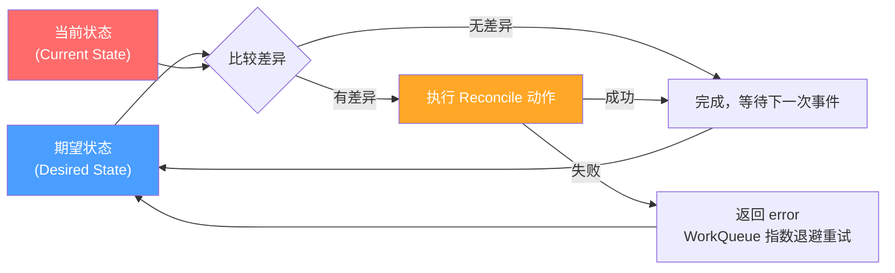
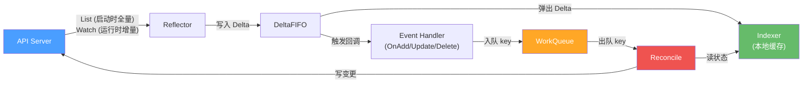

## 一个真实的 P1 故障

周五下午 4 点半，值班群炸了。

监控大屏上，Hub 集群的 API Server 请求延迟从平稳的 50ms 一路飙升到 5 秒以上，etcd 的 leader 选举开始波动，整个管控面摇摇欲坠。与此同时，200 多个 ManagedCluster 同时显示 `Unknown` 状态——它们在一次短暂的网络故障后集体断连，又几乎同时尝试重新注册。

翻开 controller-manager 的日志，满屏都是同一行：

```
Reconcile error, requeue after 5s
```

200 个对象，每 5 秒重试一次。API Server 每秒承受着 40 次无意义的 Reconcile 请求，每次都要读 etcd、做 status 更新，持续不断。这不是 DDoS，但效果比 DDoS 更糟——因为攻击来自"自己人"。

最终定位到问题只有一行代码：

```go
// 问题代码
if err != nil {
    return ctrl.Result{RequeueAfter: 5 * time.Second}, nil  // ← 这里！
}
```

注意看，这行代码返回的 error 是 `nil`。它告诉 controller-runtime："我没出错，只是 5 秒后再跑一次。" 而 WorkQueue 的指数退避机制只对 `error != nil` 的情况生效。换句话说，**这行代码完美绕过了 Kubernetes 设计的所有限速保护**。

修复方案只需要改成：

```go
// 修复后
if err != nil {
    return ctrl.Result{}, err  // 交给 WorkQueue 的指数退避
}
```

当 Reconcile 返回 error 时，WorkQueue 的 `RateLimitingQueue` 会自动应用指数退避——从 5ms 开始，逐步拉长到 1s、2s、4s……最长 16 分钟。200 个对象不再同步重试，而是自然错开，API Server 的压力瞬间降下来。

这个故障只改了一行代码，但要理解**为什么**是这一行，你需要搞懂 Controller 内部的完整机制。这篇文章就从这里开始。

## 声明式 vs 命令式：Controller 存在的哲学基础

在聊 Controller 的内部机制之前，先回答一个更根本的问题：为什么 Kubernetes 要用 Controller 这种模式？

答案藏在"声明式"和"命令式"的区别里。

**命令式**是告诉系统"怎么做"：

```bash
# 命令式：一步步告诉系统操作步骤
kubectl run nginx --image=nginx
kubectl scale deployment nginx --replicas=3
kubectl expose deployment nginx --port=80
```

每一步都是一条命令。如果第二步失败了，你需要自己判断该重试还是回滚。如果执行到一半网络断了，系统停在一个半成品状态，没人会自动修复。

**声明式**是告诉系统"要什么"：

```yaml
# 声明式：只描述最终状态
apiVersion: apps/v1
kind: Deployment
metadata:
  name: nginx
spec:
  replicas: 3
  template:
    spec:
      containers:
      - name: nginx
        image: nginx
        ports:
        - containerPort: 80
```

你只描述期望状态（Desired State），系统自己想办法达到。如果一个 Pod 挂了，系统会自动拉起新的。如果网络断了重连后，系统会重新对账，补齐差异。

这就是 Controller 存在的意义：**它是声明式系统的执行引擎，负责不断地将现实状态 Reconcile（调谐）到期望状态**。

## Reconcile Loop：Controller 的心跳

每一个 Controller 的核心都是一个 Reconcile 循环，伪代码长这样：

```go
func (r *MyReconciler) Reconcile(ctx context.Context, req ctrl.Request) (ctrl.Result, error) {
    // 1. 获取期望状态（从 CR/Spec 中读取）
    desired := getDesiredState(req.NamespacedName)

    // 2. 获取当前状态（从集群/外部系统中读取）
    current := getCurrentState()

    // 3. 比较差异
    diff := compare(desired, current)

    // 4. 执行 Reconcile 动作
    if diff != nil {
        if err := reconcileDiff(diff); err != nil {
            return ctrl.Result{}, err  // 失败→WorkQueue指数退避后重试
        }
    }

    // 5. 完成，不再重新入队
    return ctrl.Result{}, nil
}
```

用一张图来描述这个循环：



**关键设计原则**：Reconcile 函数必须是**幂等**的。因为它可能因为任何原因被调用——资源变更、定时重试、甚至虚假唤醒。你的 Reconcile 逻辑不能假设"上一次执行成功了"或"这次调用一定是因为某个特定事件"。它每次都应该完整地读取期望状态、对比当前状态、补齐差异。

## Informer 机制：Controller 的眼睛

Reconcile 循环回答了 Controller "怎么干活"的问题。但还有一个关键问题：**Controller 怎么知道该干活了？**

难道每隔几秒轮询一次 API Server，问"有没有新变化"？那 1000 个 Controller 同时轮询，API Server 直接崩了。

Kubernetes 的答案是 **Informer**——一套精密的事件监听和本地缓存机制。它确保 Controller 能实时感知资源变化，同时几乎不给 API Server 增加负担。

整个数据流水线长这样：



接下来逐个拆解每个组件。

### Reflector：与 API Server 的桥梁

Reflector 负责与 API Server 通信，获取资源的变更事件。它的工作分两个阶段：

**启动阶段——List**：

Controller 刚启动时，Reflector 向 API Server 发起一次全量 List 请求，拉取指定资源的所有对象。这一次请求建立起本地缓存的基线。

**运行阶段——Watch**：

List 完成后，Reflector 基于返回的 `resourceVersion` 建立一条长连接 Watch，API Server 通过这条连接实时推送增量变更事件（Added、Modified、Deleted）。

**异常处理**：

- 如果 Watch 连接断开，Reflector 会自动用上次的 `resourceVersion` 重新建立 Watch
- 如果 `resourceVersion` 过期（API Server 返回 `410 Gone`），说明 etcd 的历史已经被压缩，Reflector 会退回到全量 re-list
- 从 Kubernetes 1.27 开始，支持 Watch Bookmark 事件，API Server 会定期推送最新的 `resourceVersion`，减少 re-list 的频率

```go
// Reflector 的核心循环（简化版）
func (r *Reflector) ListAndWatch() {
    // 1. 全量 List
    list := r.listerWatcher.List()
    r.syncWith(list)
    resourceVersion := list.ResourceVersion

    for {
        // 2. 基于 resourceVersion Watch 增量事件
        watcher := r.listerWatcher.Watch(resourceVersion)
        for event := range watcher.ResultChan() {
            switch event.Type {
            case Added:
                r.store.Add(event.Object)
            case Modified:
                r.store.Update(event.Object)
            case Deleted:
                r.store.Delete(event.Object)
            case Bookmark:
                // 更新 resourceVersion，不触发回调
            }
            resourceVersion = event.Object.ResourceVersion
        }
        // Watch 断开，循环重连
    }
}
```

### DeltaFIFO：有序的变更队列

> **为什么叫 "Delta"？** Delta（Δ）是希腊字母，对应拉丁字母 D，取自 "difference"（差异）的首字母。数学中 Δx = x₂ - x₁ 表示两个值之间的差，即"变化量/增量"。这个含义从数学传入工程领域后被广泛使用：git diff 产生的是 delta，数据库增量更新叫 delta update，增量同步叫 delta sync。所以 DeltaFIFO 的意思就是：**存储对象增量变化（而非对象快照）的先进先出队列**。

Reflector 收到的事件不是直接交给 Event Handler，而是先写入 DeltaFIFO。这是一个特殊的队列，它做了两件重要的事：

**1. 保持 FIFO 顺序**：确保事件按照发生的先后顺序被处理。如果一个对象先被 Added 再被 Modified，处理顺序绝不会反过来。

**2. 合并同一对象的 Delta**：同一个对象的多次变更会被合并到一个 Delta 列表中。这意味着如果一个 Deployment 在短时间内被修改了 5 次，DeltaFIFO 里只有一个条目（包含 5 个 Delta），而不是 5 个独立条目。

```go
// Delta 的结构
type Delta struct {
    Type   DeltaType  // Added, Updated, Deleted, Replaced, Sync
    Object interface{}
}

// DeltaFIFO 为每个对象维护一个 Delta 列表
// key: "namespace/name"
// value: []Delta
type DeltaFIFO struct {
    items map[string]Deltas  // key → Delta列表
    queue []string           // FIFO 顺序的 key 列表
}
```

DeltaFIFO 弹出（Pop）时，会把一个对象的**所有**累积 Delta 一起交给处理函数。处理函数遍历 Delta 列表，更新 Indexer 缓存，并触发相应的 Event Handler。

### Indexer：本地缓存

Indexer 是 Informer 维护的一份本地缓存，存储了 Controller 关注的所有资源对象的最新状态。

**核心设计**：**读操作走缓存，写操作走 API Server**。

```go
// 读：从 Indexer 缓存读取，不访问 API Server
obj, exists, err := indexer.GetByKey("default/my-pod")

// 写：必须通过 API Server
err = client.Update(ctx, obj)
```

这个设计极大地减轻了 API Server 的负担。一个 Controller 可能每秒 Reconcile 几十次，每次都要读取多个资源的状态。如果每次都去 API Server 查，API Server 根本扛不住。

Indexer 默认使用 `MetaNamespaceKeyFunc` 作为 key 函数，把对象映射为 `namespace/name` 格式。你也可以创建自定义索引来加速特定查询：

```go
// 自定义索引：按 nodeName 索引 Pod
indexer.AddIndexers(cache.Indexers{
    "byNode": func(obj interface{}) ([]string, error) {
        pod := obj.(*v1.Pod)
        return []string{pod.Spec.NodeName}, nil
    },
})

// 查询：获取某个 Node 上的所有 Pod
pods, err := indexer.ByIndex("byNode", "node-1")
```

### WorkQueue：解耦生产与消费

WorkQueue 是 Informer 和 Reconcile 之间的桥梁。要理解它为什么存在，先要搞清楚一个关键事实：

> **我们写的 Reconcile 方法不能直接在 Informer 的 goroutine 中执行。** Informer 的事件分发是单线程的（一个 goroutine 顺序处理 DeltaFIFO 弹出的所有 Delta），如果 Reconcile 在这里执行，一个慢请求（比如等待外部 API 响应 30 秒）会阻塞所有后续事件的分发。

所以 WorkQueue 的**根本目的是解耦**：把事件的生产（Informer 分发）和消费（Reconcile 处理）分离到不同的 goroutine。

具体来说，这里有两个角色：

- **Publisher（Event Handler）**：通过 `AddEventHandler` 注册的回调函数（`OnAdd`、`OnUpdate`、`OnDelete`），运行在 Informer 的 goroutine 中。它只做一件轻量的事——从事件中提取 key（`namespace/name`），`queue.Add(key)` 然后立即返回
- **Consumer（Reconcile）**：在独立的 worker goroutine 中，循环调用 `queue.Get()` 取出 key，执行实际的业务逻辑

```
Informer goroutine（Publisher）:
  DeltaFIFO.Pop() → 更新 Indexer → Event Handler（OnAdd/OnUpdate/OnDelete）
                                          ↓
                                    queue.Add(key)    ← 轻量操作，立即返回
                                          ↓
                                      WorkQueue
                                          ↓
                                    queue.Get(key)    ← 阻塞等待
                                          ↓
Worker goroutine（Consumer）:
  Reconcile(key)                                      ← 你写的业务逻辑在这里执行
```

> **注意**：如果你用 controller-runtime 框架，Event Handler 是框架自动帮你注册的，你只需要写 `Reconcile()` 方法。所以很多开发者会模糊地把 "Event Handler" 和 "Reconcile" 当同一个东西——但它们实际上运行在不同的 goroutine 中，中间隔了一个 WorkQueue。

这样无论 Reconcile 多慢，都不影响 Informer 继续接收和分发事件。

有了这层解耦之后，**去重和限速**就是自然而然需要加上的优化，目的都是**提效**：

- **去重**：如果一个对象在短时间内变了 10 次，WorkQueue 里只会有一个条目。Reconcile 只需要跑一次，读取最新状态即可——少做 9 次无意义的处理
- **限速**：当 Reconcile 持续失败时，用指数退避拉开重试间隔，防止 Controller 以过高的频率访问 API Server——避免做注定失败的无用功

Kubernetes 提供了三层 WorkQueue，逐层增强：

```
Queue (基础FIFO)
  └── DelayingQueue (延迟入队)
        └── RateLimitingQueue (限速)
```

- **Queue**：基础 FIFO 队列，支持去重。同一个 key 不会同时出现两次
- **DelayingQueue**：在 Queue 基础上支持延迟入队。`AddAfter(key, 5*time.Second)` 会在 5 秒后将 key 加入队列
- **RateLimitingQueue**：在 DelayingQueue 基础上增加限速策略。默认使用指数退避——第一次失败等 5ms，第二次 10ms，第三次 20ms……最长 16 分钟（1000 秒）

```go
// 默认的 RateLimiter 组合了两种策略
rateLimiter := workqueue.NewMaxOfRateLimiter(
    // 1. 指数退避：baseDelay=5ms, maxDelay=1000s
    workqueue.NewItemExponentialFailureRateLimiter(5*time.Millisecond, 1000*time.Second),
    // 2. 令牌桶：每秒 10 个，突发 100 个
    &workqueue.BucketRateLimiter{Limiter: rate.NewLimiter(rate.Limit(10), 100)},
)
```

**现在回到开头的故障**：当代码用 `RequeueAfter: 5s` 而不是返回 error 时，它实际上调用的是 `DelayingQueue.AddAfter()`，完全绕过了 `RateLimitingQueue` 的指数退避。每个对象永远固定 5 秒后重试，不管失败了多少次。

而当你返回 error 时，controller-runtime 会调用 `RateLimitingQueue.AddRateLimited()`，触发指数退避。第 1 次失败等 5ms，第 2 次 10ms，第 10 次约 5 秒，第 18 次就到了最大值 1000 秒（约 16 分钟）。200 个对象的重试频率会自然地拉开，API Server 的压力指数级下降。

## Operator 模式：把运维知识编码成软件

理解了 Controller 的内部机制后，我们来聊一个更上层的概念：**Operator 模式**。

一句话总结：

> **Operator = CRD（Custom Resource Definition）+ Custom Controller**

CRD 让你在 Kubernetes 中定义新的资源类型，比如 `ManagedCluster`、`PostgresCluster`、`CertificateRequest`。Custom Controller 则 watch 这些自定义资源，根据 spec 执行相应的运维操作。

Operator 的核心价值在于：**把人类运维专家的知识编码成软件**。

比如一个 PostgreSQL Operator：
- 人类 DBA 知道怎么初始化一个 PG 集群、怎么做主从切换、怎么备份恢复
- Operator 把这些知识写成代码，放在 Reconcile 里
- 用户只需要声明"我要一个 3 副本的 PG 集群"，Operator 自动处理所有细节

### Framework 层级关系

如果你要写一个 Operator，不需要从零开始。社区提供了多层框架：

```
┌────────────────────────────────────────────┐
│            Operator SDK (Red Hat)           │  ← 最高层：脚手架 + OLM 集成 + Helm/Ansible 支持
│               scaffolding, OLM              │
├────────────────────────────────────────────┤
│           Kubebuilder (SIG)                │  ← 中间层：代码生成 + 项目结构
│       code generation, project layout       │
├────────────────────────────────────────────┤
│         controller-runtime (SIG)           │  ← 底层：Manager, Controller, Reconciler 抽象
│     Manager, Controller, Reconciler         │
├────────────────────────────────────────────┤
│         client-go (Kubernetes)             │  ← 基础：Informer, WorkQueue, Client
│     Informer, WorkQueue, RESTClient         │
└────────────────────────────────────────────┘
```

- **client-go**：Kubernetes 官方 Go 客户端，提供 Informer、WorkQueue 等原语。你可以直接用它写 Controller，但需要大量样板代码
- **controller-runtime**：在 client-go 之上的抽象层，定义了 `Manager`、`Controller`、`Reconciler` 接口。你只需要实现 `Reconcile()` 方法，框架帮你管理 Informer、WorkQueue、Leader Election
- **Kubebuilder**：在 controller-runtime 之上的代码生成工具，帮你生成项目骨架、CRD YAML、RBAC 配置
- **Operator SDK**：在 Kubebuilder 之上，增加了 OLM（Operator Lifecycle Manager）集成、Scorecard 测试、Helm/Ansible Operator 支持

大多数 Go 语言 Operator 项目选择 **Kubebuilder** 或 **Operator SDK** 作为起点。

## 面试追问

### Q1：为什么用 WorkQueue 而不是直接在 Event Handler 里处理？

**根本原因是解耦**。Informer 的 DeltaFIFO 消费是单 goroutine 的，如果 Reconcile 直接在 Event Handler 中执行，一个慢操作会阻塞所有后续事件的分发。WorkQueue 把事件生产和消费分到不同的 goroutine，让两者互不影响。

有了这层解耦之后，去重和限速都是自然的提效手段：

1. **去重**：一个对象短时间内触发多次事件，WorkQueue 自动去重后 Reconcile 只需要跑一次
2. **限速**：RateLimitingQueue 的指数退避防止 Controller 在故障时压垮 API Server

### Q2：Reconcile 失败了怎么办？

两种重试策略：

- **返回 error**：controller-runtime 将 key 重新入队到 RateLimitingQueue，触发**指数退避**。这是推荐做法
- **返回 `Result{RequeueAfter: duration}`**：固定时间后重新入队，**不经过指数退避**。适合轮询外部系统状态等场景，不适合错误重试

**绝对不要**在错误处理中使用固定 RequeueAfter——这就是本文开头那个故障的根因。

### Q3：Informer 的本地缓存和 etcd 会不一致吗？

会，但是是**最终一致**的。

Informer 的缓存通过 Watch 机制保持更新，但 Watch 事件有传播延迟。在极端情况下（比如 Watch 断连重连期间），缓存可能短暂落后于 etcd。

Kubernetes 通过 `resourceVersion` 解决冲突：每个对象都有一个 `resourceVersion`，更新时 API Server 会检查你提交的 `resourceVersion` 是否和 etcd 中的一致。如果不一致（说明对象被其他人改过了），更新会被拒绝并返回 `409 Conflict`，你需要重新读取最新版本后再试。

这就是为什么 Reconcile 必须是幂等的——它可能基于稍旧的缓存做出决策，但通过 `resourceVersion` 乐观锁保证不会覆盖别人的更新。

### Q4：一个 Controller 可以 Watch 多种资源吗？

可以。通过 controller-runtime 的 `Watches` 方法，一个 Controller 可以 watch 多种资源，并将它们的事件映射到同一个 Reconcile 函数。

最常见的用法是 `EnqueueRequestForOwner`：当子资源（比如 Pod）发生变化时，自动找到它的 Owner（比如 ReplicaSet），将 Owner 的 key 入队。

```go
func (r *MyReconciler) SetupWithManager(mgr ctrl.Manager) error {
    return ctrl.NewControllerManagedBy(mgr).
        For(&myv1.MyResource{}).                          // 主资源
        Owns(&corev1.Pod{}).                              // 子资源：Pod 变更时 reconcile 父资源
        Watches(&corev1.ConfigMap{},                      // 关联资源
            handler.EnqueueRequestsFromMapFunc(r.findObjectsForConfigMap)).
        Complete(r)
}
```

### Q5：SharedInformer 是什么？

如果一个进程里有多个 Controller 都需要 watch Pod，每个都创建自己的 Informer，就会有多条 Watch 连接和多份缓存——巨大的浪费。

`SharedInformer` 解决了这个问题：同一种资源只维护**一条 Watch 连接和一份缓存**，多个 Controller 共享。每个 Controller 通过 `AddEventHandler` 注册自己的回调，SharedInformer 负责将事件分发给所有注册的 Handler。

在实践中，你几乎不会直接创建 Informer。`SharedInformerFactory`（client-go）或 `Manager`（controller-runtime）会自动管理 SharedInformer 的生命周期。

```go
// client-go 的 SharedInformerFactory
factory := informers.NewSharedInformerFactory(clientset, 30*time.Second)
podInformer := factory.Core().V1().Pods().Informer()  // 多次调用返回同一个 Informer
```

## 写 Controller 的常见错误

理解了 Controller 的内部机制之后，来看新手最容易踩的坑。这些错误的共同特点是：**代码能跑，测试能过，但上了生产环境就出事**。

### 错误 1：Status 更新触发 Reconcile 死循环

这是最经典的新手错误。逻辑链如下：

```
Reconcile 更新 Status
  → API Server 写入 etcd，resourceVersion 递增
  → Watch 检测到 Modified 事件
  → Event Handler 将 key 入队
  → 又触发 Reconcile
  → 又更新 Status → ……无限循环
```

**现象**：Controller 的 CPU 占用 100%，日志显示 Reconcile 被不断触发，每次都在更新 Status。

**为什么新手容易犯**：因为 controller-runtime 帮你屏蔽了 Event Handler 的细节，你只写 Reconcile，很容易忘记"更新 Status 本身也会产生事件"。

**解法（三选一或组合使用）**：

1. **先比较再更新**——最基本的防御。只有当新旧 Status 不同时才执行更新：

```go
// 错误：每次都更新
obj.Status.Phase = "Ready"
client.Status().Update(ctx, obj)

// 正确：先比较，有变化才更新
if !reflect.DeepEqual(obj.Status, newStatus) {
    obj.Status = newStatus
    client.Status().Update(ctx, obj)
}
```

2. **使用 Predicate 过滤事件**——从源头掐断循环。`GenerationChangedPredicate` 只在 `metadata.generation` 变化时（即 Spec 变化）才放行事件，忽略纯 Status 更新：

```go
ctrl.NewControllerManagedBy(mgr).
    For(&myv1.MyResource{},
        builder.WithPredicates(predicate.GenerationChangedPredicate{})).
    Complete(r)
```

3. **用 `Status().Update()` 而不是整体 `Update()`**——前者只更新 `/status` 子资源，不会递增 `metadata.generation`

### 错误 2：用 RequeueAfter 处理错误，绕过指数退避

这就是本文开头的 P1 故障。核心区别：

| 方式 | 底层调用 | 退避行为 |
|------|---------|---------|
| `return err` | `RateLimitingQueue.AddRateLimited()` | 指数退避：5ms → 10ms → 20ms → … → 最大 1000s |
| `return Result{RequeueAfter: 5s}` | `DelayingQueue.AddAfter()` | 永远固定 5s，不管失败多少次 |

**规则**：错误重试必须返回 error；`RequeueAfter` 只用于非错误场景（比如定期轮询外部系统状态）。

同时建议根据业务场景自定义 RateLimiter 和并发度：

```go
ctrl.NewControllerManagedBy(mgr).
    WithOptions(controller.Options{
        MaxConcurrentReconciles: 5,  // 限制并发
        RateLimiter: workqueue.NewMaxOfRateLimiter(
            workqueue.NewItemExponentialFailureRateLimiter(1*time.Second, 30*time.Minute),
            &workqueue.BucketRateLimiter{Limiter: rate.NewLimiter(rate.Limit(5), 50)},
        ),
    }).
    Complete(r)
```

### 错误 3：过度信任 Informer 缓存做关键决策

**现象**：Policy Controller 报告某些集群的安全策略"合规"，但实际上相关资源已经被删除了。

**根因**：Controller 在判断合规状态时，只读了 Informer 的本地缓存。在一次 API Server 重启后，Watch 重连存在延迟，缓存中仍然保留着已删除资源的旧数据。Controller 基于过期缓存做出了错误的合规判断。

**解法**：

1. 对关键决策路径，增加 **直接读 API Server** 的兜底逻辑（`client.Get()` 而不是从 cache 读）
2. 在 Reconcile 中检查 `DeletionTimestamp` 和 `resourceVersion`，对过期数据做防御性处理
3. 定期触发 re-sync（Informer 的 `resyncPeriod` 参数），确保缓存周期性地和 API Server 对账

### 错误 4：多个 Controller 各建 Informer，Watch 连接数爆炸

**现象**：一个 Operator 项目中有 5 个 Controller 都需要 watch Pod 和 ConfigMap。上线后发现 API Server 的 Watch 连接数暴增，内存占用翻了好几倍。

**根因**：每个 Controller 都独立创建了自己的 Informer，导致同一种资源有 5 条 Watch 连接和 5 份完全相同的本地缓存。

**解法**：

1. 使用 **SharedInformerFactory**（client-go）或 **Manager**（controller-runtime）来管理 Informer。同一种资源自动共享一个 Informer
2. 在 controller-runtime 中，这是默认行为。只要多个 Controller 注册到同一个 Manager，它们自动共享缓存和 Watch 连接
3. 如果需要对不同 Controller 做不同的缓存过滤（比如一个只关心某个 namespace 的 Pod），可以通过 `cache.Options` 的 `ByObject` 配置 per-object 的 field/label selector

## 关键结论

- Controller 的核心价值是把声明式的"期望状态"变成现实。它不是在响应事件，而是在不断回答"当前和期望是否一致"这个问题。
- Reconcile 必须是幂等的——它可能因为任何原因被重复调用，你的代码不能假设"上一次成功了"或"这次是因为某个事件触发的"。
- 错误重试必须返回 error 让 WorkQueue 的指数退避生效，绝不要用固定的 `RequeueAfter` 处理错误。一行代码的差别就是"正常运行"和"压垮 API Server"的区别。
- Informer 的设计哲学是"读操作走本地缓存，写操作走 API Server"。Controller 的大量读操作不会给 API Server 施加压力，这就是为什么几十个 Controller 同时运行也没问题。
- Status 更新会触发 Watch 事件。如果不用 Predicate 过滤或 DeepEqual 对比，就会陷入 Reconcile 死循环——这是写 Controller 最经典的新手错误。
- 同一个对象的 Reconcile 是串行的（由 WorkQueue 保证），不同对象可以并行。这意味着你不需要在 Reconcile 里加锁，但要合理设置并发度。

## 总结

回到开头那个 P1 故障。一行 `RequeueAfter: 5s` 导致 200+ 集群管控面雪崩，表面看是"写错了一个参数"，本质上是对 Controller 内部限速机制的认知不足。

整个 Controller 的设计可以用一句话概括：

> **用最少的 API Server 交互，实现最终一致的状态 Reconcile。**

从 Reflector 的 List-Watch 避免轮询，到 DeltaFIFO 的事件合并，到 Indexer 的本地缓存减少读请求，到 WorkQueue 的去重和限速——每一层设计都在减少对 API Server 的压力。理解了这些，你写的 Controller 才不会变成 API Server 的 DDoS 武器。
