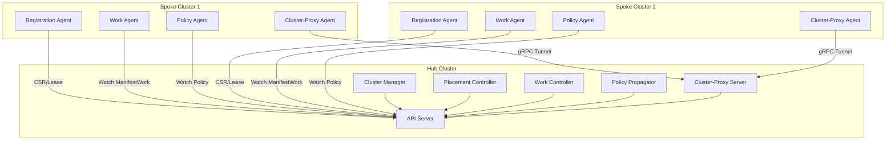
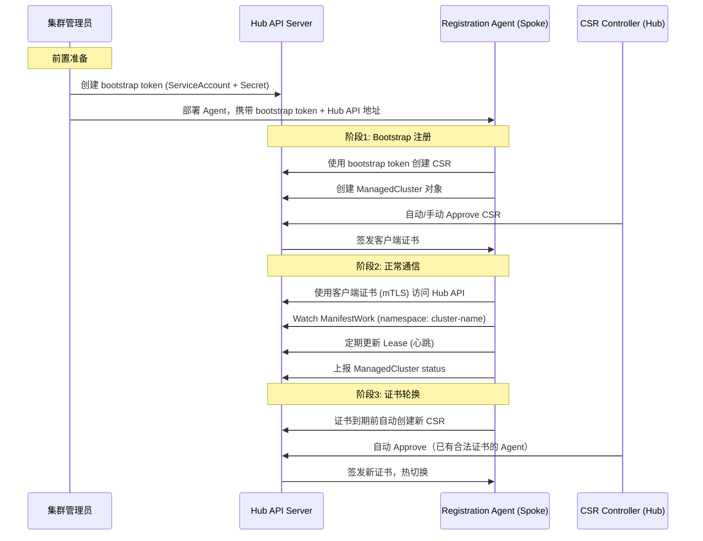
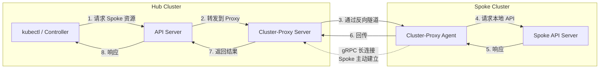

## 开场：管理 200+ 集群是什么体验

当你管理 5 个集群时，kubectl 切换 context 就够了。当你管理 50 个集群时，你需要一个统一的管理平面。当你管理 200+ 集群时，你会发现——**管理平面本身成了最大的瓶颈**。

我在 Red Hat ACM（Advanced Cluster Management）团队工作了 5 年，ACM 基于开源项目 OCM（Open Cluster Management）构建，是目前业界最成熟的 Kubernetes 多集群管理方案之一。从最初的功能开发到后来的大规模性能优化，我经历了从"能管"到"管好"的完整过程。

这篇文章不是文档翻译，而是我对多集群管理的**系统性思考和实战经验总结**。我会覆盖架构选型、资源分发、集群注册、网络互通、性能优化五个核心主题，每个主题后附Q&A，帮你建立完整的多集群知识体系。

---

## 多集群管理架构设计（Hub-Spoke vs 联邦）

### 两种基本范式

多集群管理本质上是一个**控制论问题**：一个中心（或多个中心）如何对多个被管理实体施加控制。业界形成了两种主流架构：

| 维度 | Pull Mode | Push Mode |
|------|-----------|-----------|
| 控制方向 | Spoke 主动拉取任务 | Hub 主动推送到 Spoke |
| 网络要求 | Spoke → Hub（出站即可） | Hub → Spoke（需入站） |
| Agent 部署 | 每个 Spoke 部署 Agent | 无 Agent 或轻量 Agent |
| 集群自治 | Hub 挂了，Spoke 继续运行 | Hub 挂了，新变更无法下发 |
| 适合场景 | 大规模、跨网络、边缘 | 同数据中心、网络互通 |

**代表项目**：OCM/ACM 采用 Pull Mode；KubeFed 采用 Push Mode；**Karmada 同时支持 Push 和 Pull 两种模式**——Push 模式适合同数据中心内网络互通的场景，Pull 模式通过部署 `karmada-agent` 到成员集群来适配跨网络、大规模场景。

### Hub-Spoke 架构全景



Hub 集群是整个架构的大脑，运行着：
- **Cluster Manager**：管理集群生命周期（注册、接受、驱逐）
- **Placement Controller**：决策资源应该放到哪些集群
- **Work Controller**：跟踪 ManifestWork 的状态
- **Policy Propagator**：将策略转化为可分发的工作负载
- **Cluster-Proxy**：反向隧道，解决 Hub 到 Spoke 的网络互通

Spoke 集群运行轻量 Agent：
- **Registration Agent**：完成注册、证书轮换、心跳上报
- **Work Agent**：Watch Hub 上的 ManifestWork，在本地 Apply
- **Policy Agent**：执行策略合规检查
- **Cluster-Proxy Agent**：维持到 Hub 的反向 gRPC 隧道

### 为什么选择 Pull Mode

#### Push Mode 的三个致命问题

**问题 1：网络穿透困难**

企业环境中，Spoke 集群往往在私有网络、DMZ 甚至边缘节点，Hub 根本无法直接访问 Spoke 的 API Server。Push Mode 要么需要打通网络（安全风险），要么需要 VPN（运维成本），对于边缘场景几乎不可行。

**问题 2：凭据管理噩梦**

Hub 需要持有每个 Spoke 的 kubeconfig。200 个集群就是 200 份凭据。这些凭据要存储、要轮换、一旦泄露影响面巨大。这不仅是安全问题，更是运维问题——想象一下批量轮换 200 个 kubeconfig 的场景。

**问题 3：故障域耦合**

Hub 挂了，所有 Push 操作停止。如果 Hub 正在做滚动更新，部分集群更新了、部分没更新，一致性无法保证。Push Mode 把 Hub 变成了整个系统的 SPOF（单点故障）。

#### Pull Mode 的三个优势

**优势 1：网络友好**

所有连接都是 Spoke → Hub（出站），天然穿越 NAT 和防火墙。Spoke 只需要能访问 Hub API Server 的地址即可，这在绝大多数网络环境下都是可行的。

**优势 2：Hub 不持有 Spoke 凭据**

Spoke Agent 通过 CSR（Certificate Signing Request）获得 Hub 的客户端证书，用于身份认证。Hub 不需要知道任何 Spoke 集群的 kubeconfig。每个 Agent 只有访问自己 namespace 的权限，最小权限原则。

**优势 3：集群自治**

Hub 挂了，Spoke 上已经 Apply 的工作负载继续运行。Agent 会不断重试连接，Hub 恢复后自动重连。这种设计在边缘场景（网络不稳定）尤其关键。

#### Pull Mode 的代价

Pull Mode 不是没有代价：
- **最终一致性**：状态从 Hub 到 Spoke 有延迟（Watch 延迟 + Apply 延迟），不适合强实时性需求
- **Agent 运维成本**：每个 Spoke 都要部署和升级 Agent，Agent 本身可能出 bug
- **Hub 压力集中**：所有 Spoke 都 Watch Hub，Hub 的 API Server 和 etcd 承受巨大压力（后面会详细讲）

### ACM 实战认知

在 ACM 的实际使用中，我观察到一些有趣的现象：

1. **混合模式是常态**：虽然架构是 Pull Mode，但很多操作（如通过 Cluster-Proxy 访问 Spoke API）本质上是 Push。纯粹的 Pull 或 Push 在实践中并不存在。

2. **自治是分级的**：Agent 挂了，已有工作负载不受影响；Agent 的 Watch 断了，新的变更无法同步；Hub 挂了，所有新操作停止。不同级别的故障有不同的影响面。

3. **规模决定架构**：10 个集群用 KubeFed 完全够用，简单直接。200+ 集群必须用 Pull Mode，否则 Hub 的凭据管理和网络问题会让你崩溃。

---

### Q&A

**Q1：Hub-Spoke 架构中 Hub 是单点故障吗？怎么解决？**

Hub 确实是架构中的关键节点，但不是传统意义上的"单点故障"。Pull Mode 下，Hub 短暂不可用时：
- 已分发的工作负载继续运行（Spoke 自治）
- Agent 自动重试连接
- 新的变更暂时无法下发

解决方案：
- Hub 集群本身做高可用（多 master、etcd 集群）
- Controller 做 leader election
- 极端情况可以做 Hub 级别的灾备（但实际生产中很少见，因为 Spoke 自治足够应对大多数场景）

**Q2：如果让你设计一个多集群管理系统，你选 Push 还是 Pull？**

取决于场景：
- **云厂商内部**（集群间网络打通、数量有限）→ Push 更简单
- **企业级多环境**（跨 VPC、跨数据中心、边缘）→ Pull 是唯一可行选择
- **关键决策因素**：集群数量 > 50、涉及边缘场景、安全要求高 → Pull Mode

**Q3：OCM 和 KubeFed/Karmada 的本质区别是什么？**

三者都支持多集群管理，但设计哲学不同：
- **OCM** 把 Spoke 当作黑盒，只通过 ManifestWork 和 Status 交互，最大程度尊重集群自治，纯 Pull Mode
- **KubeFed** 把 Spoke 当作 Hub 的延伸，直接操作 Spoke 资源，纯 Push Mode
- **Karmada** 同时支持 Push 和 Pull 两种模式，Push 模式下直接操作成员集群 API Server，Pull 模式下通过 `karmada-agent` 拉取任务，灵活性更高
- **设计哲学**：OCM 更像"联邦制"（自治 + 协调），KubeFed 更像"中央集权"（统一控制），Karmada 介于两者之间（可选）

---

## 跨集群资源分发和调度策略

### ManifestWork：资源分发的核心机制

ManifestWork 是 OCM 中资源分发的基本单元。一个 ManifestWork 代表"Hub 希望 Spoke 上存在的一组资源"。

#### 工作流程

```
┌──────────────────── Hub Cluster ────────────────────┐
│                                                      │
│  User/Controller                                     │
│       │                                              │
│       ▼                                              │
│  ┌─────────────────────────────────────────┐        │
│  │ ManifestWork (namespace: cluster1)       │        │
│  │   spec:                                  │        │
│  │     workload:                            │        │
│  │       manifests:                         │        │
│  │         - apiVersion: apps/v1            │        │
│  │           kind: Deployment               │        │
│  │           metadata:                      │        │
│  │             name: nginx                  │        │
│  │           spec: ...                      │        │
│  │   status:                                │        │
│  │     conditions:                          │        │
│  │       - type: Applied                    │        │
│  │         status: "True"                   │        │
│  │       - type: Available                  │        │
│  │         status: "True"                   │        │
│  └──────────────────┬──────────────────────┘        │
│                     │ Watch (Long Poll)               │
│                     ▼                                │
└──────────────────────────────────────────────────────┘
                      │
                      │ Spoke Agent watches its namespace
                      │
┌──────────────────── Spoke Cluster (cluster1) ────────┐
│                     │                                 │
│                     ▼                                 │
│  ┌─────────────────────────────────────────┐         │
│  │ Work Agent                               │         │
│  │   1. Watch ManifestWork changes          │         │
│  │   2. Decode manifests                    │         │
│  │   3. Apply to local cluster              │         │
│  │   4. Report status back to Hub           │         │
│  └──────────────────┬──────────────────────┘         │
│                     │                                 │
│                     ▼                                 │
│  ┌─────────────────────────────────────────┐         │
│  │ Local Resources                          │         │
│  │   - Deployment/nginx (Applied)           │         │
│  │   - Service/nginx   (Applied)            │         │
│  └─────────────────────────────────────────┘         │
└──────────────────────────────────────────────────────┘
```

关键设计要点：

1. **Namespace 隔离**：每个 Spoke 在 Hub 上有一个同名 namespace（如 `cluster1`），ManifestWork 放在对应 namespace 下，Agent 只有权限 Watch 自己 namespace 的资源。

2. **声明式语义**：ManifestWork 是声明式的，描述期望状态。Work Agent 负责 Apply 并持续对账（reconcile），确保 Spoke 上的实际状态与期望一致。

3. **状态回报**：Work Agent 将每个 manifest 的 Apply 结果和运行状态上报到 ManifestWork 的 `status` 字段，Hub 端可以聚合查看。

4. **幂等性**：Work Agent 使用 Server-Side Apply，天然幂等。ManifestWork 更新时，Agent 重新 Apply 最新版本。

#### ManifestWork 的局限

- **体积限制**：ManifestWork 存在 etcd 的 value 大小限制（默认 1.5MB），不能塞太多 manifest
- **无模板能力**：每个集群的 ManifestWork 是独立的，如果 200 个集群要部署同一个 Deployment，就是 200 个 ManifestWork 对象
- **解决方案**：ManifestWorkReplicaSet 支持模板化 + 批量创建，减少用户的配置负担

### Placement：多集群调度策略

Placement 决定"资源应该放到哪些集群上"，类似于单集群中 kube-scheduler 的角色，但调度的对象从 Pod → Node 变成了 Workload → Cluster。

#### 与单集群 Scheduler 的对比

| 维度 | kube-scheduler (单集群) | Placement Controller (多集群) |
|------|------------------------|------------------------------|
| 调度对象 | Pod | Workload（一组资源） |
| 调度目标 | Node | ManagedCluster |
| 过滤阶段 | Predicates (NodeSelector, Affinity, Taints) | Predicates (LabelSelector, ClaimSelector, Tolerations) |
| 打分阶段 | Priorities (LeastRequested, BalancedAllocation) | Prioritizers (Balance, Steady, ResourceAllocatable) |
| 调度结果 | 绑定 Pod.spec.nodeName | 生成 PlacementDecision |
| 重调度 | 不会主动重调度（需要 descheduler） | 支持动态重调度 |
| 扩展方式 | Scheduler Framework | AddOn 自定义 Prioritizer |

#### Placement 调度流程

```
 ManagedClusterSet          Placement                PlacementDecision
┌──────────────────┐   ┌─────────────────────┐   ┌───────────────────┐
│ production        │   │ spec:                │   │ status:           │
│   - cluster1      │   │   clusterSets:       │   │   decisions:      │
│   - cluster2      │   │     - production     │   │     - clusterName:│
│   - cluster3      │   │   predicates:        │   │         cluster1  │
│   - cluster4      │   │     - requiredCluster│   │     - clusterName:│
│   - cluster5      │   │         Selector:    │   │         cluster3  │
│                   │   │         matchLabels: │   │     - clusterName:│
│ staging           │   │           region: us │   │         cluster5  │
│   - cluster6      │   │   prioritizers:      │   │                   │
│   - cluster7      │   │     - name: Balance  │   │                   │
│                   │   │       weight: 1      │   │                   │
│                   │   │   numberOfClusters: 3│   │                   │
└──────────────────┘   └─────────────────────┘   └───────────────────┘

调度流程：
Step 1: ClusterSet 过滤
  production → {cluster1, cluster2, cluster3, cluster4, cluster5}

Step 2: Predicate 过滤 (region=us)
  → {cluster1, cluster3, cluster5}   (假设这三个在 us region)

Step 3: Prioritizer 打分 (Balance)
  cluster1: 80分 (负载较低)
  cluster3: 60分 (负载中等)
  cluster5: 90分 (负载最低)

Step 4: 选择 Top N (numberOfClusters=3)
  → 全部入选: {cluster1, cluster3, cluster5}

Step 5: 生成 PlacementDecision
  → decisions: [cluster1, cluster3, cluster5]
```

#### 关键概念

- **ManagedClusterSet**：集群分组，类似"资源池"。一个集群可以属于多个 Set。
- **Predicate**：硬约束，不满足的集群直接淘汰（Label 匹配、Taint 容忍等）。
- **Prioritizer**：软约束，给通过 Predicate 的集群打分：
  - `Balance`：倾向于将工作负载均匀分布
  - `Steady`：倾向于保持现有调度不变（减少迁移）
  - `ResourceAllocatableCPU/Memory`：倾向于资源充足的集群
- **PlacementDecision**：最终调度结果，其他 Controller（如 Work Controller）Watch 这个对象来创建 ManifestWork。

---

### Q&A

**Q1：ManifestWork 怎么处理冲突？如果有人直接在 Spoke 上修改了资源怎么办？**

ManifestWork 使用 Server-Side Apply，遵循字段所有权（Field Ownership）机制：
- ManifestWork 管理的字段会被强制覆盖回期望状态（由 Work Agent reconcile）
- 用户手动添加的额外字段（如额外的 label）不受影响
- 可以通过 `updateStrategy` 配置冲突处理行为：`ServerSideApply`（默认）、`CreateOnly`（只创建不更新）、`ReadOnly`（只读取状态，不修改）

**Q2：Placement 支持动态重调度吗？什么场景会触发？**

支持。触发条件：
- 集群状态变化（某集群变为 `NotReady`、被标记 `Taint`）
- 集群 Label 变化（不再满足 Predicate）
- Placement 自身 spec 变化
- Prioritizer 得分变化（如集群资源利用率变化）

重调度时，`Steady` Prioritizer 提供稳定性保证——它给当前已选中的集群加分，避免频繁迁移。

**Q3：如何实现跨集群的渐进式发布（如 Canary）？**

OCM 本身不内置 Canary 逻辑，但可以组合实现：
1. 创建两个 Placement：canary-placement（选 1 个集群）和 production-placement（选剩余集群）
2. 先在 canary 集群部署新版本
3. 通过 ManifestWork 的 status 回报确认健康
4. 更新 production-placement 的 ManifestWork
5. 也可以通过 Policy + Placement 联动实现自动化的渐进式发布

---

## 集群注册/发现/心跳机制

### 注册流程全景



### Bootstrap 详解

Bootstrap 是集群注册的起点，整个过程与 kubelet 的 TLS Bootstrap 高度相似。

先解释一个关键概念——**CSR（Certificate Signing Request，证书签名请求）**。CSR 是 Kubernetes 内置的 API 资源（`certificates.k8s.io/v1`），它的作用是让集群内的组件向 API Server 申请 X.509 客户端证书。流程是：申请方生成一对密钥（公钥 + 私钥），把公钥和身份信息封装成 CSR 对象提交给 API Server，API Server 侧的 CSR Controller（或管理员）审批后签发证书。kubelet 加入集群时用的就是这个机制。

理解了 CSR 之后，来看 Bootstrap 的四个步骤：

1. **管理员准备**：在 Hub 上创建一个 bootstrap ServiceAccount，生成 token。这个 token 的权限非常有限——只能创建 CSR 和 ManagedCluster 对象，**不能读写 ManifestWork 或其他任何资源**。

2. **Agent 启动**：Agent 带着 bootstrap token 和 Hub API Server 地址启动。第一次连接使用 token 认证。

3. **CSR 签发**：Agent 在本地生成密钥对，将公钥封装成 CSR 提交给 Hub。CSR 中包含期望的身份信息——CN（Common Name）设为 `system:open-cluster-management:<cluster-name>:<agent-name>`。Hub 端的 CSR Controller（或管理员手动）Approve CSR 后，用 Hub 的 CA 签发客户端证书。

4. **切换到 mTLS**：Agent 拿到客户端证书后，后续所有通信使用 mTLS（双向 TLS），bootstrap token 不再使用。

**权限是怎么"扩展"的？** 关键在于：bootstrap token 和签发后的证书是**两套完全不同的身份**，背后绑定的 RBAC 权限也不同：

| 阶段 | 身份 | RBAC 权限 |
|------|------|-----------|
| Bootstrap 阶段 | ServiceAccount token | 只能创建 CSR 和 ManagedCluster |
| 证书签发后 | 证书 CN: `system:open-cluster-management:<cluster-name>:...` | 可以读写对应 namespace 下的 ManifestWork、更新 Lease、上报 Status |

Hub 管理员预先为 `system:open-cluster-management:<cluster-name>:*` 这个身份模式创建了 RBAC RoleBinding，绑定到对应 namespace 的权限。所以 Agent 拿到证书后，API Server 通过证书中的 CN 识别身份，匹配到预设的 RBAC 规则，就自动获得了更大的权限。**不是证书本身扩展了权限，而是证书中的身份匹配到了预设的 RBAC 规则。**

关键安全设计：
- **Bootstrap token 是一次性的**：用完即弃，减少泄露风险
- **最小权限**：bootstrap token 只有创建 CSR 和 ManagedCluster 的权限，即使泄露也做不了什么
- **证书绑定身份**：证书的 CN 包含集群名称，通过 RBAC 精确限定到对应 namespace 的权限

### 证书轮换

Agent 的客户端证书有有效期（默认较短），到期前 Agent 会自动发起证书轮换：

1. Agent 检测到证书即将到期（通常是到期前 20%-10% 的时间窗口）
2. 使用**当前有效的证书**（而非 bootstrap token）创建新的 CSR
3. Hub 端的 CSR Controller 自动 Approve（因为请求方持有合法证书，身份已验证）
4. Agent 拿到新证书后热切换，无需重启

这个设计保证了证书轮换的自动化和零停机。

### 身份模型与 Namespace 隔离

每个 ManagedCluster 在 Hub 上对应一个同名 namespace：

```
Hub Cluster:
├── namespace: cluster1
│   ├── ManifestWork/deploy-nginx
│   ├── ManifestWork/deploy-monitoring
│   └── (Agent cluster1 只能访问这个 namespace)
├── namespace: cluster2
│   ├── ManifestWork/deploy-nginx
│   └── (Agent cluster2 只能访问这个 namespace)
└── namespace: cluster3
    └── ...
```

**注意**：证书 CN 中的身份（如 `system:open-cluster-management:cluster1:agent`）在 Kubernetes RBAC 中是一个 **User**，不是 ServiceAccount。虽然命名格式看起来很像 ServiceAccount（`system:serviceaccount:<ns>:<name>`），但它们是两套完全独立的身份体系——客户端证书的 CN 被 API Server 解析为 User，SA token 被解析为 ServiceAccount，两者都能作为 RBAC 的 Subject，但来源不同。

Hub 管理员预先为这个 User 身份创建 RoleBinding：

```yaml
apiVersion: rbac.authorization.k8s.io/v1
kind: RoleBinding
metadata:
  name: cluster1-agent
  namespace: cluster1
subjects:
- kind: User    # 不是 ServiceAccount
  name: "system:open-cluster-management:cluster1:agent"
roleRef:
  kind: ClusterRole
  name: open-cluster-management:agent
  apiGroup: rbac.authorization.k8s.io
```

整条认证授权链路：Agent 用证书连 Hub API Server → API Server 从证书 CN 提取 User 身份 → 查 RBAC 找到上面的 RoleBinding → 确认该 User 有权限操作 `cluster1` namespace 下的资源。

通过这种方式，Hub 确保每个 Agent 只能：
- 读写自己 namespace 下的 ManifestWork status
- 更新自己的 ManagedCluster status
- 更新自己的 Lease

即使某个 Spoke 的 Agent 被攻破，攻击者也只能影响该集群对应的 namespace，无法越权访问其他集群的数据。

### 心跳机制

Agent 通过 Kubernetes Lease 对象上报心跳：

- **更新频率**：默认 60 秒一次
- **超时判定**：连续 5 次心跳缺失（5 分钟）后，Hub 标记集群为 `Unknown` 状态
- **与 Node 心跳对比**：kubelet 的心跳是 10 秒，因为 Node 级别的故障需要快速响应（Pod 驱逐）；Cluster 级别的心跳可以更长，因为 Spoke 集群本身还有自己的故障检测和恢复机制

心跳中包含的关键信息：
- 集群可达性状态
- Agent 版本信息
- 续约时间戳

集群 status 中还会上报更详细的信息：
- 集群版本、节点数量、资源容量
- 集群条件（如 `HubAccepted`、`ManagedClusterJoined`、`ManagedClusterConditionAvailable`）

---

### Q&A

**Q1：如果 bootstrap token 泄露了怎么办？**

影响有限，但需要立即处理：
- **影响范围**：攻击者可以用泄露的 token 注册一个恶意集群，但注册需要 Hub 端 Approve（手动或自动策略），且注册后只有自己 namespace 的权限
- **应对措施**：立即删除/轮换 bootstrap token，检查是否有未知的 ManagedCluster 被注册，启用更严格的 CSR Approve 策略（手动审批）
- **根本方案**：bootstrap token 应该有短有效期，或者使用更安全的注册方式（如 bootstrap kubeconfig 只用一次就销毁）

**Q2：证书轮换失败了会怎样？**

如果在证书过期前轮换失败：
- Agent 的证书过期后无法访问 Hub API
- Spoke 上已有的工作负载不受影响（自治）
- Agent 会退回到 bootstrap 流程，使用 bootstrap token 重新注册
- 如果 bootstrap token 也失效了，需要管理员手动干预

这是一个**降级**过程，而非灾难。设计上保证了即使证书出问题，最坏情况也只是该集群与 Hub 暂时断连。

**Q3：心跳 60 秒会不会太慢？集群故障检测的延迟怎么接受？**

60 秒是合理的权衡：
- **与 Node 心跳对比**：Node 心跳 10 秒是因为 Pod 驱逐的实时性要求高。Cluster 心跳不涉及 Pod 驱逐，只影响新的调度决策
- **实际影响**：集群 5 分钟后才被标记 `Unknown`，但这不意味着 5 分钟内无法检测问题——Spoke 上的 Agent 会持续 reconcile，如果 Agent 本身断连，Hub 上的 ManifestWork status 不更新就能发现异常
- **优化方向**：对于关键集群，可以缩短心跳间隔；也可以结合外部监控（Prometheus）做更快的故障检测

---

## 多集群网络互通方案

### 核心问题

Pull Mode 架构下，所有连接都是 Spoke → Hub，Hub 无法主动访问 Spoke。但很多场景需要 Hub 到 Spoke 的通信：

- 管理员想通过 Hub 查看 Spoke 的 Pod 日志
- Hub 上的 Controller 需要读取 Spoke 的资源状态
- 跨集群的服务发现和调用

Spoke 集群通常在 NAT 后面、防火墙后面，甚至在边缘节点上，Hub 没有直接可达的 API Server 地址。

### Cluster-Proxy 反向隧道

OCM 的 Cluster-Proxy 组件通过**反向隧道**解决这个问题：



### 实现细节

Cluster-Proxy 基于 Kubernetes 的 **ANP（API Network Proxy）** 项目（也叫 konnectivity），核心组件：

1. **Proxy Server（Hub 端）**：
   - 注册为 Hub API Server 的 Aggregation API
   - 接收来自 kubectl 或 Controller 的请求
   - 通过已建立的 gRPC 隧道将请求转发到目标 Spoke

2. **Proxy Agent（Spoke 端）**：
   - 启动时主动建立到 Proxy Server 的 gRPC 长连接
   - 注册自己管理的集群名称
   - 收到请求后，在本地调用 Spoke API Server
   - 将响应通过同一条 gRPC 连接回传

3. **gRPC 长连接**：
   - Spoke Agent **主动**建立连接（出站，穿越 NAT）
   - 连接建立后双向通信
   - 内置心跳和重连机制
   - 使用 mTLS 加密

### 安全模型：两层 RBAC

Cluster-Proxy 的安全设计包含两层访问控制：

**第一层：Hub 端 RBAC**
- 用户/Controller 需要有访问 `managedclustersets/proxy` 子资源的权限
- 控制"谁可以通过 Proxy 访问 Spoke"

**第二层：Spoke 端 RBAC**
- Proxy 到达 Spoke 后，使用的身份是 Proxy Agent 的 ServiceAccount
- 控制"通过 Proxy 进来的请求在 Spoke 上有什么权限"
- 可以配置 impersonation，让请求在 Spoke 上使用原始用户的身份

两层 RBAC 确保了：即使通过 Proxy 可以访问 Spoke，访问范围也是受限的。

### 反向隧道 vs L7 代理

| 维度 | 反向隧道 (Cluster-Proxy) | L7 代理 (如 KubeGateway) |
|------|--------------------------|--------------------------|
| 网络要求 | Spoke → Hub (出站) | Hub → Spoke (入站) 或 双方到代理 |
| NAT 穿越 | 天然支持 | 需要额外配置 |
| 协议支持 | 任意 TCP (gRPC 封装) | HTTP/HTTPS |
| 性能 | 有额外封装开销 | 直接代理，开销较小 |
| 适用场景 | Spoke 在私有网络/边缘 | 集群间网络较好 |
| 复杂度 | 需要部署 Agent | 需要网络可达性 |

在 ACM 场景中，反向隧道是唯一可行的方案，因为我们无法假设 Hub 能直接访问 Spoke。

---

### Q&A

**Q1：gRPC 长连接断了怎么办？重连机制是怎么实现的？**

Proxy Agent 内置了指数退避重连：
- 连接断开后立即尝试重连
- 失败后逐渐增加重试间隔（1s → 2s → 4s → ... → 最大 30s）
- 重连期间，通过该隧道的请求会报错（503），Hub 端的调用方需要自己处理重试
- 重连成功后自动恢复，无需人工干预
- 健康检查：Agent 定期发送 gRPC ping，如果 pong 超时则主动断开重建连接

**Q2：反向隧道的性能开销大吗？能支持大流量场景吗？**

性能开销主要在：
- **封装开销**：TCP 流量封装在 gRPC 中，有序列化/反序列化成本，但对于 API 调用场景（小包、低频）影响很小
- **单连接瓶颈**：默认单条 gRPC 连接，高并发时可能成为瓶颈
- **优化**：可以配置多条并行隧道，负载均衡

反向隧道适合**控制面流量**（API 调用、状态查询），不适合**数据面流量**（大规模数据传输、日志流）。数据面场景应该使用专门的方案（如 Submariner、Service Mesh 跨集群）。

---

## 大规模集群管理的性能挑战和优化

### Hub 压力模型

管理 200+ 集群时，Hub 集群承受的压力可以分为四类：

```
Hub 压力模型 (200 集群)

┌─────────────────────────────────────────────────┐
│                API Server 压力                    │
│  - 200 个 Agent Watch ManifestWork              │
│  - 200 个 Agent 定期更新 Lease                   │
│  - 200 个 Agent 上报 Cluster Status             │
│  - Controller Watch 各种资源                     │
│  预估 QPS: 500-2000 (取决于变更频率)              │
├─────────────────────────────────────────────────┤
│                etcd 压力                          │
│  - 200 × N 个 ManifestWork 对象                 │
│  - 200 个 ManagedCluster 对象                   │
│  - 200 个 Lease 对象 (每 60 秒更新)              │
│  - Watch 事件的扇出                              │
│  关键瓶颈: etcd 写吞吐 + 存储大小                │
├─────────────────────────────────────────────────┤
│                Controller 压力                    │
│  - Placement Controller: 200 个集群的调度计算     │
│  - Work Controller: 跟踪所有 ManifestWork 状态   │
│  - Policy Propagator: 策略评估 × 200             │
│  关键瓶颈: 单 Controller 的处理能力              │
├─────────────────────────────────────────────────┤
│                Network 压力                       │
│  - 200 条 Watch 长连接                           │
│  - 200 条 gRPC 隧道 (Cluster-Proxy)             │
│  - 状态同步流量                                  │
│  关键瓶颈: 连接数 + 带宽                         │
└─────────────────────────────────────────────────┘
```

### 实际遇到的问题和优化方案

#### 问题 1：ManifestWork 数量爆炸导致 etcd 压力

**场景**：每个集群平均 20 个 ManifestWork，200 个集群就是 4000 个对象。每次更新策略，Policy Propagator 要修改大量 ManifestWork，产生巨大的写压力。

**优化方案**：
- **ManifestWork 合并**：将多个小的 manifest 合并到一个 ManifestWork 中，减少对象总数
- **ManifestWorkReplicaSet**：用模板 + 副本集代替逐个创建，Controller 内部批量处理
- **增量更新**：只更新变化的字段，而不是整个 ManifestWork 重新 Apply
- **效果**：ManifestWork 数量减少 60%-70%，etcd 写操作显著下降

#### 问题 2：Lease 更新的 etcd 写放大

**场景**：200 个 Agent 每 60 秒更新一次 Lease，看起来 QPS 不高（约 3.3 QPS），但 Lease 更新触发 Watch 事件，所有 Watch Lease 资源的 Controller 都会收到通知，形成写放大。

**优化方案**：
- **增大心跳间隔**：对于稳定的集群，将心跳间隔从 60 秒增大到 5 分钟
- **分离心跳和状态上报**：心跳用 Lease（轻量），详细状态用 ManagedCluster status（低频更新）
- **Controller 端过滤**：确保 Controller 的 Watch 只关注必要的事件，忽略纯心跳更新
- **效果**：etcd Lease 相关写操作减少 80%

#### 问题 3：Placement 全量重算的 CPU 开销

**场景**：任何集群状态变化（心跳更新、Label 变化）都会触发 Placement 重新计算。200 个集群 × 50 个 Placement 规则 = 大量计算。

**优化方案**：
- **增量计算**：只重新评估受影响的集群和 Placement，而不是全量重算
- **事件去重和批处理**：短时间内的多次变化合并为一次重算（debounce）
- **缓存中间结果**：Predicate 过滤结果缓存，只有相关条件变化时才重新评估
- **效果**：Placement 计算频率降低 90%，CPU 使用率大幅下降

#### 问题 4：Watch 连接数的内存开销

**场景**：每个 Agent 与 Hub API Server 建立多个 Watch 连接（ManifestWork、Policy、AddOn 等），200 个集群可能有 1000+ 并发 Watch。每个 Watch 在 API Server 端消耗内存（缓存 + event buffer）。

**优化方案**：
- **Watch Bookmark**：启用 Watch Bookmark 减少 Watch 重建时的全量同步
- **合并 Watch**：Agent 端合并多个资源类型的 Watch（如果业务允许）
- **API Server 调优**：调整 `--watch-cache-sizes`，对不同资源类型设置合理的缓存大小
- **效果**：API Server 内存从 8GB 稳定到 4GB

#### 问题 5：策略评估的扇出问题

**场景**：一个 Policy 变更需要评估 200 个集群的合规性，然后为不合规的集群生成/更新 ManifestWork。一次策略变更触发的 API 调用可能是数百次。

**优化方案**：
- **分批处理**：策略评估分批进行（如每批 20 个集群），避免瞬时峰值
- **并发控制**：限制 Policy Propagator 的并发度，用队列削峰填谷
- **短路评估**：如果集群已经合规，跳过后续操作
- **效果**：策略变更的峰值 API QPS 降低 10 倍

### 3 分钟口述框架

如果面试官问"你们管理 200+ 集群遇到过什么性能问题"，可以这样组织回答：

> **开场**：管理 200+ 集群时，Hub 承受的压力来自四个方面：API Server 的连接和请求、etcd 的存储和写吞吐、Controller 的计算、网络的连接和带宽。
>
> **最痛的问题**：是 ManifestWork 的数量爆炸。每个集群 20+ 个 ManifestWork，200 个集群就是 4000+ 个对象。策略变更时批量更新这些对象，etcd 的写吞吐直接饱和。
>
> **解决思路**：三个层面——减少对象数量（合并 ManifestWork、用模板替代逐个创建）、减少更新频率（增量更新、心跳间隔优化、事件去重）、减少计算量（Placement 增量计算、策略评估分批）。
>
> **实际效果**：ManifestWork 数量减少 60%+，etcd 写操作降低 80%，Placement 计算频率降低 90%。Hub 的 API Server 从需要 16GB 内存降到 8GB，响应延迟 P99 从 2 秒降到 200 毫秒。
>
> **反思**：大规模系统的性能优化不是一次性的事，而是随着集群数量增长不断发现和解决新瓶颈的过程。最重要的是**建立监控体系**，能够提前发现瓶颈，而不是等到 P0 故障才去处理。

---

## 关键结论

- 集群数超过 50 或涉及边缘/跨网络场景时，Pull Mode（Spoke 主动拉取）是唯一务实的选择——Push Mode 的凭据管理和网络穿透问题会随规模指数级恶化。
- Hub 不持有任何 Spoke 的 kubeconfig，这不只是安全优势，更是运维优势——想象一下批量轮换 200 个 kubeconfig 的痛苦。
- 大规模管理的第一个瓶颈永远是 etcd：ManifestWork 数量 × 集群数 × 更新频率，三者相乘就是 Hub 承受的写压力。优化的核心是减少对象数量和更新频率。
- Hub 挂了不等于灾难——Pull Mode 下 Spoke 上已分发的工作负载继续运行，这种"自治"特性在边缘场景尤其关键。
- 反向隧道适合控制面流量（API 调用、状态查询），不适合数据面流量（大规模数据传输）。跨集群的数据面通信需要专门的方案。

## 总结

多集群管理是一个典型的**分布式系统问题**，涉及架构选型、资源分发、身份认证、网络互通和性能优化五个核心方面。

回顾 5 年的 ACM 实战经验，我最大的感悟是：

1. **架构决定天花板**：Hub-Spoke 的 Pull Mode 在网络友好性和安全性上有天然优势，但也带来了最终一致性和 Hub 压力的挑战。架构选型在项目初期就决定了后面能走多远。

2. **抽象层级很关键**：ManifestWork + Placement 的设计把"资源分发"和"调度策略"干净地解耦了。好的抽象让系统可以在不改变核心架构的情况下扩展功能。

3. **规模暴露一切**：10 个集群时看不出的问题，200 个集群时全部暴露。心跳写放大、Watch 内存、Placement 重算——每一个"小"问题乘以 200 都变成大问题。

4. **安全不能妥协**：从 bootstrap 注册的最小权限，到 namespace 隔离，到双层 RBAC，多集群管理的每个环节都必须考虑安全性。一个集群被攻破不能影响其他集群。

如果你正在准备 Kubernetes 多集群相关的面试，建议按这个顺序准备：先理解 Hub-Spoke 架构的"为什么"，再看 ManifestWork/Placement 的"怎么做"，然后是注册和网络互通的"基础设施"，最后用性能优化的实战经验展示深度。
