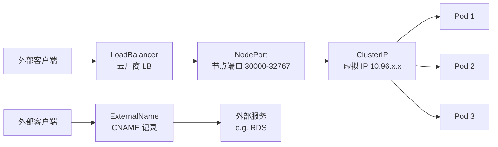
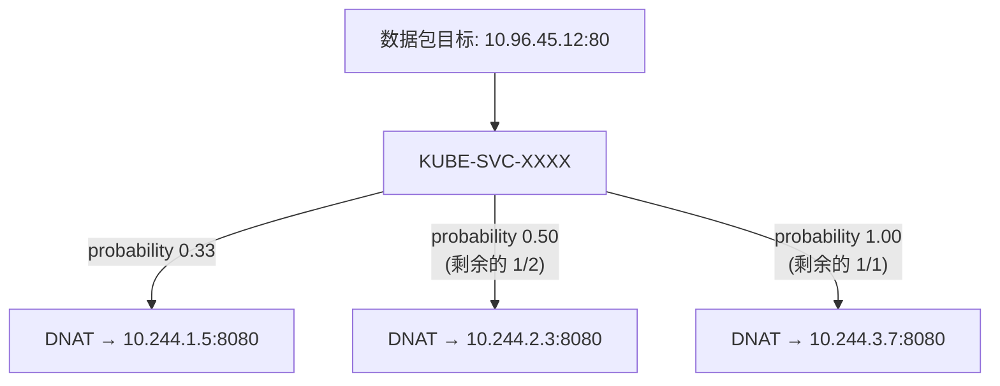

## 故事的起点：Service Endpoints 为空

周五下午，同事在 Slack 里喊："新部署的服务 curl 超时了，帮忙看一下。"

```bash
$ kubectl get svc my-app
NAME     TYPE        CLUSTER-IP    EXTERNAL-IP   PORT(S)   AGE
my-app   ClusterIP   10.96.45.12   <none>        80/TCP    10m

$ curl 10.96.45.12:80
# 卡住，最终超时

$ kubectl get endpoints my-app
NAME     ENDPOINTS   AGE
my-app   <none>      10m
```

Endpoints 为空——Service 背后没有挂载任何 Pod。这意味着流量到达 ClusterIP 后无处可去。

排查过程很快定位到原因：**Service 的 `selector` 标签和 Pod 的标签不匹配**。开发同学把 Pod 的 label 从 `app: my-app` 改成了 `app.kubernetes.io/name: my-app`，但忘了同步更新 Service。

```bash
$ kubectl get pods --show-labels
NAME                      READY   STATUS    LABELS
my-app-7d8f9b6c4-x2k9l   1/1     Running   app.kubernetes.io/name=my-app

$ kubectl get svc my-app -o yaml | grep -A2 selector
  selector:
    app: my-app    # ← 这里还是旧 label
```

修正 selector 后，Endpoints 立刻填充，流量恢复正常。

这个小事故看似简单，但要真正理解"为什么 Endpoints 会空"、"ClusterIP 到底是什么"、"流量怎么从 Service 到 Pod"，需要串联整个 K8s 网络模型。今天就从这个问题出发，把 K8s 网络彻底讲清楚。

---

## K8s 网络模型基本原则

Kubernetes 对集群网络提出了三个基本要求（不管你用什么 CNI 插件，这三条必须满足）：

1. **Pod 与 Pod 之间可以直接通信**，不需要 NAT——任意两个 Pod 可以用对方的 IP 直接通信，无论是否在同一节点。
2. **Node 与 Pod 之间可以直接通信**，不需要 NAT——节点上的进程可以直接访问任意 Pod IP。
3. **Pod 看到自己的 IP 和别人看到它的 IP 是一样的**——没有地址伪装，容器内看到的源 IP 就是真实的 Pod IP。

这三条原则的核心思想是：**每个 Pod 都拥有一个集群范围内唯一的、真实可达的 IP 地址**。这让 K8s 的网络模型保持了"扁平"的简洁性，避免了传统 Docker bridge 网络中端口映射的复杂性。

### CNI 插件：谁来实现这个模型？

K8s 本身不实现网络——它通过 **CNI（Container Network Interface）** 插件机制，把网络的实现交给第三方。主流 CNI 插件：

| 插件 | 实现方式 | 特点 |
|------|---------|------|
| **Calico** | BGP / VXLAN / IP-in-IP | 支持 NetworkPolicy，性能好，生产最常用 |
| **Cilium** | eBPF | 内核级数据面，绕过 iptables，性能极高，可观测性强 |
| **Flannel** | VXLAN / host-gw | 简单轻量，适合小集群，不支持 NetworkPolicy |
| **Weave** | VXLAN + 加密 | 开箱即用，支持加密通信，但性能一般 |

CNI 插件在 Pod 创建时被 kubelet 调用（通过 CNI ADD 命令），负责：分配 Pod IP、配置 veth pair、设置路由规则，让 Pod 能按照上述三个原则通信。

---

## Service：解决 Pod IP 不稳定的问题

Pod 是 ephemeral 的——随时可能被销毁重建，每次重建 IP 都会变。如果客户端直接连 Pod IP，Pod 重启后连接就断了。

**Service** 就是 K8s 给出的答案：提供一个稳定的虚拟 IP（ClusterIP），背后自动关联一组 Pod，并做负载均衡。

### 四种 Service 类型



| 类型 | 说明 | 典型场景 |
|------|------|---------|
| **ClusterIP** | 默认类型，只在集群内部可达 | 微服务间调用 |
| **NodePort** | 在每个节点上开一个端口（30000-32767），转发到 ClusterIP | 开发测试、无 LB 环境 |
| **LoadBalancer** | 在 NodePort 基础上，请求云厂商创建外部负载均衡器 | 生产环境暴露服务 |
| **ExternalName** | 返回一条 CNAME 记录，不做代理 | 引用集群外部服务（如 RDS） |

注意层级关系：**LoadBalancer ⊃ NodePort ⊃ ClusterIP**。创建一个 LoadBalancer Service，K8s 会自动分配 NodePort 和 ClusterIP。

### Service 到 Pod 的映射：Endpoints 和 EndpointSlice

回到开头的问题——Service 怎么知道该把流量发给哪些 Pod？

答案是 **Endpoints**（和更新的 **EndpointSlice**）。Endpoints Controller 持续 watch Service 和 Pod：

1. 找到所有 label 匹配 Service selector 的 Pod
2. 过滤掉不 Ready 的 Pod
3. 将这些 Pod 的 IP:Port 写入 Endpoints 对象

```bash
$ kubectl get endpoints my-app
NAME     ENDPOINTS                                      AGE
my-app   10.244.1.5:8080,10.244.2.3:8080,10.244.3.7:8080   5m
```

**为什么需要 EndpointSlice？**

在大规模集群中，一个 Service 可能关联数千个 Pod。传统 Endpoints 对象将所有 Pod IP 塞进一个资源——每次有一个 Pod 变化，整个 Endpoints 对象都要更新并推送给所有 kube-proxy。

EndpointSlice 把端点分片，每个 slice 默认最多 100 个端点：

- 单个 Pod 变化只需更新对应的 slice，减少 API Server 和 kube-proxy 的压力
- K8s 1.21+ 默认启用

### kube-proxy：Service 背后的流量转发

ClusterIP 是一个虚拟 IP——它**不绑定任何网卡**，不存在于任何网络设备上。那流量是怎么从 ClusterIP 到达 Pod 的？

答案是 **kube-proxy**。它运行在每个节点上，watch Service 和 EndpointSlice 的变化，然后配置数据面规则（iptables 或 IPVS），在节点上实现流量转发。

#### iptables 模式（默认）

kube-proxy 为每个 Service 创建一系列 iptables 规则。当流量目标是 ClusterIP 时，iptables 通过概率匹配实现负载均衡：



实际的 iptables 规则大致长这样：

```bash
-A KUBE-SVC-XXXX -m statistic --mode random --probability 0.33333 -j KUBE-SEP-AAA
-A KUBE-SVC-XXXX -m statistic --mode random --probability 0.50000 -j KUBE-SEP-BBB
-A KUBE-SVC-XXXX -j KUBE-SEP-CCC

-A KUBE-SEP-AAA -j DNAT --to-destination 10.244.1.5:8080
-A KUBE-SEP-BBB -j DNAT --to-destination 10.244.2.3:8080
-A KUBE-SEP-CCC -j DNAT --to-destination 10.244.3.7:8080
```

#### IPVS 模式

当 Service 数量很多时，iptables 模式有性能问题（后面面试追问会详细讨论）。IPVS 模式使用内核的 IPVS（IP Virtual Server）模块，基于哈希表查找，性能是 O(1)：

```bash
# 启用 IPVS 模式
$ kube-proxy --proxy-mode=ipvs

# 查看 IPVS 规则
$ ipvsadm -Ln
TCP  10.96.45.12:80 rr
  -> 10.244.1.5:8080    Masq    1      0          0
  -> 10.244.2.3:8080    Masq    1      0          0
  -> 10.244.3.7:8080    Masq    1      0          0
```

IPVS 还支持多种调度算法：轮询（rr）、最少连接（lc）、源地址哈希（sh）等。

---

## Ingress：L7 层的 HTTP 路由

Service 工作在 L4（TCP/UDP），只能按 IP:Port 转发。如果你需要：

- 基于域名或 URL 路径路由（`api.example.com/v1` → service-a，`api.example.com/v2` → service-b）
- TLS 终结（HTTPS 卸载）
- 多个 Service 共用一个外部 IP

那你需要 **Ingress**。

### Ingress 资源示例

```yaml
apiVersion: networking.k8s.io/v1
kind: Ingress
metadata:
  name: my-ingress
  annotations:
    nginx.ingress.kubernetes.io/rewrite-target: /
spec:
  ingressClassName: nginx
  tls:
    - hosts:
        - api.example.com
      secretName: api-tls-secret
  rules:
    - host: api.example.com
      http:
        paths:
          - path: /v1
            pathType: Prefix
            backend:
              service:
                name: service-v1
                port:
                  number: 80
          - path: /v2
            pathType: Prefix
            backend:
              service:
                name: service-v2
                port:
                  number: 80
    - host: web.example.com
      http:
        paths:
          - path: /
            pathType: Prefix
            backend:
              service:
                name: web-frontend
                port:
                  number: 80
```

Ingress 资源本身只是一段声明——它需要 **Ingress Controller** 来真正实现流量路由。

### 常见 Ingress Controller

| Controller | 特点 |
|-----------|------|
| **NGINX Ingress Controller** | 社区最流行，基于 NGINX，功能全面 |
| **Traefik** | 自动服务发现，内置 Let's Encrypt |
| **HAProxy Ingress** | 高性能，企业级 |
| **Contour** | 基于 Envoy，支持 HTTPProxy CRD |
| **AWS ALB Ingress Controller** | AWS 原生 ALB 集成 |

### Gateway API：Ingress 的继任者

Ingress API 有不少局限性（只支持 HTTP、角色分离不清晰、高级功能依赖 annotations）。**Gateway API**（K8s 1.19+ 引入，1.26 GA）是其继任者，提供了更丰富的模型：

- **GatewayClass** → 基础设施提供者定义
- **Gateway** → 集群运维人员配置监听端口/协议
- **HTTPRoute / TCPRoute / GRPCRoute** → 开发者定义路由规则

Gateway API 的核心优势是**角色分离**：基础设施团队、平台团队、应用团队各管各的资源，互不干扰。

---

## NetworkPolicy：Pod 间的防火墙

### 默认行为：全部放通

K8s 默认情况下，**所有 Pod 可以和任意 Pod 自由通信**——没有任何网络隔离。这在生产环境中是不可接受的。

**NetworkPolicy** 让你定义 Pod 级别的网络访问控制。

### NetworkPolicy 示例

```yaml
apiVersion: networking.k8s.io/v1
kind: NetworkPolicy
metadata:
  name: api-server-policy
  namespace: production
spec:
  podSelector:
    matchLabels:
      app: api-server
  policyTypes:
    - Ingress
    - Egress
  ingress:
    - from:
        - namespaceSelector:
            matchLabels:
              env: production
          podSelector:
            matchLabels:
              role: frontend
        - ipBlock:
            cidr: 10.0.0.0/8
            except:
              - 10.0.1.0/24
      ports:
        - protocol: TCP
          port: 8080
  egress:
    - to:
        - podSelector:
            matchLabels:
              app: database
      ports:
        - protocol: TCP
          port: 5432
    - to:  # 允许 DNS 查询
        - namespaceSelector: {}
      ports:
        - protocol: UDP
          port: 53
```

这个策略说的是：

- **对 `app: api-server` 的 Pod 生效**
- **Ingress（入站）**：只允许 production namespace 中 `role: frontend` 的 Pod，或来自 `10.0.0.0/8`（排除 `10.0.1.0/24`）的流量，且只能访问 TCP 8080
- **Egress（出站）**：只允许访问 `app: database` 的 TCP 5432，以及集群 DNS（UDP 53）

### 关键语义陷阱：白名单模式的激活

NetworkPolicy 有一个容易踩坑的语义：

> **一旦某个 Pod 被任何一条 NetworkPolicy 的 `podSelector` 选中，那个方向（Ingress/Egress）就从"默认放通"切换到"默认拒绝"。** 只有策略中显式声明的流量才被放行。

这就是"白名单模式"——**一旦激活，未声明的流量全部被拒**。后面实战场景 4 会展示这个陷阱如何导致生产故障。

### 前提条件：CNI 支持

NetworkPolicy 是 K8s 的 API 资源，但**实际执行依赖 CNI 插件**。不是所有 CNI 都支持：

- ✅ Calico、Cilium、Weave：完整支持
- ❌ Flannel：**不支持 NetworkPolicy**——你创建了策略资源，但不会有任何效果

---

## 面试追问

### Q1: ClusterIP 是怎么实现的？能 ping 通吗？

ClusterIP 是一个**虚拟 IP**——它不分配给任何网卡，不存在于任何网络命名空间中，也没有 ARP 条目。你在集群任何节点上 `ip addr` 都看不到它。

它只存在于 iptables / IPVS 规则中：当数据包的目的地址匹配 ClusterIP 时，内核在 PREROUTING 或 OUTPUT 链中做 DNAT，把目的地址替换成某个后端 Pod 的真实 IP。

**能 ping 通吗？** 不能。`ping` 发送 ICMP 包，而 iptables 规则通常只匹配 TCP/UDP + 端口。ICMP 包不会命中 DNAT 规则，所以 ping ClusterIP 会超时。但 `curl ClusterIP:port` 可以正常工作。

### Q2: Headless Service 是什么？什么时候用？

Headless Service 就是把 `clusterIP` 设为 `None` 的 Service：

```yaml
apiVersion: v1
kind: Service
metadata:
  name: my-headless
spec:
  clusterIP: None
  selector:
    app: my-app
  ports:
    - port: 80
```

它**不分配 ClusterIP**，也不经过 kube-proxy。DNS 查询这个 Service 时，直接返回所有后端 Pod 的 A 记录：

```bash
$ nslookup my-headless.default.svc.cluster.local
Name:    my-headless.default.svc.cluster.local
Address: 10.244.1.5
Address: 10.244.2.3
Address: 10.244.3.7
```

典型使用场景：

- **StatefulSet**：每个 Pod 需要稳定的 DNS 名称（`pod-0.my-headless.default.svc`），客户端需要知道所有实例的地址（如 Kafka broker 列表）
- 客户端自己做负载均衡或服务发现

### Q3: Ingress 和 Service 有什么区别？

| 维度 | Service | Ingress |
|------|---------|---------|
| OSI 层 | L4（TCP/UDP） | L7（HTTP/HTTPS） |
| 路由能力 | IP:Port | 域名 + URL 路径 |
| TLS | 不处理 | 可以做 TLS 终结 |
| 外部暴露 | NodePort / LoadBalancer | 通过 Ingress Controller |
| 数量关系 | 每个微服务一个 | 多个 Service 可以共用一个 Ingress |

简单说：**Service 解决"服务发现 + L4 负载均衡"，Ingress 解决"L7 HTTP 路由 + TLS 卸载"**。Ingress 最终还是把流量转发给 Service。

### Q4: iptables 模式有什么性能问题？

两个核心问题：

1. **规则数量线性增长，匹配复杂度 O(n)**：每个 Service 的每个 endpoint 对应若干条 iptables 规则。当集群有 5000 个 Service、每个 Service 10 个 Pod 时，iptables 规则可能达到数万条。每个数据包都需要线性遍历这些规则链。

2. **全量更新**：iptables 不支持增量更新。每次 Service 或 endpoint 变化，kube-proxy 都要重新生成**所有**规则并原子替换（`iptables-restore`）。在大集群中，一次更新可能需要数秒，期间可能出现短暂的连接中断。

**IPVS 模式的优势**：
- 基于内核哈希表，查找复杂度 O(1)
- 支持增量更新
- 内置多种调度算法
- 大规模集群（1000+ Service）建议使用 IPVS 模式

### Q5: Pod 的 IP 是怎么分配的？

Pod IP 的分配过程：

1. kubelet 创建 Pod 时，调用 CNI 插件的 `ADD` 命令
2. CNI 插件调用 **IPAM（IP Address Management）** 模块分配 IP
3. 常见 IPAM 方式：
   - `host-local`：每个节点预分配一个子网（如 `10.244.1.0/24`），节点内自行分配
   - `calico-ipam`：Calico 自己的 IPAM，支持跨节点的 IP 池管理
   - `whereabouts`：支持跨节点的 IP 范围管理，避免地址冲突
4. 分配 IP 后，CNI 插件创建 veth pair，一端放入 Pod 网络命名空间，另一端连接到节点的网络桥接或路由表

每个节点通常从集群 CIDR（如 `10.244.0.0/16`）中分配一个子网（如 `/24`），通过 `--pod-cidr` 或 IPAM 插件管理。

---

## 实战场景

### 场景 1：Service Endpoints 为空（本文开头的问题）

**现象**：`curl ClusterIP:port` 超时，`kubectl get endpoints` 返回空。

**排查清单**：

```bash
# 1. 检查 Service selector 和 Pod label 是否匹配
kubectl get svc my-app -o jsonpath='{.spec.selector}'
kubectl get pods --show-labels

# 2. 检查 Pod 是否 Ready
kubectl get pods -l app=my-app
# 如果 Pod 状态不是 Running/Ready，Endpoints 不会包含它

# 3. 检查 Pod 的端口是否和 Service 的 targetPort 一致
kubectl get svc my-app -o yaml  # 看 targetPort
kubectl get pod <pod> -o yaml   # 看 containerPort

# 4. 检查 namespace 是否一致
# Service 和 Pod 必须在同一个 namespace
```

**常见原因**：
- label 不匹配（最常见，本文开头的例子）
- Pod 不在 Ready 状态（readinessProbe 失败）
- targetPort 配置错误
- namespace 不一致

### 场景 2：NodePort 集群内通，外部不可达

**现象**：集群内 `curl NodeIP:NodePort` 正常，但从外部访问超时。

**排查方向**：

```bash
# 1. 检查云平台安全组 / 防火墙规则
# NodePort 范围 30000-32767 是否放通？

# 2. 检查节点防火墙
sudo iptables -L INPUT -n | grep <node-port>
sudo firewall-cmd --list-ports  # 如果用 firewalld

# 3. 检查 externalTrafficPolicy
kubectl get svc my-app -o jsonpath='{.spec.externalTrafficPolicy}'
# 如果是 Local，流量只会到有 Pod 的节点
# 如果你访问的节点上没有 Pod，就会超时
```

**解决方案**：
- 在云平台安全组中放通 NodePort 端口范围
- 检查节点本地防火墙规则
- 如果使用 `externalTrafficPolicy: Local`，确保访问的是有 Pod 的节点

### 场景 3：Pod 内 DNS 解析缓慢——ndots:5 陷阱

**现象**：Pod 内访问外部域名（如 `api.github.com`）时，DNS 解析耗时明显增加，有时需要数秒。

**原因**：K8s 默认给 Pod 的 `/etc/resolv.conf` 设置 `ndots:5`：

```bash
$ cat /etc/resolv.conf
nameserver 10.96.0.10
search default.svc.cluster.local svc.cluster.local cluster.local
options ndots:5
```

`ndots:5` 的含义：**如果域名中的点号少于 5 个，先尝试拼接 search 域查询**。

当你查询 `api.github.com`（2 个点，少于 5）时，DNS 解析器会依次尝试：

1. `api.github.com.default.svc.cluster.local` → NXDOMAIN
2. `api.github.com.svc.cluster.local` → NXDOMAIN
3. `api.github.com.cluster.local` → NXDOMAIN
4. `api.github.com` → 成功

前 3 次查询全部浪费。每次 NXDOMAIN 都要经过 CoreDNS，在高并发场景下会：
- 增加 DNS 延迟
- 给 CoreDNS 带来大量无效查询压力

**解决方案**：

```yaml
# 方案 1：在域名末尾加点号（FQDN），跳过 search 域
# 代码中使用 "api.github.com." 而不是 "api.github.com"

# 方案 2：在 Pod spec 中降低 ndots
spec:
  dnsConfig:
    options:
      - name: ndots
        value: "2"

# 方案 3：使用 NodeLocal DNSCache 缓解 CoreDNS 压力
# 在每个节点部署 DNS 缓存，减少跨节点 DNS 查询
```

### 场景 4：NetworkPolicy 意外阻断合法流量

**现象**：新加了一条 NetworkPolicy 后，原本正常的 Pod 间通信突然中断。

**原因**：白名单模式被激活。

举个例子：你有三个服务 A → B → C，原本没有任何 NetworkPolicy，三者自由通信。现在你给 B 加了一条策略，只允许 A 访问 B 的 8080 端口：

```yaml
apiVersion: networking.k8s.io/v1
kind: NetworkPolicy
metadata:
  name: allow-a-to-b
spec:
  podSelector:
    matchLabels:
      app: service-b
  policyTypes:
    - Ingress
  ingress:
    - from:
        - podSelector:
            matchLabels:
              app: service-a
      ports:
        - port: 8080
```

**后果**：B 的 Ingress 方向进入白名单模式。A → B 的 8080 正常，但 B → C 的 Egress **不受影响**（因为策略只声明了 `Ingress`）。如果你同时声明了 `Egress` 但没写 egress 规则，B 的所有出站流量都会被拒绝——**包括 DNS 查询**。

**排查步骤**：

```bash
# 1. 查看作用于某个 Pod 的所有 NetworkPolicy
kubectl get networkpolicy -A -o wide

# 2. 用 kubectl describe 确认策略的选择器和规则
kubectl describe networkpolicy allow-a-to-b

# 3. 临时删除策略验证是否恢复
kubectl delete networkpolicy allow-a-to-b  # 测试环境操作

# 4. 检查是否遗漏了 DNS egress 规则
# 如果声明了 Egress policyType，必须显式放通 DNS（UDP 53）
```

**关键记忆点**：
- 没有任何 NetworkPolicy → 全部放通
- 有 NetworkPolicy 但没选中你 → 你不受影响
- 有 NetworkPolicy 选中了你 → 只有**显式声明的方向和规则**才放通
- 声明了 `policyTypes: [Egress]` 但没写 egress 规则 → **所有出站流量被拒，包括 DNS**

---

## 小结

从一个 "Service Endpoints 为空" 的小事故出发，我们串联了 K8s 的整个网络模型：

1. **网络三原则**：Pod-Pod 直通、Node-Pod 直通、IP 内外一致——CNI 插件负责实现
2. **Service**：稳定入口 + L4 负载均衡，ClusterIP 是虚拟 IP，靠 kube-proxy 的 iptables/IPVS 规则做 DNAT
3. **Ingress**：L7 HTTP 路由 + TLS 终结，需要 Ingress Controller 实现，Gateway API 是未来
4. **NetworkPolicy**：Pod 级防火墙，白名单语义——一旦选中就默认拒绝未声明的流量

这些知识点看似独立，但在生产环境中经常交织在一起。理解底层原理，排查问题时才能快速定位，而不是对着 `curl: connection timed out` 发呆。
