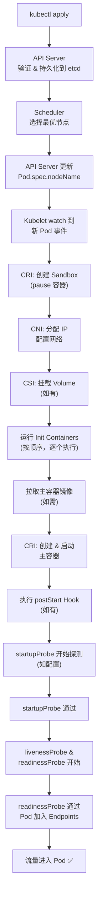
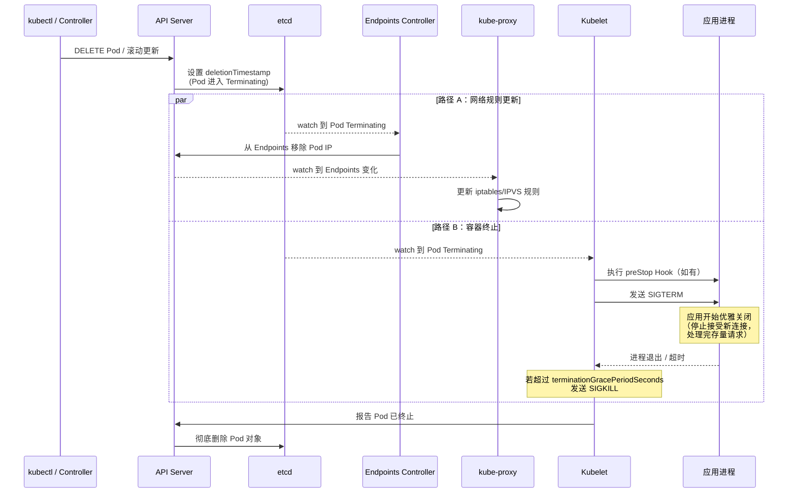

## 引子：一次滚动更新引发的 502

周五下午 4 点，线上告警群突然炸了：Nginx Ingress 返回大量 502 Bad Gateway。

排查发现，问题出在一次常规的 Deployment 滚动更新。每次新 Pod ready、旧 Pod 被终止的那几秒钟，总有零星请求打到了已经关闭端口的旧 Pod 上。

根因其实很简单——旧 Pod 收到 `SIGTERM` 后**立即**关闭了监听端口，但 kube-proxy 还没来得及把这个 Pod 的 IP 从 iptables/IPVS 规则里摘掉。在这个窗口期内，流量仍然会被转发到旧 Pod，得到的就是 `connection refused` → Ingress 返回 502。

要彻底理解这个问题，需要把 Pod 的完整生命周期从头到尾串一遍。

---

## Pod 的五种状态

| Phase | 含义 | 常见场景 |
|-------|------|----------|
| **Pending** | Pod 已被 API Server 接受，但尚未被调度或容器尚未就绪 | 等待调度、拉取镜像中 |
| **Running** | Pod 已绑定到节点，至少一个容器正在运行 | 正常工作状态 |
| **Succeeded** | 所有容器正常退出（exit code 0），不会重启 | Job/CronJob 完成 |
| **Failed** | 所有容器已终止，且至少一个非零退出 | 应用崩溃、OOMKilled |
| **Unknown** | 无法获取 Pod 状态 | 节点失联、kubelet 异常 |

> **注意**：这里的 Phase 是 Pod 级别的状态，不要和 Container 级别的 `Waiting`/`Running`/`Terminated` 搞混。一个 Pod 处于 `Running` Phase，并不代表它里面的每个容器都在运行。

---

## Pod 从创建到运行的完整流程

当你执行 `kubectl apply -f deployment.yaml` 后，背后发生了什么？



### 关键步骤详解

**1. Scheduler 调度**

Scheduler 通过 watch 机制感知到未绑定节点的 Pod，执行过滤（Filtering）和打分（Scoring）两个阶段，最终选出最优节点。调度结果通过更新 `Pod.spec.nodeName` 写回 API Server。

**2. Sandbox 创建（pause 容器）**

Kubelet 首先通过 CRI 接口创建一个 Sandbox。这个 Sandbox 对应的就是大名鼎鼎的 `pause` 容器——它是整个 Pod 网络命名空间的持有者。所有业务容器共享 pause 容器的 Network Namespace，这也是为什么同一个 Pod 内的容器可以用 `localhost` 互相通信。

**3. CNI 网络配置**

Sandbox 创建后，Kubelet 调用 CNI 插件为 Pod 分配 IP 地址、配置网卡、路由和 iptables 规则。常见的 CNI 插件包括 Calico、Cilium、Flannel 等。

**4. Init Containers**

Init Containers **按定义顺序依次执行**，前一个成功退出（exit code 0）后才启动下一个。常见用途：
- 等待依赖服务就绪（如数据库）
- 拉取配置文件、初始化数据目录
- 设置文件权限

**5. 主容器启动与 postStart Hook**

所有 Init Containers 完成后，主容器**并行启动**。如果配置了 `postStart` Hook，它会在容器启动后**异步**执行，但 Kubelet 会等 postStart 完成后才将容器标记为 Running。

---

## 健康检查（Probe）详解

Kubernetes 提供三种探针，各自解决不同的问题：

### 三种 Probe 的设计哲学

| Probe | 目的 | 失败后果 | 典型场景 |
|-------|------|----------|----------|
| **startupProbe** | 判断应用是否已完成启动 | 重启容器 | 启动慢的 Java 应用、需要加载大量数据的服务 |
| **livenessProbe** | 判断应用是否存活（死锁检测） | 重启容器 | 检测死锁、检测内存泄露导致的无响应 |
| **readinessProbe** | 判断应用是否准备好接收流量 | 从 Endpoints 摘除（不重启） | 依赖的下游服务不可用时暂停接收流量 |

**执行顺序**：`startupProbe` → 通过后 → `livenessProbe` + `readinessProbe` 并行执行。

在 `startupProbe` 通过之前，`livenessProbe` 和 `readinessProbe` 都不会执行——这就是 startupProbe 被引入的原因：避免启动慢的应用被 livenessProbe 误杀。

### 四种探测方式

```yaml
# 1. HTTP GET — 最常用
livenessProbe:
  httpGet:
    path: /healthz
    port: 8080
    httpHeaders:
    - name: X-Custom-Header
      value: Awesome
  # 返回 200-399 视为成功

# 2. TCP Socket — 适用于非 HTTP 服务
readinessProbe:
  tcpSocket:
    port: 3306
  # 能建立 TCP 连接视为成功

# 3. Exec — 执行命令
livenessProbe:
  exec:
    command:
    - cat
    - /tmp/healthy
  # exit code 0 视为成功

# 4. gRPC — Kubernetes 1.24+ 原生支持
readinessProbe:
  grpc:
    port: 50051
    service: my.health.v1.Health
  # gRPC Health Checking Protocol
```

### 配置参数

```yaml
readinessProbe:
  httpGet:
    path: /ready
    port: 8080
  initialDelaySeconds: 5    # 容器启动后等多久开始探测
  periodSeconds: 10         # 探测间隔
  timeoutSeconds: 3         # 单次探测超时时间
  failureThreshold: 3       # 连续失败几次判定为失败
  successThreshold: 1       # 连续成功几次判定为成功（liveness/startup 只能为 1）
```

**参数设计建议**：
- `initialDelaySeconds`：如果配了 `startupProbe`，liveness/readiness 的这个值可以设 0
- `periodSeconds`：不要太短（增加 API Server 负担）也不要太长（响应慢）
- `timeoutSeconds`：必须小于 `periodSeconds`，否则探测会堆积
- `failureThreshold`：设太小容易误杀，设太大响应慢——需要在可用性和稳定性之间取舍

---

## Pod 终止流程：竞态是 502 的根因

这是本文的核心部分。当你执行 `kubectl delete pod` 或触发滚动更新时，以下事件**并行**发生：



### 竞态问题

看出来了吗？**路径 A 和路径 B 是并行的**，没有任何同步机制保证"iptables 规则更新完毕"先于"应用关闭端口"。

在实际环境中，路径 B（SIGTERM → 应用关闭端口）往往只需要几十毫秒，而路径 A（API Server → Endpoints Controller → kube-proxy → iptables）可能需要几秒钟。这就产生了一个窗口期：应用端口已关闭，但流量仍在被转发过来。

### 解决方案：preStop Hook

```yaml
lifecycle:
  preStop:
    exec:
      command: ["sh", "-c", "sleep 5"]
```

在 preStop 中 sleep 几秒，给 Endpoints Controller 和 kube-proxy 足够的时间完成规则更新。这不是 hack，而是 Kubernetes 官方文档推荐的最佳实践。

**完整的优雅终止配置**：

```yaml
spec:
  terminationGracePeriodSeconds: 30  # 默认 30 秒
  containers:
  - name: app
    lifecycle:
      preStop:
        exec:
          command: ["sh", "-c", "sleep 5"]
    # 应用本身也需要正确处理 SIGTERM：
    # 1. 停止接受新连接
    # 2. 等待存量请求处理完毕
    # 3. 关闭数据库连接等资源
    # 4. 退出进程
```

> **注意**：`terminationGracePeriodSeconds` 是 preStop + SIGTERM 等待时间的**总和**，不是分别计算的。如果 preStop sleep 了 5 秒，留给应用处理 SIGTERM 的时间就只剩 25 秒。

---

## 容器运行时（CRI）

### CRI 是什么

CRI（Container Runtime Interface）是 Kubelet 和容器运行时之间的 **gRPC 接口规范**。它定义了两组服务：

- **RuntimeService**：管理 Pod Sandbox 和容器的生命周期（创建、启动、停止、删除、exec、attach 等）
- **ImageService**：管理镜像（拉取、列出、删除）

### 为什么 Kubernetes 1.24 移除了 dockershim

在早期，Kubernetes 直接调用 Docker API。但 Docker 本身是一个完整的开发工具链（docker build、docker push、docker run），Kubernetes 只需要其中"运行容器"的部分。

于是 Kubernetes 在 1.5 引入了 CRI 接口，并在 Kubelet 内部维护了一个 `dockershim` 来适配 Docker。调用链变成了：

```
Kubelet → dockershim → Docker Engine → containerd → runc
```

这条链路又长又脆弱。而 containerd 本身就实现了 CRI 接口，绕过 Docker 后调用链简化为：

```
Kubelet → containerd（CRI 插件） → runc
```

所以 Kubernetes 1.24 正式移除 dockershim，不再支持 Docker 作为容器运行时。**但 Docker 构建的镜像仍然兼容**——镜像格式遵循 OCI 标准，与运行时无关。

### 运行时分层

| 层级 | 组件 | 职责 |
|------|------|------|
| **CRI 客户端** | Kubelet | 通过 gRPC 调用 CRI 接口 |
| **高层运行时** | containerd / CRI-O | 镜像管理、容器生命周期、存储管理 |
| **Shim** | containerd-shim-runc-v2 | 解耦 containerd 与容器进程，允许 containerd 重启不影响容器 |
| **底层运行时（OCI Runtime）** | runc / crun / kata-containers | 真正创建和运行容器（设置 namespaces, cgroups, rootfs） |

**containerd vs CRI-O**：
- **containerd**：CNCF 毕业项目，从 Docker 中独立出来。功能丰富，生态广泛，是目前最主流的选择
- **CRI-O**：红帽主导，专为 Kubernetes 设计。只做 CRI 需要的事，更轻量。OpenShift 默认使用 CRI-O

**runc vs crun vs kata-containers**：
- **runc**：Go 编写，OCI 参考实现，最广泛使用
- **crun**：C 编写，性能更好，内存占用更低
- **kata-containers**：每个容器运行在轻量级 VM 中，提供硬件级隔离

### 完整调用链


**为什么需要 shim？**

containerd-shim 作为容器进程的父进程存在，解决两个关键问题：
1. **containerd 可以重启升级而不影响正在运行的容器**——容器进程挂在 shim 下，不受 containerd 进程生命周期影响
2. **收集容器退出码**——shim 作为容器的父进程，负责 `wait4()` 收集子进程退出状态，避免僵尸进程

---

## 面试追问

### Q1: Pod 中多个容器怎么通信？

同一个 Pod 内的所有容器共享 **Network Namespace**（由 pause 容器持有），因此：
- 容器之间可以通过 `localhost` + 不同端口直接通信
- 共享同一个 IP 地址和端口空间
- 可以通过 `emptyDir` Volume 共享文件

```
Pod (172.17.0.5)
├── pause (持有 Network Namespace)
├── container-a (localhost:8080)
├── container-b (localhost:9090)
└── 共享: Network Namespace, IPC Namespace, emptyDir Volumes
```

### Q2: 为什么需要 pause 容器？

如果没有 pause 容器，需要指定某个业务容器作为"第一个"来创建 Network Namespace。问题是：
1. 如果这个容器崩溃重启，Network Namespace 被销毁，其他容器的网络全断
2. 容器启动顺序产生了隐式依赖

pause 容器解决了这个问题：
- 它只执行一个无限 `pause()` 系统调用，几乎不消耗资源（约 1MB 内存）
- 它永远不会崩溃（代码只有几十行 C）
- 它是 Network Namespace 和 IPC Namespace 的稳定持有者
- 所有业务容器加入（join）它的 Namespace

### Q3: livenessProbe 和 readinessProbe 典型的错误配置有哪些？

**错误 1：livenessProbe 检查下游依赖**

```yaml
# ❌ 错误：数据库挂了 → liveness 失败 → Pod 重启 → 重启后数据库还是挂的 → 无限重启
livenessProbe:
  httpGet:
    path: /healthz  # 这个接口内部 ping 了数据库
    port: 8080
```

livenessProbe 只应该检查应用**自身**是否存活，不要检查外部依赖。外部依赖不可用应该通过 readinessProbe 来处理——把自己从流量中摘掉，而不是重启自己。

**错误 2：readinessProbe 和 livenessProbe 用同一个接口**

```yaml
# ❌ 如果 /healthz 检查了外部依赖，就等于 liveness 也检查了外部依赖
livenessProbe:
  httpGet:
    path: /healthz
readinessProbe:
  httpGet:
    path: /healthz
```

正确做法是分开两个接口：`/livez` 只检查进程自身，`/readyz` 检查是否准备好服务请求。

**错误 3：没有配置 startupProbe，livenessProbe 的 initialDelaySeconds 又太短**

```yaml
# ❌ Java 应用启动可能要 60 秒，但 10 秒后就开始 liveness 检测
livenessProbe:
  httpGet:
    path: /livez
    port: 8080
  initialDelaySeconds: 10
  failureThreshold: 3
  periodSeconds: 5
  # 10 + 3*5 = 25 秒后就会被杀掉，但应用还没启动完
```

正确做法是用 startupProbe 保护启动阶段：

```yaml
startupProbe:
  httpGet:
    path: /livez
    port: 8080
  failureThreshold: 30
  periodSeconds: 2
  # 最多等 60 秒启动
livenessProbe:
  httpGet:
    path: /livez
    port: 8080
  periodSeconds: 10
  failureThreshold: 3
  # startupProbe 通过后才开始
```

### Q4: Pod 被 delete 后还在接收流量，怎么解决？

这就是本文开头的问题。根因是 Pod 终止和 Endpoints 更新的**并行竞态**。

解决方案：

```yaml
lifecycle:
  preStop:
    exec:
      command: ["sh", "-c", "sleep 5"]
```

`preStop` 在 SIGTERM 之前执行。sleep 5 秒给 Endpoints Controller 和 kube-proxy 足够的时间把这个 Pod 的 IP 从 iptables 规则中移除。之后应用再收到 SIGTERM 开始优雅关闭，此时已经没有新流量进来了。

### Q5: Docker 和 containerd 是什么关系？

containerd 最初是 Docker 的一个组件，负责容器的生命周期管理。2017 年捐赠给 CNCF，成为独立项目。

```
Docker Engine 架构：
  docker CLI → dockerd (Docker Daemon) → containerd → runc

Kubernetes 早期（< 1.24）：
  Kubelet → dockershim → dockerd → containerd → runc

Kubernetes 现在（>= 1.24）：
  Kubelet → containerd (CRI plugin) → runc
```

总结：
- Docker 是一个**完整的开发者工具**（build + ship + run）
- containerd 是 Docker 中负责 **run** 的核心组件
- Kubernetes 只需要 run，所以直接用 containerd 就够了
- `docker build` 构建的镜像仍然可以在 containerd 上运行（OCI 标准镜像格式）

---

## 实战场景

### 场景 1：CrashLoopBackOff — livenessProbe 配错了

**现象**：

```bash
$ kubectl get pods
NAME                    READY   STATUS             RESTARTS     AGE
myapp-7d6f8b4c5-x2j9k   0/1     CrashLoopBackOff   5 (30s ago)  3m
```

**排查思路**：

```bash
# 1. 查看事件
$ kubectl describe pod myapp-7d6f8b4c5-x2j9k
Events:
  Warning  Unhealthy  Liveness probe failed: HTTP probe failed with statuscode: 503
  Normal   Killing    Container myapp failed liveness probe, will be restarted

# 2. 查看上一次容器的日志
$ kubectl logs myapp-7d6f8b4c5-x2j9k --previous

# 3. 发现：应用需要 45 秒启动，但 liveness 30 秒后就开始检测
```

**修复**：增加 startupProbe 或增大 `initialDelaySeconds`。

### 场景 2：滚动更新 502 — 优雅关闭失败

**现象**：每次 Deployment 滚动更新时，监控显示短暂的 502 spike。

**根因**：如前文分析，Pod 终止与 Endpoints 更新的并行竞态。

**完整修复方案**：

```yaml
apiVersion: apps/v1
kind: Deployment
metadata:
  name: myapp
spec:
  strategy:
    rollingUpdate:
      maxSurge: 1
      maxUnavailable: 0  # 保证不减少可用 Pod 数
  template:
    spec:
      terminationGracePeriodSeconds: 30
      containers:
      - name: myapp
        lifecycle:
          preStop:
            exec:
              command: ["sh", "-c", "sleep 5"]
        readinessProbe:
          httpGet:
            path: /ready
            port: 8080
          periodSeconds: 5
          failureThreshold: 1  # 快速从 Endpoints 摘除
```

同时，应用代码需要正确处理 SIGTERM：

```go
// Go 示例
quit := make(chan os.Signal, 1)
signal.Notify(quit, syscall.SIGTERM)
<-quit

// 1. 停止接受新连接
server.SetKeepAlivesEnabled(false)
// 2. 等待存量请求完成
ctx, cancel := context.WithTimeout(context.Background(), 20*time.Second)
defer cancel()
server.Shutdown(ctx)
```

### 场景 3：ImagePullBackOff — 三种根因

```bash
$ kubectl get pods
NAME                    READY   STATUS             AGE
myapp-5f6d7c8b9-abc12   0/1     ImagePullBackOff   5m
```

**根因 1：镜像名或 tag 写错了**

```bash
$ kubectl describe pod myapp-5f6d7c8b9-abc12
Events:
  Warning  Failed  Failed to pull image "myapp:v1.2.3": manifest unknown
```

检查 `image` 字段是否拼写正确，tag 是否存在。

**根因 2：私有镜像仓库认证失败**

```bash
Events:
  Warning  Failed  Failed to pull image: unauthorized: authentication required
```

需要创建 `imagePullSecrets`：

```bash
kubectl create secret docker-registry regcred \
  --docker-server=<registry> \
  --docker-username=<user> \
  --docker-password=<password>
```

然后在 Pod spec 中引用：

```yaml
spec:
  imagePullSecrets:
  - name: regcred
```

**根因 3：网络问题（无法连接到镜像仓库）**

```bash
Events:
  Warning  Failed  Failed to pull image: dial tcp: lookup registry.example.com: no such host
```

检查节点的 DNS 配置和网络出口策略。如果是内网环境，可能需要配置 mirror 或 proxy。

### 场景 4：OOMKilled — requests vs limits

**现象**：

```bash
$ kubectl get pods
NAME                    READY   STATUS    RESTARTS      AGE
myapp-5f6d7c8b9-def34   1/1     Running   3 (2m ago)    10m

$ kubectl describe pod myapp-5f6d7c8b9-def34
    Last State:  Terminated
      Reason:    OOMKilled
      Exit Code: 137
```

**根因**：容器实际内存使用超过了 `resources.limits.memory`，被 Linux OOM Killer 杀掉。

**requests vs limits 的区别**：

| 字段 | 调度时 | 运行时 |
|------|--------|--------|
| `requests` | Scheduler 据此决定调度到哪个节点 | 无硬限制，但作为 QoS 分类依据 |
| `limits` | 不影响调度 | 硬限制——超过 memory limit 触发 OOMKill，超过 CPU limit 触发 throttling |

```yaml
resources:
  requests:
    memory: "256Mi"   # 调度保证：节点至少有 256Mi 可分配
    cpu: "250m"
  limits:
    memory: "512Mi"   # 硬上限：超过就 OOMKill
    cpu: "500m"       # 硬上限：超过就 CPU throttling
```

**排查和修复**：

```bash
# 查看容器实际内存使用
kubectl top pod myapp-5f6d7c8b9-def34

# 查看节点资源
kubectl top node
```

- 如果是内存泄露：修复应用代码
- 如果是正常业务增长：调大 limits（同时注意节点容量）
- 如果是 JVM 应用：确保 `-Xmx` 设置小于 limits，并留出堆外内存空间

---

## 总结

回到开头的 502 问题，本质上是对 Pod 终止流程中的**并行竞态**不了解导致的。把完整的 Pod 生命周期梳理一遍：

1. **创建**：API Server → Scheduler → Kubelet → CRI → CNI → Init → Main → Probes → 加入 Endpoints
2. **运行**：livenessProbe 保证存活，readinessProbe 控制流量
3. **终止**：deletionTimestamp → 并行（Endpoints 摘除 + preStop + SIGTERM + SIGKILL）→ 删除

理解了这条线，你就能理解为什么需要 preStop sleep、为什么 livenessProbe 不该检查外部依赖、为什么 1.24 要移除 dockershim——它们都不是孤立的知识点，而是 Pod 生命周期这条主线上的一个个节点。
