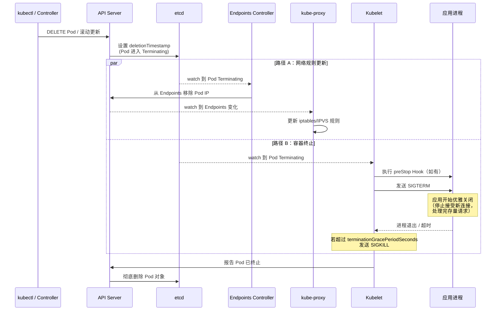

## 引子：一次滚动更新引发的 502

周五下午 4 点，线上告警群突然炸了：Nginx Ingress 返回大量 502 Bad Gateway。

排查发现，问题出在一次常规的 Deployment 滚动更新。每次新 Pod ready、旧 Pod 被终止的那几秒钟，总有零星请求被路由到了已经关闭端口的旧 Pod 上。

根因其实很简单——旧 Pod 收到 `SIGTERM` 后**立即**关闭了监听端口，但 kube-proxy 还没来得及把这个 Pod 的 IP 从 iptables/IPVS 规则里摘掉。在这个窗口期内，流量仍然会被转发到旧 Pod，得到的就是 `connection refused` → Ingress 返回 502。

要彻底理解这个问题，需要把 Pod 的完整生命周期从头到尾串一遍。

---

## Pod 的五种状态

| Phase | 含义 | 常见场景 |
|-------|------|----------|
| **Pending** | Pod 已被 API Server 接受，但尚未被调度或容器尚未就绪 | 等待调度、拉取镜像中 |
| **Running** | Pod 已绑定到节点，至少一个容器正在运行 | 正常工作状态 |
| **Succeeded** | 所有容器正常退出（exit code 0），不会重启 | Job/CronJob 完成 |
| **Failed** | 所有容器已终止，且至少一个非零退出 | 应用崩溃、OOMKilled |
| **Unknown** | 无法获取 Pod 状态 | 节点失联、kubelet 异常 |

> **注意**：这里的 Phase 是 Pod 级别的状态，不要和 Container 级别的 `Waiting`/`Running`/`Terminated` 搞混。一个 Pod 处于 `Running` Phase，并不代表它里面的每个容器都在运行。

---

## Pod 从创建到运行的完整流程

当你执行 `kubectl apply -f deployment.yaml` 后，背后发生了什么？

1. **kubectl apply** — 请求发送到 API Server
2. **API Server** — 验证请求，持久化到 etcd
3. **Scheduler** — watch 到未绑定节点的 Pod，执行 Filter + Score，选择最优节点
   - Scheduler 通过 watch 机制感知到未绑定节点的 Pod，执行 Filter（过滤不满足条件的节点）和 Score（给剩余节点打分排序）两个阶段，最终选出最优节点。调度结果通过更新 `Pod.spec.nodeName` 写回 API Server。
4. **API Server** — 更新 `Pod.spec.nodeName`
5. **Kubelet** — watch 到新 Pod 事件，开始创建
6. **CRI** — 创建 Sandbox（pause 容器）
   - Kubelet 首先通过 CRI 接口创建一个 Sandbox。这个 Sandbox 对应的就是 `pause` 容器——它是整个 Pod 网络命名空间的持有者。所有业务容器共享 pause 容器的 Network Namespace，这也是为什么同一个 Pod 内的容器可以用 `localhost` 互相通信。
7. **CNI** — 分配 IP，配置网络
   - Sandbox 创建后，Kubelet 调用 CNI 插件为 Pod 分配 IP 地址、配置网卡、路由和 iptables 规则。常见的 CNI 插件包括 Calico、Cilium、Flannel 等。
8. **CSI** — 挂载 Volume（如有）
9. **Init Containers** — 按顺序逐个执行，前一个成功才启动下一个
   - Init Containers **按定义顺序依次执行**，前一个成功退出（exit code 0）后才启动下一个。常见用途：等待依赖服务就绪（如数据库）、拉取配置文件 / 初始化数据目录、设置文件权限。
10. **拉取主容器镜像**（如需）
11. **CRI** — 创建并启动主容器
12. **postStart Hook** — 异步执行（如有配置）
    - 所有 Init Containers 完成后，主容器**并行启动**。如果配置了 `postStart` Hook，它会在容器启动后**异步**执行，但 Kubelet 会等 postStart 完成后才将容器标记为 Running。
13. **startupProbe** — 开始探测（如有配置）
14. **startupProbe 通过** — livenessProbe 和 readinessProbe 开始并行执行
15. **readinessProbe 通过** — Kubelet 将 Pod 状态中的 `Ready` condition 设为 True
16. **Endpoints Controller** — watch 到 Pod Ready，将 Pod IP 加入对应 Service 的 Endpoints
17. **kube-proxy** — watch 到 Endpoints 变化，更新节点上的 iptables / IPVS 规则
18. **流量进入 Pod** — 此时请求经过 Service → iptables/IPVS → Pod IP，链路打通

---

## 健康检查（Probe）详解

Kubernetes 提供三种探针，各自解决不同的问题：

### 三种 Probe 的设计哲学

| Probe | 目的 | 失败后果 | 典型场景 |
|-------|------|----------|----------|
| **startupProbe** | 判断应用是否已完成启动 | 重启容器 | 启动慢的 Java 应用、需要加载大量数据的服务 |
| **livenessProbe** | 判断应用是否存活（死锁检测） | 重启容器 | 检测死锁、检测内存泄露导致的无响应 |
| **readinessProbe** | 判断应用是否准备好接收流量 | 从 Endpoints 摘除（不重启） | 依赖的下游服务不可用时暂停接收流量 |

**执行顺序**：`startupProbe` → 通过后 → `livenessProbe` + `readinessProbe` 并行执行。

在 `startupProbe` 通过之前，`livenessProbe` 和 `readinessProbe` 都不会执行——这就是 startupProbe 被引入的原因：避免启动慢的应用被 livenessProbe 误杀。

### 四种探测方式

```yaml
# 1. HTTP GET — 最常用
livenessProbe:
  httpGet:
    path: /healthz
    port: 8080
    httpHeaders:
    - name: X-Custom-Header
      value: Awesome
  # 返回 200-399 视为成功

# 2. TCP Socket — 适用于非 HTTP 服务
readinessProbe:
  tcpSocket:
    port: 3306
  # 能建立 TCP 连接视为成功

# 3. Exec — 执行命令
livenessProbe:
  exec:
    command:
    - cat
    - /tmp/healthy
  # exit code 0 视为成功

# 4. gRPC — Kubernetes 1.24+ 原生支持
readinessProbe:
  grpc:
    port: 50051
    service: my.health.v1.Health
  # gRPC Health Checking Protocol
```

### 配置参数

```yaml
readinessProbe:
  httpGet:
    path: /ready
    port: 8080
  initialDelaySeconds: 5    # 容器启动后等多久开始探测
  periodSeconds: 10         # 探测间隔
  timeoutSeconds: 3         # 单次探测超时时间
  failureThreshold: 3       # 连续失败几次判定为失败
  successThreshold: 1       # 连续成功几次判定为成功（liveness/startup 只能为 1）
```

**参数设计建议**：
- `initialDelaySeconds`：如果配了 `startupProbe`，liveness/readiness 的这个值可以设 0
- `periodSeconds`：不要太短（增加 API Server 负担）也不要太长（响应慢）
- `timeoutSeconds`：必须小于 `periodSeconds`，否则探测会堆积
- `failureThreshold`：设太小容易误杀，设太大响应慢——需要在可用性和稳定性之间取舍

---

## Pod 终止流程：竞态是 502 的根因

这是本文的核心部分。当你执行 `kubectl delete pod` 或触发滚动更新时，以下事件**并行**发生：



### 竞态问题：用户请求为什么会失败？

用一个具体场景来理解。假设你有一个电商 API 服务正在滚动更新，用户正在下单：

1. 滚动更新触发，旧 Pod 开始终止
2. **路径 B 先完成**：Kubelet 发送 SIGTERM，应用收到信号后几十毫秒内关闭了 8080 端口
3. **路径 A 还没完成**：Endpoints Controller 和 kube-proxy 还在更新 iptables 规则，需要几秒钟
4. 这时候用户点了"提交订单" → 请求经过 Service → iptables 规则里**还有旧 Pod 的 IP** → 请求被转发到已关闭端口的旧 Pod → **用户看到 502 Bad Gateway**

**路径 A 和路径 B 是并行的**，没有任何同步机制保证"iptables 规则更新完毕"先于"应用关闭端口"。这个竞态窗口就是 502 的根因。

> **补充**：如果你的 Pod 运行的是 Controller（比如多集群管理中的各种 controller），它们不直接接收用户 HTTP 请求，没有流量经过 Service → Endpoints 这条链路，所以通常不需要配置 preStop。这个问题主要影响**通过 Service 暴露的、直接服务用户请求的业务 Pod**。

### 解决方案：preStop Hook

思路很简单：在 SIGTERM 之前加一个等待，让路径 A 有时间先完成。

```yaml
lifecycle:
  preStop:
    exec:
      command: ["sh", "-c", "sleep 5"]
```

加了 preStop 之后，同样的场景变成：

1. 滚动更新触发，旧 Pod 开始终止
2. **路径 B**：Kubelet 先执行 preStop → sleep 5 秒 → 5 秒后才发 SIGTERM → 应用才开始关闭端口
3. **路径 A**：这 5 秒内，Endpoints Controller 和 kube-proxy 已经完成了 iptables 规则更新，旧 Pod IP 已从规则中移除
4. 用户点"提交订单" → iptables 已经不包含旧 Pod → 请求被转发到新 Pod → **正常返回**

sleep 时长取决于集群中 Endpoints 更新和 kube-proxy 规则同步的延迟——小集群 3-5 秒通常够用，大集群或使用 Ingress Controller 的场景可能需要 10-20 秒（参考 [AWS EKS Best Practices](https://docs.aws.amazon.com/prescriptive-guidance/latest/ha-resiliency-amazon-eks-apps/lifecycle-hooks.html) 建议的 20 秒）。

**完整的优雅终止配置**：

```yaml
spec:
  terminationGracePeriodSeconds: 30  # 默认 30 秒
  containers:
  - name: app
    lifecycle:
      preStop:
        exec:
          command: ["sh", "-c", "sleep 5"]
    # 应用本身也需要正确处理 SIGTERM：
    # 1. 停止接受新连接
    # 2. 等待存量请求处理完毕
    # 3. 关闭数据库连接等资源
    # 4. 退出进程
```

> **注意**：`terminationGracePeriodSeconds` 是 preStop + SIGTERM 等待时间的**总和**，不是分别计算的。如果 preStop sleep 了 5 秒，留给应用处理 SIGTERM 的时间就只剩 25 秒。

---

## 容器运行时（CRI）

### CRI 是什么

CRI（Container Runtime Interface）是 Kubelet 和容器运行时之间的 **gRPC 接口规范**。它定义了两组服务：

- **RuntimeService**：管理 Pod Sandbox 和容器的生命周期（创建、启动、停止、删除、exec、attach 等）
- **ImageService**：管理镜像（拉取、列出、删除）

### 为什么 Kubernetes 1.24 移除了 dockershim

在早期，Kubernetes 直接调用 Docker API。但 Docker 本身是一个完整的开发工具链（docker build、docker push、docker run），Kubernetes 只需要其中"运行容器"的部分。

于是 Kubernetes 在 1.5 引入了 CRI 接口，并在 Kubelet 内部维护了一个 `dockershim` 来适配 Docker。调用链变成了：

```
Kubelet → dockershim → Docker Engine → containerd → runc
```

这条链路又长又脆弱。而 containerd 本身就实现了 CRI 接口，绕过 Docker 后调用链简化为：

```
Kubelet → containerd（CRI 插件） → runc
```

所以 Kubernetes 1.24 正式移除 dockershim，不再支持 Docker 作为容器运行时。**但 Docker 构建的镜像仍然兼容**——镜像格式遵循 OCI 标准，与运行时无关。

### 运行时分层

| 层级 | 组件 | 职责 |
|------|------|------|
| **CRI 客户端** | Kubelet | 通过 gRPC 调用 CRI 接口 |
| **高层运行时** | containerd / CRI-O | 镜像管理、容器生命周期、存储管理 |
| **Shim（垫片）** | containerd-shim-runc-v2 | 夹在 containerd 与容器进程之间，解耦两者——containerd 重启升级时容器不受影响 |
| **底层运行时（OCI Runtime）** | runc / crun / kata-containers | 真正创建和运行容器（设置 namespaces, cgroups, rootfs） |

**containerd vs CRI-O**：
- **containerd**：CNCF 毕业项目，从 Docker 中独立出来。功能丰富，生态广泛，是目前最主流的选择
- **CRI-O**：红帽主导，专为 Kubernetes 设计。只做 CRI 需要的事，更轻量。OpenShift 默认使用 CRI-O

**runc vs crun vs kata-containers**：

这三个都不是 Linux 内核自带的，而是为容器生态专门创建的用户态工具。Linux 内核提供的是底层原语（namespace、cgroup、seccomp），这些运行时在上面封装出"容器"这个抽象：

| 运行时 | 来源 | 维护方 | 语言 | 特点 |
|--------|------|--------|------|------|
| **runc** | 2015 年 Docker 将运行时核心代码捐出 | OCI (Open Container Initiative) | Go | OCI 参考实现，行业标准，containerd 和 CRI-O 默认调用 |
| **crun** | Red Hat 工程师开发的轻量替代 | Red Hat / 社区 | C | 比 runc 启动更快、内存占用更低，Podman 生态中常用 |
| **kata-containers** | 2017 年 Intel Clear Containers 和 Hyper.sh runV 合并 | OpenInfra Foundation | Go/Rust | 每个容器跑在轻量级 VM 中，硬件级隔离 |

**必须选一个，但可以混用。** containerd / CRI-O 每次创建容器时都要调用一个底层 OCI 运行时，否则容器起不来。不过不必全局只用一个——Kubernetes 的 `RuntimeClass` 机制允许按 Pod 粒度选择不同的运行时：

```yaml
# 定义两个 RuntimeClass
apiVersion: node.k8s.io/v1
kind: RuntimeClass
metadata:
  name: normal
handler: runc            # 普通业务用 runc
---
apiVersion: node.k8s.io/v1
kind: RuntimeClass
metadata:
  name: secure
handler: kata            # 需要强隔离的用 kata
```

```yaml
# Pod 指定使用哪个运行时
spec:
  runtimeClassName: secure    # 这个 Pod 跑在 Kata 虚拟机里
  containers:
    - name: untrusted-code
      image: user-submitted-code:latest
```

实际使用中，绝大多数集群只用 runc（默认、性能最好）。需要强隔离的场景（多租户、运行不可信代码）才会额外装 Kata，通过 RuntimeClass 让特定 Pod 走 Kata。

### 完整调用链


**为什么需要 shim？**

containerd-shim 作为容器进程的父进程存在，解决两个关键问题：
1. **containerd 可以重启升级而不影响正在运行的容器**——容器进程挂在 shim 下，不受 containerd 进程生命周期影响
2. **收集容器退出码**——shim 作为容器的父进程，负责 `wait4()` 收集子进程退出状态，避免僵尸进程

---

## Q&A

### Q1: Pod 中多个容器怎么通信？

同一个 Pod 内的所有容器共享 **Network Namespace**（由 pause 容器持有），因此：
- 容器之间可以通过 `localhost` + 不同端口直接通信
- 共享同一个 IP 地址和端口空间
- 可以通过 `emptyDir` Volume 共享文件

```
Pod (172.17.0.5)
├── pause (持有 Network Namespace)
├── container-a (localhost:8080)
├── container-b (localhost:9090)
└── 共享: Network Namespace, IPC Namespace, emptyDir Volumes
```

### Q2: 为什么需要 pause 容器？

核心思想是**关注点分离（Separation of Concerns）**：基础设施环境（Network Namespace、IPC Namespace）不应该由业务容器持有，也不应该让业务容器负责这些环境的稳定性。

这个设计模式在很多领域都有类似的做法：
- **操作系统**：内核负责进程调度、内存管理、网络协议栈，应用程序只管业务逻辑，不需要自己管理硬件
- **Web 服务器**：Nginx/Apache 负责 TLS 终止、连接管理、请求路由，后端应用只处理业务请求
- **Service Mesh**：Envoy sidecar 负责流量管理、mTLS、可观测性，业务容器完全不感知网络治理

pause 容器就是 Pod 内的"基础设施层"——它把网络环境的持有和管理从业务容器中剥离出来：

- 它只执行一个无限 `pause()` 系统调用，几乎不消耗资源（约 1MB 内存）
- 它永远不会崩溃（代码只有几十行 C）
- 它是 Network Namespace 和 IPC Namespace 的**稳定持有者**
- 所有业务容器加入（join）它的 Namespace

如果没有 pause 容器，就需要让某个业务容器来创建和持有 Network Namespace。这会带来两个问题：
1. 该容器崩溃重启 → Network Namespace 被销毁 → 其他容器的网络全断
2. 容器启动顺序产生了隐式依赖（谁先启动谁就得"兼职"管网络）

pause 容器把这个职责独立出来，业务容器只需要关心自己的业务逻辑。

### Q3: livenessProbe 和 readinessProbe 典型的错误配置有哪些？

**错误 1：livenessProbe 检查了外部依赖**

假设你有一个 Web API 服务，它依赖一个外部数据库。开发者在 `/healthz` 接口的实现中 ping 了数据库：

```go
// 应用代码中 /healthz 的实现
func healthzHandler(w http.ResponseWriter, r *http.Request) {
    err := db.Ping()  // 检查外部数据库是否可用
    if err != nil {
        w.WriteHeader(http.StatusInternalServerError)
        return
    }
    w.WriteHeader(http.StatusOK)
}
```

然后在 YAML 里把这个接口配给了 livenessProbe：

```yaml
# ❌ 看起来没问题，但 /healthz 内部 ping 了数据库
livenessProbe:
  httpGet:
    path: /healthz
    port: 8080
```

问题在于 livenessProbe 失败的后果是**重启容器**。当数据库挂了时：数据库不可用 → `/healthz` 返回 500 → livenessProbe 失败 → Kubelet 重启容器 → 重启后数据库还是挂的 → 又失败 → **无限重启**。你的应用本身没有任何问题，但一个不属于自己的故障把自己杀死了，而且重启根本解决不了数据库挂了的问题。

livenessProbe 只应该检查应用**自身**是否存活（进程没死锁、没 hang 住），不要检查外部依赖。外部依赖不可用应该通过 readinessProbe 来处理——把自己从 Endpoints 摘掉不接收新流量，但**不重启**。等数据库恢复后，readinessProbe 自动通过，流量重新进来。

**错误 2：readinessProbe 和 livenessProbe 用同一个接口**

延伸错误 1 的例子：你意识到需要检查数据库是否可用，这个判断本身是对的——但应该交给 readinessProbe 来做。问题是如果两个 Probe 都指向同一个 `/healthz`，而这个接口里检查了数据库，那 livenessProbe 就等于也在检查数据库，又回到了错误 1 的情况：

```yaml
# ❌ 两个 Probe 用同一个接口，livenessProbe 被"污染"了
livenessProbe:
  httpGet:
    path: /healthz   # 内部 ping 了数据库 → 数据库挂了就重启
readinessProbe:
  httpGet:
    path: /healthz   # 内部 ping 了数据库 → 数据库挂了就摘流量（这个是对的）
```

正确做法是分开两个接口，各自检查不同的东西：

```yaml
# ✅ 分开接口，各司其职
livenessProbe:
  httpGet:
    path: /livez     # 只检查进程自身：没死锁、没 hang 住
readinessProbe:
  httpGet:
    path: /readyz    # 检查是否能服务请求：数据库可用、缓存预热完成等
```

**错误 3：没有配置 startupProbe，livenessProbe 的 initialDelaySeconds 又太短**

```yaml
# ❌ Java 应用启动可能要 60 秒，但 10 秒后就开始 liveness 检测
livenessProbe:
  httpGet:
    path: /livez
    port: 8080
  initialDelaySeconds: 10
  failureThreshold: 3
  periodSeconds: 5
  # 10 + 3*5 = 25 秒后就会被杀掉，但应用还没启动完
```

正确做法是用 startupProbe 保护启动阶段：

```yaml
startupProbe:
  httpGet:
    path: /livez
    port: 8080
  failureThreshold: 30
  periodSeconds: 2
  # 最多等 60 秒启动
livenessProbe:
  httpGet:
    path: /livez
    port: 8080
  periodSeconds: 10
  failureThreshold: 3
  # startupProbe 通过后才开始
```

### Q4: Pod 被 delete 后还在接收流量，怎么解决？

这就是本文开头的问题。根因是 Pod 终止和 Endpoints 更新的**并行竞态**。

解决方案：

```yaml
lifecycle:
  preStop:
    exec:
      command: ["sh", "-c", "sleep 5"]
```

`preStop` 在 SIGTERM 之前执行。sleep 5 秒给 Endpoints Controller 和 kube-proxy 足够的时间把这个 Pod 的 IP 从 iptables 规则中移除。之后应用再收到 SIGTERM 开始优雅关闭，此时已经没有新流量进来了。

### Q5: Docker 和 containerd 是什么关系？

containerd 最初是 Docker 的一个组件，负责容器的生命周期管理。2017 年捐赠给 CNCF，成为独立项目。

```
Docker Engine 架构：
  docker CLI → dockerd (Docker Daemon) → containerd → runc

Kubernetes 早期（< 1.24）：
  Kubelet → dockershim → dockerd → containerd → runc

Kubernetes 现在（>= 1.24）：
  Kubelet → containerd (CRI plugin) → runc
```

总结：
- Docker 是一个**完整的开发者工具**（build + ship + run）
- containerd 是 Docker 中负责 **run** 的核心组件
- Kubernetes 只需要 run，所以直接用 containerd 就够了
- `docker build` 构建的镜像仍然可以在 containerd 上运行（OCI 标准镜像格式）

### Q6: Pod 一直 Pending 怎么排查？

Pod Pending 意味着它还**没有被调度到节点上**，或者已经调度但 Kubelet 还没开始创建。排查思路沿着创建流程逐步定位：

**第一步：看 Events**

```bash
kubectl describe pod <pod-name>
```

Events 区域通常会直接告诉你原因。常见的几类：

| Events 关键信息 | 原因 | 解决方向 |
|---|---|---|
| `0/5 nodes are available: insufficient cpu` | 集群资源不足 | 扩容节点，或降低 Pod 的 requests |
| `0/5 nodes are available: node(s) had taint ... that the pod didn't tolerate` | Taint 不匹配 | 给 Pod 加 Toleration，或去掉节点 Taint |
| `0/5 nodes are available: node(s) didn't match Pod's node affinity/selector` | 亲和性/选择器无匹配节点 | 检查 nodeSelector 或 nodeAffinity 配置 |
| `pod has unbound immediate PersistentVolumeClaims` | PVC 未 Bound（StorageClass 不存在、没有可用 PV、容量不匹配） | `kubectl get pvc` 检查 PVC 状态，`kubectl describe pvc` 看具体原因 |
| `FailedMount: Unable to attach or mount volumes` | Volume 挂载失败（存储后端不可用、跨可用区等） | 检查 PV 状态和 StorageClass 配置 |
| `ImagePullBackOff` / `ErrImagePull` | 镜像拉取失败（不存在、认证失败、网络不通） | 检查镜像名、imagePullSecrets、网络 |
| 没有任何 Events | Scheduler 没有运行，或 Pod 指定的 `schedulerName` 不存在 | 检查 Scheduler Pod 状态 |

**第二步：按 Events 提示进一步确认**

Events 已经告诉你原因了，第二步是根据提示做进一步确认：

```bash
# 如果 Events 提示资源不足 → 查看各节点资源分配情况
kubectl describe nodes | grep -A 5 "Allocated resources"

# 如果 Events 提示 PVC 未 Bound → 查看 PVC 状态和原因
kubectl get pvc
kubectl describe pvc <pvc-name>

# 如果 Events 提示 Taint → 查看节点 Taint 配置
kubectl describe nodes | grep -A 3 "Taints"
```

总结：**排查 Pending 基本上就是 `kubectl describe pod` 看 Events**，Events 会直接告诉你原因（资源不足、Taint 不匹配、PVC 未 Bound、镜像拉取失败等），然后针对性地确认和修复。

---

## 实战场景

### 场景 1：CrashLoopBackOff — livenessProbe 配错了

**现象**：

```bash
$ kubectl get pods
NAME                    READY   STATUS             RESTARTS     AGE
myapp-7d6f8b4c5-x2j9k   0/1     CrashLoopBackOff   5 (30s ago)  3m
```

**排查思路**：

```bash
# 1. 查看事件
$ kubectl describe pod myapp-7d6f8b4c5-x2j9k
Events:
  Warning  Unhealthy  Liveness probe failed: HTTP probe failed with statuscode: 503
  Normal   Killing    Container myapp failed liveness probe, will be restarted

# 2. 查看上一次容器的日志
$ kubectl logs myapp-7d6f8b4c5-x2j9k --previous

# 3. 发现：应用需要 45 秒启动，但 liveness 30 秒后就开始检测
```

**修复**：增加 startupProbe 或增大 `initialDelaySeconds`。

### 场景 2：滚动更新 502 — 优雅关闭失败

**现象**：每次 Deployment 滚动更新时，监控显示短暂的 502 spike。

**根因**：如前文分析，Pod 终止与 Endpoints 更新的并行竞态。

**完整修复方案**：

```yaml
apiVersion: apps/v1
kind: Deployment
metadata:
  name: myapp
spec:
  strategy:
    rollingUpdate:
      maxSurge: 1
      maxUnavailable: 0  # 保证不减少可用 Pod 数
  template:
    spec:
      terminationGracePeriodSeconds: 30
      containers:
      - name: myapp
        lifecycle:
          preStop:
            exec:
              command: ["sh", "-c", "sleep 5"]
        readinessProbe:
          httpGet:
            path: /ready
            port: 8080
          periodSeconds: 5
          failureThreshold: 1  # 快速从 Endpoints 摘除
```

同时，应用代码需要正确处理 SIGTERM：

```go
// Go 示例
quit := make(chan os.Signal, 1)
signal.Notify(quit, syscall.SIGTERM)
<-quit

// 1. 停止接受新连接
server.SetKeepAlivesEnabled(false)
// 2. 等待存量请求完成
ctx, cancel := context.WithTimeout(context.Background(), 20*time.Second)
defer cancel()
server.Shutdown(ctx)
```

### 场景 3：ImagePullBackOff — 三种根因

```bash
$ kubectl get pods
NAME                    READY   STATUS             AGE
myapp-5f6d7c8b9-abc12   0/1     ImagePullBackOff   5m
```

**根因 1：镜像名或 tag 写错了**

```bash
$ kubectl describe pod myapp-5f6d7c8b9-abc12
Events:
  Warning  Failed  Failed to pull image "myapp:v1.2.3": manifest unknown
```

检查 `image` 字段是否拼写正确，tag 是否存在。

**根因 2：私有镜像仓库认证失败**

```bash
Events:
  Warning  Failed  Failed to pull image: unauthorized: authentication required
```

需要创建 `imagePullSecrets`：

```bash
kubectl create secret docker-registry regcred \
  --docker-server=<registry> \
  --docker-username=<user> \
  --docker-password=<password>
```

然后在 Pod spec 中引用：

```yaml
spec:
  imagePullSecrets:
  - name: regcred
```

**根因 3：网络问题（无法连接到镜像仓库）**

```bash
Events:
  Warning  Failed  Failed to pull image: dial tcp: lookup registry.example.com: no such host
```

检查节点的 DNS 配置和网络出口策略。如果是内网环境，可能需要配置 mirror 或 proxy。

### 场景 4：OOMKilled — requests vs limits

**现象**：

```bash
$ kubectl get pods
NAME                    READY   STATUS    RESTARTS      AGE
myapp-5f6d7c8b9-def34   1/1     Running   3 (2m ago)    10m

$ kubectl describe pod myapp-5f6d7c8b9-def34
    Last State:  Terminated
      Reason:    OOMKilled
      Exit Code: 137
```

**根因**：容器实际内存使用超过了 `resources.limits.memory`，被 Linux OOM Killer 杀掉。

**requests vs limits 的区别**：

| 字段 | 调度时 | 运行时 |
|------|--------|--------|
| `requests` | Scheduler 据此决定调度到哪个节点 | 无硬限制，但作为 QoS 分类依据 |
| `limits` | 不影响调度 | 硬限制——超过 memory limit 触发 OOMKill，超过 CPU limit 触发 throttling |

```yaml
resources:
  requests:
    memory: "256Mi"   # 调度保证：节点至少有 256Mi 可分配
    cpu: "250m"
  limits:
    memory: "512Mi"   # 硬上限：超过就 OOMKill
    cpu: "500m"       # 硬上限：超过就 CPU throttling
```

**排查和修复**：

```bash
# 查看容器实际内存使用
kubectl top pod myapp-5f6d7c8b9-def34

# 查看节点资源
kubectl top node
```

- 如果是内存泄露：修复应用代码
- 如果是正常业务增长：调大 limits（同时注意节点容量）
- 如果是 JVM 应用：确保 `-Xmx` 设置小于 limits，并留出堆外内存空间

---

## 关键结论

- 滚动更新出现 502 几乎都是同一个原因：Pod 关端口比 iptables 规则摘除更快。加一个 `preStop: sleep` 等待 Endpoints 更新完成即可解决，sleep 时长根据集群规模调整（小集群 3-5 秒，大集群或有 Ingress Controller 的场景可能需要 10-20 秒）。
- livenessProbe 只检查应用自身是否死锁，绝不要检查外部依赖——数据库挂了你重启自己没有任何意义，那是 readinessProbe 的职责。
- 启动慢的应用（Java、大数据加载）必须配 startupProbe，否则 livenessProbe 会在应用还没起来时就把它杀掉，形成无限重启。
- `terminationGracePeriodSeconds` 是 preStop + SIGTERM 等待的总时间，不是分别计算的。preStop sleep 太长会挤占应用处理存量请求的时间。
- Docker 镜像在 containerd 上完全兼容——1.24 移除的是 dockershim 这个中间层，不是 Docker 镜像格式。构建流程不需要任何改变。

## 总结

回到开头的 502 问题，本质上是对 Pod 终止流程中的**并行竞态**不了解导致的。把完整的 Pod 生命周期梳理一遍：

1. **创建**：API Server → Scheduler → Kubelet → CRI → CNI → Init → Main → Probes → 加入 Endpoints
2. **运行**：livenessProbe 保证存活，readinessProbe 控制流量
3. **终止**：deletionTimestamp → 并行（Endpoints 摘除 + preStop + SIGTERM + SIGKILL）→ 删除

理解了这条线，你就能理解为什么需要 preStop sleep、为什么 livenessProbe 不该检查外部依赖、为什么 1.24 要移除 dockershim——它们都不是孤立的知识点，而是 Pod 生命周期这条主线上的一个个节点。
