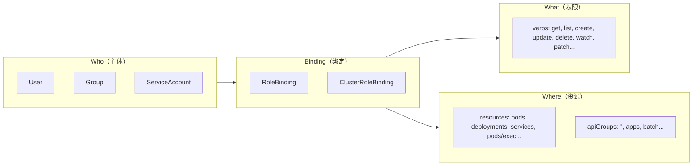
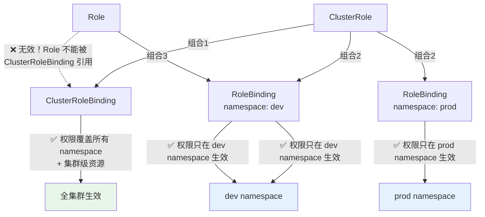

## 引子：一个让人困惑的 Forbidden

某天下午，同事找到我："我的 ServiceAccount 能正常 `kubectl get pods`，但 `kubectl exec` 就报错，权限明明给了 pods 的所有操作啊！"

报错信息长这样：

```
Error from server (Forbidden): pods "my-pod" is forbidden:
User "system:serviceaccount:dev:deployer" cannot create resource "pods/exec" in API group "" in the namespace "dev"
```

注意关键词：**pods/exec**。不是 `pods`，而是 `pods/exec`——这是一个**子资源（subresource）**。很多人给 `pods` 配了 `*` 权限，但完全忘了 `exec`、`log`、`portforward` 这些子资源需要**单独授权**。

这个小坑，恰好是理解 RBAC 全貌的绝佳入口。

---

## 核心概念：Who → Binding → What → Where

Kubernetes RBAC（Role-Based Access Control）回答一个核心问题：**谁（Who）可以对哪些资源（Where）执行什么操作（What）**。



RBAC 由 4 种 API 资源组成：

| 资源 | 作用域 | 用途 |
|------|--------|------|
| **Role** | Namespace | 定义某个 namespace 内的权限规则 |
| **ClusterRole** | Cluster | 定义集群级别的权限规则 |
| **RoleBinding** | Namespace | 将 Role 或 ClusterRole 绑定到主体，权限限定在该 namespace |
| **ClusterRoleBinding** | Cluster | 将 ClusterRole 绑定到主体，权限覆盖所有 namespace |

一句话总结：**Role/ClusterRole 定义"能做什么"，Binding 定义"谁能做"**。

---

## Role 与 ClusterRole

### Role：Namespace 级别权限

Role 只能定义某个 namespace 内的权限。

```yaml
apiVersion: rbac.authorization.k8s.io/v1
kind: Role
metadata:
  namespace: dev
  name: pod-reader
rules:
- apiGroups: [""]            # 核心 API 组，用空字符串表示
  resources: ["pods"]
  verbs: ["get", "watch", "list"]
- apiGroups: [""]
  resources: ["pods/log"]    # 子资源也要单独声明
  verbs: ["get"]
```

### ClusterRole：集群级别权限

ClusterRole 不受 namespace 限制，还可以覆盖非 namespace 资源（如 nodes、PV）以及非资源 URL（如 `/healthz`）。

```yaml
apiVersion: rbac.authorization.k8s.io/v1
kind: ClusterRole
metadata:
  name: pod-operator
rules:
- apiGroups: [""]
  resources: ["pods"]
  verbs: ["get", "list", "watch", "create", "update", "patch", "delete"]
- apiGroups: [""]
  resources: ["pods/exec", "pods/log", "pods/portforward"]
  verbs: ["create", "get"]  # exec 和 portforward 用的 verb 是 create
- apiGroups: [""]
  resources: ["nodes"]      # 非 namespace 资源
  verbs: ["get", "list"]
- nonResourceURLs: ["/healthz", "/healthz/*"]
  verbs: ["get"]            # 非资源 URL
```

> **注意**：`pods/exec` 的 verb 是 `create`，不是 `exec`。因为 kubectl exec 本质上是向 API Server **创建**一个 exec 请求。同理 `pods/portforward` 也是 `create`。

---

## Binding：将权限绑定到主体

### RoleBinding：Namespace 级别绑定

RoleBinding 可以引用同 namespace 的 Role，也可以引用一个 ClusterRole（但权限范围仍限定在当前 namespace）。

**引用 Role：**

```yaml
apiVersion: rbac.authorization.k8s.io/v1
kind: RoleBinding
metadata:
  name: read-pods-binding
  namespace: dev
subjects:
- kind: ServiceAccount
  name: deployer
  namespace: dev
roleRef:
  kind: Role
  name: pod-reader         # 引用同 namespace 的 Role
  apiGroup: rbac.authorization.k8s.io
```

**引用 ClusterRole（权限降级到 namespace 范围）：**

```yaml
apiVersion: rbac.authorization.k8s.io/v1
kind: RoleBinding
metadata:
  name: operate-pods-in-dev
  namespace: dev
subjects:
- kind: User
  name: zhangsan
  apiGroup: rbac.authorization.k8s.io
- kind: Group
  name: dev-team
  apiGroup: rbac.authorization.k8s.io
roleRef:
  kind: ClusterRole
  name: pod-operator       # 引用 ClusterRole，但权限只在 dev namespace 生效
  apiGroup: rbac.authorization.k8s.io
```

> **为什么 RoleBinding 引用 ClusterRole 很常用？** 因为可以定义一次 ClusterRole，然后在多个 namespace 分别用 RoleBinding 绑定，避免在每个 namespace 重复创建相同的 Role。

### ClusterRoleBinding：集群级别绑定

```yaml
apiVersion: rbac.authorization.k8s.io/v1
kind: ClusterRoleBinding
metadata:
  name: cluster-admin-binding
subjects:
- kind: User
  name: admin@example.com
  apiGroup: rbac.authorization.k8s.io
- kind: ServiceAccount
  name: ci-bot
  namespace: kube-system
roleRef:
  kind: ClusterRole
  name: cluster-admin      # 内置 ClusterRole，拥有所有权限
  apiGroup: rbac.authorization.k8s.io
```

---

## ServiceAccount 详解

### 自动创建的 default SA

每个 namespace 自动创建一个名为 `default` 的 ServiceAccount。如果 Pod 没有指定 `serviceAccountName`，就会使用它。

```bash
$ kubectl get sa -n dev
NAME      SECRETS   AGE
default   0         30d
```

> **最佳实践**：永远不要给 `default` SA 赋予额外权限。应该为每个应用创建专用 SA。

### Token 演进：1.24 前后的巨变

#### 1.24 之前：永久 Secret Token

```yaml
# 自动创建的 Secret，包含永不过期的 JWT token
apiVersion: v1
kind: Secret
metadata:
  name: deployer-token-x7b2k
  annotations:
    kubernetes.io/service-account.name: deployer
type: kubernetes.io/service-account-token
data:
  token: eyJhbGciOiJSUzI1NiIs...    # 永不过期！
  ca.crt: LS0tLS1CRUdJTi...
  namespace: ZGV2
```

问题很明显：**token 永不过期 + 自动挂载到每个 Pod**，一旦泄露就是永久后门。

#### 1.24+：TokenRequest API + Projected Volume

从 1.24 开始，Kubernetes 不再自动创建 Secret token，改用 **TokenRequest API** 动态签发短期 token：

```yaml
apiVersion: v1
kind: Pod
metadata:
  name: my-app
spec:
  serviceAccountName: deployer
  containers:
  - name: app
    image: my-app:latest
    volumeMounts:
    - mountPath: /var/run/secrets/kubernetes.io/serviceaccount
      name: kube-api-access
  volumes:
  - name: kube-api-access
    projected:                    # projected volume 投射卷
      sources:
      - serviceAccountToken:
          expirationSeconds: 3600  # 默认 1 小时过期
          path: token
          audience: api           # 限定受众
      - configMap:
          name: kube-root-ca.crt
          items:
          - key: ca.crt
            path: ca.crt
      - downwardAPI:
          items:
          - path: namespace
            fieldRef:
              fieldPath: metadata.namespace
```

关键改进：

| 特性 | 1.24 之前 | 1.24+ |
|------|-----------|-------|
| Token 类型 | Secret 中的静态 JWT | TokenRequest API 签发的短期 JWT |
| 有效期 | 永不过期 | 默认 1 小时，kubelet 自动轮换 |
| 受众（audience） | 无限制 | 可限定（如只能调 API Server） |
| 存储方式 | Secret 对象 | Projected Volume，不持久化 |
| 自动挂载 | 是 | 是（但可通过 `automountServiceAccountToken: false` 关闭） |

### ServiceAccount 最佳实践

```yaml
# 1. 创建专用 SA
apiVersion: v1
kind: ServiceAccount
metadata:
  name: my-controller
  namespace: app-system
automountServiceAccountToken: false  # 2. 默认关闭自动挂载

---
# 3. 只在需要的 Pod 中显式挂载
apiVersion: v1
kind: Pod
spec:
  serviceAccountName: my-controller
  automountServiceAccountToken: true  # 显式启用
```

---

## 组合关系全景图

这是 RBAC 最容易混淆的地方。三种组合方式，效果完全不同：



| 组合 | Role 类型 | Binding 类型 | 生效范围 |
|------|-----------|-------------|---------|
| 组合 1 | ClusterRole | ClusterRoleBinding | **所有 namespace + 集群级资源** |
| 组合 2 | ClusterRole | RoleBinding | **仅该 RoleBinding 所在 namespace** |
| 组合 3 | Role | RoleBinding | **仅该 Role 所在 namespace** |
| ❌ 无效 | Role | ClusterRoleBinding | 不允许！API Server 会拒绝 |

### 内置 ClusterRole

Kubernetes 预定义了一组 ClusterRole，覆盖常见场景：

| ClusterRole | 权限范围 |
|-------------|---------|
| `cluster-admin` | 超级管理员，所有资源所有操作 |
| `admin` | namespace 内完全管理权限（不含 ResourceQuota 和 namespace 本身） |
| `edit` | namespace 内读写权限（不含 RBAC 规则） |
| `view` | namespace 内只读权限（不含 Secret） |

```bash
# 查看内置 ClusterRole
$ kubectl get clusterrole | grep -E '^(cluster-admin|admin|edit|view)\s'
admin          2024-01-01T00:00:00Z
cluster-admin  2024-01-01T00:00:00Z
edit           2024-01-01T00:00:00Z
view           2024-01-01T00:00:00Z
```

---

## 面试追问

### Q1：认证（Authentication）和授权（Authorization）有什么区别？

请求到达 API Server 后，经过的链路是：

```
请求 → Authentication（你是谁？）→ Authorization（你能做什么？）→ Admission Control（要不要放行？）
```

- **认证（AuthN）**：确认身份。方式包括 X.509 客户端证书、Bearer Token、OIDC、Webhook 等。认证失败返回 401。
- **授权（AuthZ）**：确认权限。方式包括 RBAC、ABAC、Webhook、Node 等。授权失败返回 403。
- **准入控制（Admission）**：对已授权请求做进一步校验和变更（如 ResourceQuota、PodSecurityAdmission、Webhook）。

RBAC 处于**授权**这一层。即使通过了认证，没有对应的 Role/Binding 绑定，也会被 403 拒绝。

### Q2：如何调试 RBAC 权限问题？

**方法 1：`kubectl auth can-i`**

```bash
# 检查当前用户权限
$ kubectl auth can-i create pods/exec -n dev
no

# 检查指定 SA 的权限
$ kubectl auth can-i create pods/exec -n dev \
  --as=system:serviceaccount:dev:deployer
no

# 列出所有权限
$ kubectl auth can-i --list -n dev \
  --as=system:serviceaccount:dev:deployer
Resources          Non-Resource URLs   Resource Names   Verbs
pods               []                  []               [get list watch]
pods/log           []                  []               [get]
```

**方法 2：审计日志（Audit Log）**

在 API Server 启用审计策略后，所有 403 请求都会记录：

```json
{
  "kind": "Event",
  "level": "RequestResponse",
  "verb": "create",
  "resource": "pods",
  "subresource": "exec",
  "user": {
    "username": "system:serviceaccount:dev:deployer"
  },
  "responseStatus": {
    "code": 403,
    "reason": "Forbidden"
  }
}
```

**方法 3：`kubectl describe` 反向查找**

```bash
# 查看某个 RoleBinding 绑定了谁和什么角色
$ kubectl describe rolebinding -n dev

# 查看某个 ClusterRole 有哪些规则
$ kubectl describe clusterrole pod-operator
```

### Q3：User 和 ServiceAccount 有什么区别？

| 维度 | User | ServiceAccount |
|------|------|---------------|
| K8s 对象 | **不是** K8s 资源，无法通过 API 创建 | **是** K8s 资源（`v1/ServiceAccount`） |
| 身份来源 | 外部系统（证书 CN、OIDC provider） | K8s 自身创建和管理 |
| 作用域 | 全局（不属于任何 namespace） | 属于特定 namespace |
| 适用场景 | 人类用户、CI/CD pipeline | Pod 内的程序调用 API |
| 命名规范 | 任意字符串 | `system:serviceaccount:<ns>:<name>` |

> 提示：K8s 没有 "User" 对象，不存在 `kubectl get user`。用户身份完全由认证层决定（证书的 CN 字段、OIDC 的 sub claim 等）。

### Q4：如何做多租户隔离？

多租户隔离需要多个维度配合：

```
Namespace（逻辑隔离边界）
   ├── ServiceAccount（身份隔离，每个租户独立 SA）
   ├── RBAC（权限隔离，RoleBinding 限定 namespace）
   ├── ResourceQuota（资源配额，防止资源抢占）
   ├── LimitRange（默认资源限制）
   └── NetworkPolicy（网络隔离，限制跨 namespace 通信）
```

```yaml
# 1. 为租户创建 namespace
apiVersion: v1
kind: Namespace
metadata:
  name: tenant-a

---
# 2. 创建租户 SA
apiVersion: v1
kind: ServiceAccount
metadata:
  name: tenant-a-admin
  namespace: tenant-a

---
# 3. RBAC：用 RoleBinding 绑定 edit ClusterRole（权限限定在 tenant-a）
apiVersion: rbac.authorization.k8s.io/v1
kind: RoleBinding
metadata:
  name: tenant-a-edit
  namespace: tenant-a
subjects:
- kind: ServiceAccount
  name: tenant-a-admin
  namespace: tenant-a
roleRef:
  kind: ClusterRole
  name: edit
  apiGroup: rbac.authorization.k8s.io

---
# 4. 资源配额
apiVersion: v1
kind: ResourceQuota
metadata:
  name: tenant-a-quota
  namespace: tenant-a
spec:
  hard:
    requests.cpu: "4"
    requests.memory: 8Gi
    limits.cpu: "8"
    limits.memory: 16Gi
    pods: "20"

---
# 5. 网络隔离：默认拒绝所有入站
apiVersion: networking.k8s.io/v1
kind: NetworkPolicy
metadata:
  name: default-deny-ingress
  namespace: tenant-a
spec:
  podSelector: {}
  policyTypes:
  - Ingress
```

### Q5：什么是 Aggregated ClusterRole？

Aggregated ClusterRole 允许通过 label selector 自动**聚合**多个 ClusterRole 的规则。Kubernetes 内置的 `admin`、`edit`、`view` 就是聚合角色。

```yaml
# 定义一个聚合 ClusterRole
apiVersion: rbac.authorization.k8s.io/v1
kind: ClusterRole
metadata:
  name: monitoring-view
  labels:
    # 这个 label 会被 "view" ClusterRole 聚合
    rbac.authorization.k8s.io/aggregate-to-view: "true"
rules:
- apiGroups: ["monitoring.coreos.com"]
  resources: ["prometheuses", "alertmanagers", "servicemonitors"]
  verbs: ["get", "list", "watch"]
```

当你创建了上面这个 ClusterRole 后，所有拥有 `view` 权限的用户会**自动获得**对 Prometheus CRD 的只读权限——不需要修改任何现有的 Binding。

这就是 CRD operator 通常的做法：安装时创建带有聚合 label 的 ClusterRole，自动融入内置权限体系。

查看 `view` 的聚合规则：

```bash
$ kubectl get clusterrole view -o yaml | head -20
apiVersion: rbac.authorization.k8s.io/v1
kind: ClusterRole
metadata:
  name: view
  labels:
    kubernetes.io/bootstrapping: rbac-defaults
aggregationRule:
  clusterRoleSelectors:
  - matchLabels:
      rbac.authorization.k8s.io/aggregate-to-view: "true"
rules: []   # rules 由聚合自动填充，不手动维护
```

---

## 实战场景

### 场景 1：Controller 无法创建 CRD 资源——忘记配 RBAC

**现象**：自定义 Controller 启动后日志报错：

```
E0424 14:23:01.123456  controller.go:42]
Failed to list *v1alpha1.MyResource: myresources.example.com is forbidden:
User "system:serviceaccount:controller-system:my-controller"
cannot list resource "myresources" in API group "example.com"
```

**原因**：开发者创建了 CRD 和 Controller，但忘了给 Controller 的 SA 配 RBAC 权限。

**解决**：

```yaml
apiVersion: rbac.authorization.k8s.io/v1
kind: ClusterRole
metadata:
  name: my-controller-role
rules:
- apiGroups: ["example.com"]
  resources: ["myresources"]
  verbs: ["get", "list", "watch", "create", "update", "patch", "delete"]
- apiGroups: ["example.com"]
  resources: ["myresources/status"]   # 别忘了 status 子资源
  verbs: ["get", "update", "patch"]

---
apiVersion: rbac.authorization.k8s.io/v1
kind: ClusterRoleBinding
metadata:
  name: my-controller-rolebinding
subjects:
- kind: ServiceAccount
  name: my-controller
  namespace: controller-system
roleRef:
  kind: ClusterRole
  name: my-controller-role
  apiGroup: rbac.authorization.k8s.io
```

> **提示**：使用 kubebuilder / operator-sdk 脚手架时，RBAC 权限通过 `//+kubebuilder:rbac:groups=...` 注解自动生成到 `config/rbac/` 目录。手动开发时务必检查。

### 场景 2：能 get pods 但无法 exec——子资源权限的隐藏坑

这就是文章开头的场景。回顾一下原始 Role：

```yaml
# ❌ 错误配置：只授权了 pods，没有 pods/exec
apiVersion: rbac.authorization.k8s.io/v1
kind: Role
metadata:
  namespace: dev
  name: pod-manager
rules:
- apiGroups: [""]
  resources: ["pods"]
  verbs: ["*"]          # 这里的 * 只覆盖 pods 本身
```

`verbs: ["*"]` 是对 **pods** 这个资源的所有操作，但 `pods/exec`、`pods/log`、`pods/portforward` 是**独立的子资源**，必须单独声明：

```yaml
# ✅ 正确配置
apiVersion: rbac.authorization.k8s.io/v1
kind: Role
metadata:
  namespace: dev
  name: pod-manager
rules:
- apiGroups: [""]
  resources: ["pods"]
  verbs: ["*"]
- apiGroups: [""]
  resources: ["pods/exec", "pods/log", "pods/portforward"]
  verbs: ["create", "get"]
```

常见的子资源列表：

| 父资源 | 子资源 | 典型 verb |
|--------|--------|-----------|
| pods | pods/exec | create |
| pods | pods/log | get |
| pods | pods/portforward | create |
| pods | pods/attach | create |
| deployments | deployments/scale | get, update, patch |
| nodes | nodes/proxy | create, get |
| services | services/proxy | create, get |
| * | */status | get, update, patch |

### 场景 3：升级 1.24+ 后 Pod 内调 API 间歇性 401

**现象**：集群从 1.23 升级到 1.26 后，部分 Pod 内调用 K8s API 偶尔报 401 Unauthorized，重启 Pod 后恢复，但一段时间后又出现。

**根因分析**：

应用代码在启动时**一次性读取** `/var/run/secrets/kubernetes.io/serviceaccount/token` 并缓存到内存。1.24 之前 token 永不过期，所以没问题。1.24+ 后 token 默认 1 小时过期，kubelet 会在过期前自动轮换文件内容，但应用内存中缓存的还是旧 token。

**解决方案**：

```go
// ❌ 错误做法：一次性读取
token, _ := os.ReadFile("/var/run/secrets/kubernetes.io/serviceaccount/token")
// 用这个 token 调 API... 1 小时后就 401

// ✅ 正确做法 1：每次调 API 前重新读取
func getToken() (string, error) {
    token, err := os.ReadFile("/var/run/secrets/kubernetes.io/serviceaccount/token")
    return string(token), err
}

// ✅ 正确做法 2：使用官方 client-go，自动处理 token 轮换
import "k8s.io/client-go/rest"
config, _ := rest.InClusterConfig()  // 自动从 projected volume 读取并轮换
clientset, _ := kubernetes.NewForConfig(config)
```

> **client-go 用户无需担心**：`rest.InClusterConfig()` 内部使用的 `tokenFile` transport 会在每次请求时重新读取文件。只有自己拼 HTTP 请求的场景需要注意。

### 场景 4：权限在一个 Namespace 生效，换一个就不行

**现象**：用户在 `dev` namespace 下可以正常操作 pods，但切到 `staging` namespace 就报 403。

**排查**：

```bash
$ kubectl auth can-i list pods -n dev --as=zhangsan
yes

$ kubectl auth can-i list pods -n staging --as=zhangsan
no
```

**原因**：使用的是 **RoleBinding**，只在 `dev` namespace 创建了绑定。

```bash
$ kubectl get rolebinding -n dev
NAME              ROLE                AGE
dev-pod-reader    ClusterRole/view    30d

$ kubectl get rolebinding -n staging
No resources found in staging namespace.
```

**解决**：

方案 A：在 staging namespace 也创建 RoleBinding（推荐，最小权限原则）：

```yaml
apiVersion: rbac.authorization.k8s.io/v1
kind: RoleBinding
metadata:
  name: staging-pod-reader
  namespace: staging       # 新 namespace
subjects:
- kind: User
  name: zhangsan
  apiGroup: rbac.authorization.k8s.io
roleRef:
  kind: ClusterRole
  name: view
  apiGroup: rbac.authorization.k8s.io
```

方案 B：改用 ClusterRoleBinding（权限覆盖所有 namespace，谨慎使用）：

```yaml
apiVersion: rbac.authorization.k8s.io/v1
kind: ClusterRoleBinding
metadata:
  name: all-ns-pod-reader
subjects:
- kind: User
  name: zhangsan
  apiGroup: rbac.authorization.k8s.io
roleRef:
  kind: ClusterRole
  name: view
  apiGroup: rbac.authorization.k8s.io
```

> **选择依据**：如果用户只需要访问有限的几个 namespace，用 RoleBinding 逐个绑定更安全。如果用户确实需要跨所有 namespace 的权限（如 SRE / 平台工程师），再用 ClusterRoleBinding。

---

## 关键结论

- `pods` 的 `verbs: ["*"]` 不覆盖 `pods/exec`、`pods/log` 等子资源——子资源在 RBAC 中是独立的资源条目，必须单独授权。
- 排查权限问题的第一步永远是 `kubectl auth can-i`，而不是翻 Role 定义。它能直接告诉你某个主体对某个资源有没有某个操作权限。
- 1.24+ 之后 SA token 默认 1 小时过期，如果你的代码在启动时一次性读取 token 并缓存，迟早会遇到间歇性 401。用 `rest.InClusterConfig()` 或每次请求前重新读文件。
- 需要跨多个 namespace 用同一套权限时，定义一个 ClusterRole 然后在每个 namespace 用 RoleBinding 绑定——比在每个 namespace 重复创建 Role 干净得多。
- 永远不要给 default ServiceAccount 加权限。为每个应用创建专用 SA，并默认关闭 `automountServiceAccountToken`，只在需要时显式开启。

## 总结

回到开头的 `pods/exec forbidden`——现在你应该清楚了：

1. `pods/exec` 是**子资源**，必须在 Role/ClusterRole 的 `resources` 中单独声明
2. `exec` 操作对应的 verb 是 `create`，不是 `exec`
3. 即使对 `pods` 配了 `verbs: ["*"]`，也不会自动覆盖 `pods/exec`

更重要的是，通过这个小问题，我们串联了 RBAC 的完整知识体系：

- **4 种资源**：Role、ClusterRole、RoleBinding、ClusterRoleBinding
- **3 种组合**：决定权限是集群级还是 namespace 级
- **SA Token 演进**：从永久 Secret 到短期 Projected Volume
- **调试三板斧**：`kubectl auth can-i` → 审计日志 → describe binding

RBAC 不难，难在**细节**。希望这篇文章帮你把这些细节都补齐了。
