## 故事的开始：Pod Pending，但节点明明有资源

周五下午，一个告警弹了出来：某 Deployment 扩容后，新 Pod 一直卡在 Pending。

```bash
$ kubectl describe pod my-app-7f8d9c6b4-xk2nz
...
Events:
  Warning  FailedScheduling  default-scheduler  0/5 nodes are available:
    5 Insufficient cpu. preemption: 0/5 nodes are available:
    5 No preemption victims found for incoming pod.
```

我赶紧看了一下节点资源：

```bash
$ kubectl top nodes
NAME     CPU(cores)   CPU%   MEMORY(bytes)   MEMORY%
node-1   1200m        30%    4096Mi           50%
node-2   800m         20%    3200Mi           40%
node-3   600m         15%    2800Mi           35%
node-4   900m         22%    3600Mi           45%
node-5   1100m        27%    4200Mi           52%
```

CPU 使用率最高才 30%，为什么调度器说 `Insufficient cpu`？

答案藏在调度器的核心设计里：**调度器看的是 requests（声明量），不是实际使用量。**

```bash
$ kubectl describe node node-1
...
Allocated resources:
  Resource           Requests     Limits
  --------           --------     ------
  cpu                3800m (95%)  8000m (200%)
  memory             6Gi (75%)   12Gi (150%)
```

虽然实际只用了 30% CPU，但节点上所有 Pod 的 `requests.cpu` 加起来已经占了 95%。调度器按 requests 计算可分配资源，自然认为"没地方放了"。

这个排查过程，引出了一个更大的问题：**调度器到底是怎么工作的？**

---

## 调度的本质

Kubernetes 调度器做的事情非常简单，用一句话概括：

> **输入：一个 `spec.nodeName` 为空的 Pending Pod；输出：给它的 `spec.nodeName` 写上一个合适的 Node 名称。**

就这么简单。但"合适"二字的背后，是一套精密的插件化框架。

调度器的核心循环：

1. 从调度队列中取出一个 Pending Pod
2. 遍历所有 Node，过滤掉不满足条件的（Filter）
3. 对剩余 Node 打分排序（Score）
4. 选出最高分的 Node，执行绑定（Bind）

听起来很简单？但实际上每一步都可以通过插件扩展，这就是 **Scheduling Framework**。

---

## Scheduling Framework（1.19+ GA）

从 Kubernetes 1.19 开始，调度器内部全面重构为 **Scheduling Framework**，所有调度逻辑都以插件（Plugin）的形式挂载到一系列扩展点（Extension Point）上。

### 完整扩展点链

```mermaid
graph LR
    A[Sort] --> B[PreFilter]
    B --> C[Filter]
    C --> D[PostFilter]
    D --> E[PreScore]
    E --> F[Score]
    F --> G[NormalizeScore]
    G --> H[Reserve]
    H --> I[Permit]
    I --> J[PreBind]
    J --> K[Bind]
    K --> L[PostBind]

    style A fill:#e1f5fe
    style B fill:#e1f5fe
    style C fill:#ffebee
    style D fill:#ffebee
    style E fill:#e8f5e9
    style F fill:#e8f5e9
    style G fill:#e8f5e9
    style H fill:#fff3e0
    style I fill:#fff3e0
    style J fill:#f3e5f5
    style K fill:#f3e5f5
    style L fill:#f3e5f5
```



整个流程分为两个阶段：

| 阶段 | 包含的扩展点 | 特点 |
|------|-------------|------|
| **Scheduling Cycle**（调度周期） | Sort → PreFilter → Filter → PostFilter → PreScore → Score → NormalizeScore → Reserve → Permit | **串行执行**，同一时刻只调度一个 Pod |
| **Binding Cycle**（绑定周期） | PreBind → Bind → PostBind | **并行执行**，多个 Pod 可以同时绑定 |

为什么这样设计？因为调度决策需要全局视角（必须串行），而绑定只是写 apiserver（可以并行提高吞吐）。

---

## 各扩展点详解

### 1. Sort — 决定谁先调度

Sort 插件决定调度队列中 Pod 的排序。默认实现是 **QueueSort**，按 Pod 优先级（PriorityClass）从高到低排列，优先级相同则按创建时间排。

### 2. PreFilter — 预处理与快速失败

PreFilter 在正式过滤之前运行，用于：
- 预计算一些后续 Filter 需要的数据（避免对每个 Node 重复计算）
- 快速判断 Pod 是否根本不可调度（提前失败）

**内置 PreFilter 插件：**
- `NodeResourcesFit`：预计算 Pod 的资源请求
- `NodePorts`：检查 Pod 是否需要 hostPort
- `InterPodAffinity`：预处理 Pod 亲和/反亲和规则
- `PodTopologySpread`：预计算拓扑分布约束
- `VolumeBinding`：检查 PVC 状态

### 3. Filter — 硬性过滤（最关键的一步）

Filter 是调度器的"守门员"，任何一个 Filter 插件返回失败，该 Node 就被淘汰。

**全部内置 Filter 插件：**

| 插件 | 作用 |
|------|------|
| `NodeResourcesFit` | 检查 Node 剩余资源（Allocatable - 已分配 requests）是否满足 Pod requests |
| `NodeName` | 如果 Pod 指定了 `spec.nodeName`，只留该 Node |
| `NodePorts` | 检查 Pod 所需的 hostPort 在 Node 上是否被占用 |
| `NodeAffinity` | 评估 `nodeAffinity` 规则（`requiredDuringSchedulingIgnoredDuringExecution`） |
| `NodeUnschedulable` | 过滤掉 `spec.unschedulable: true` 的 Node（cordon 的 Node） |
| `TaintToleration` | 检查 Node 上的 Taint，Pod 是否有对应的 Toleration |
| `InterPodAffinity` | 评估 Pod 间亲和/反亲和的 `required` 规则 |
| `PodTopologySpread` | 检查 Pod 拓扑分布约束 `whenUnsatisfiable: DoNotSchedule` |
| `VolumeBinding` | 检查 PVC/PV 绑定状态，以及 Node 是否满足存储拓扑约束 |
| `VolumeRestrictions` | 检查 Volume 挂载限制（如 ReadWriteOnce 不能多节点） |
| `VolumeZone` | 检查 PV 的 zone 标签是否与 Node 匹配 |
| `EBSLimits` / `GCEPDLimits` / `AzureDiskLimits` | 检查 Node 上挂载的云盘数量是否超限 |
| `CSIMaxVolumeLimitChecker` | 检查 CSI 卷数量限制 |

> **这就解释了开头的问题**：`NodeResourcesFit` 计算的是 requests 之和，不是实际使用量。即使 `kubectl top` 显示 CPU 使用率只有 30%，只要 requests 之和超过了 Node 的 Allocatable，调度器就会拒绝。

### 4. PostFilter — 抢占的入口

当 Filter 阶段没有任何 Node 通过时，PostFilter 被触发。默认的 PostFilter 插件是 **DefaultPreemption**，它负责执行抢占逻辑（后面详细讲）。

### 5. PreScore — 打分前的准备

PreScore 在打分之前运行，用于预计算 Score 插件需要的数据。例如 `InterPodAffinity` 在 PreScore 阶段预处理拓扑匹配信息。

### 6. Score — 给候选 Node 打分

Filter 阶段筛完后，可能还剩多个 Node，Score 阶段给它们排名次。每个 Score 插件对每个 Node 打 0-100 分，最终加权求和。

**全部内置 Score 插件：**

| 插件 | 作用 | 默认权重 |
|------|------|---------|
| `NodeResourcesBalancedAllocation` | 倾向 CPU/Memory 使用比例均衡的 Node | 1 |
| `NodeResourcesFit` (LeastAllocated) | 倾向资源空闲多的 Node（默认策略） | 1 |
| `InterPodAffinity` | Pod 亲和/反亲和的 `preferred` 规则打分 | 1 |
| `NodeAffinity` | `nodeAffinity` 的 `preferredDuringSchedulingIgnoredDuringExecution` 打分 | 1 |
| `TaintToleration` | 倾向 Taint 更少的 Node | 1 |
| `PodTopologySpread` | 拓扑分布约束的 `whenUnsatisfiable: ScheduleAnyway` 打分 | 2 |
| `ImageLocality` | 倾向已经拉取过 Pod 镜像的 Node（减少拉取时间） | 1 |

> `NodeResourcesFit` 的 Score 策略有三种模式：
> - **LeastAllocated**（默认）：倾向空闲节点，适合大多数场景
> - **MostAllocated**：倾向装满节点，适合节省成本（减少节点数）
> - **RequestedToCapacityRatio**：自定义打分曲线

### 7. NormalizeScore — 归一化

将各 Score 插件的原始分数归一化到 [0, 100] 范围内，确保不同插件之间可以公平加权。

### 8. Reserve — 乐观预留

Score 选定 Node 后，Reserve 阶段"乐观"地预留资源（如将 PVC 标记为已绑定）。如果后续步骤失败，会触发 **Unreserve** 回滚。

### 9. Permit — 最后的拦截

Permit 是调度周期的最后一关，可以：
- **Approve**：允许通过
- **Deny**：拒绝，Pod 回到队列
- **Wait**：挂起等待（用于实现 Gang Scheduling 等需要多个 Pod 同时到位的场景）

### 10. PreBind → Bind → PostBind

进入 Binding Cycle（并行执行）：
- **PreBind**：绑定前的准备工作（如 `VolumeBinding` 在这里真正执行 PV/PVC 绑定）
- **Bind**：调用 apiserver 将 `spec.nodeName` 写入 Pod 对象（默认插件 `DefaultBinder`）
- **PostBind**：绑定完成后的清理工作（纯通知性质，不影响结果）

---

## 调度策略与优先级

### PriorityClass

PriorityClass 决定了 Pod 在调度队列中的优先级，以及能否触发抢占。

```yaml
apiVersion: scheduling.k8s.io/v1
kind: PriorityClass
metadata:
  name: high-priority
value: 1000000
globalDefault: false
preemptionPolicy: PreemptLowerPriority  # 或 Never
description: "用于关键业务 Pod"
---
apiVersion: v1
kind: Pod
metadata:
  name: critical-app
spec:
  priorityClassName: high-priority
  containers:
    - name: app
      image: my-app:latest
      resources:
        requests:
          cpu: "2"
          memory: "4Gi"
```

系统内置的 PriorityClass：

| 名称 | 值 | 用途 |
|------|-----|------|
| `system-cluster-critical` | 2000000000 | 集群关键组件（如 kube-dns） |
| `system-node-critical` | 2000001000 | 节点关键组件（如 kube-proxy） |

### 抢占机制（Preemption）

当高优先级 Pod 无法调度时，调度器会尝试驱逐低优先级 Pod 来腾出资源。

**抢占流程（5 步）：**

1. **触发**：Filter 阶段所有 Node 都被过滤掉，进入 PostFilter → DefaultPreemption
2. **筛选候选 Node**：在每个 Node 上模拟驱逐低优先级 Pod，看是否能腾出足够资源
3. **选择最佳 Node**：选择需要驱逐最少 Pod、影响最小的 Node（优先选择不影响 PDB 的）
4. **驱逐 Victim Pod**：给被选中的低优先级 Pod 发送删除请求（优雅终止）
5. **重新调度**：高优先级 Pod 回到调度队列等待下一轮调度（不是立即绑定，因为被驱逐的 Pod 需要时间终止）

> 注意：抢占不是立即完成的。高优先级 Pod 设置 `nominatedNodeName` 后，还要等 victim Pod 优雅退出，然后下一轮调度才真正绑定。

---

## 面试追问

### Q1: 怎么保证 Pod 不被调度到资源不足的 Node？

**核心插件：`NodeResourcesFit`**

调度器看的是 **requests**，不是 limits，更不是实际使用量。计算公式：

```
Node 可分配 = Allocatable - 已调度的所有 Pod 的 requests 之和
如果 Node 可分配 < 新 Pod 的 requests → 过滤掉
```

这意味着：
- 如果不设 requests，调度器认为 Pod 不需要资源（`requests = 0`），可以调度到任何 Node
- 如果 requests 设得太大，会浪费资源；设得太小，会导致超卖
- `kubectl top` 显示的是实际使用量（来自 metrics-server），和调度器无关

**最佳实践：** requests 应该设置为 Pod 正常运行时的资源需求（P99），limits 设置为极端情况下的上限。

### Q2: Node Affinity vs Node Selector？

| 维度 | `nodeSelector` | `nodeAffinity` |
|------|---------------|----------------|
| 表达力 | 只支持精确匹配 | 支持 `In`, `NotIn`, `Exists`, `DoesNotExist`, `Gt`, `Lt` |
| 软/硬约束 | 只有硬约束 | `required`（硬）+ `preferred`（软，带权重） |
| 使用场景 | 简单场景：指定 GPU 节点 | 复杂场景：倾向某些 zone 但不强制 |
| 调度器阶段 | Filter | Filter（required）+ Score（preferred） |

```yaml
# nodeSelector 简单用法
spec:
  nodeSelector:
    gpu: "true"

# nodeAffinity 复杂用法
spec:
  affinity:
    nodeAffinity:
      requiredDuringSchedulingIgnoredDuringExecution:
        nodeSelectorTerms:
          - matchExpressions:
              - key: topology.kubernetes.io/zone
                operator: In
                values: ["us-east-1a", "us-east-1b"]
      preferredDuringSchedulingIgnoredDuringExecution:
        - weight: 80
          preference:
            matchExpressions:
              - key: node-type
                operator: In
                values: ["high-memory"]
```

### Q3: Taint 和 Toleration 的使用场景？

Taint 和 Toleration 是"反向亲和"机制：Node 说"我有毒（Taint）"，Pod 说"我能容忍（Toleration）"。

**三种 Effect：**

| Effect | 含义 |
|--------|------|
| `NoSchedule` | 没有对应 Toleration 的 Pod 不会被调度到该 Node |
| `PreferNoSchedule` | 尽量不调度，但不是硬约束 |
| `NoExecute` | 不调度 + 已在运行的 Pod 也会被驱逐 |

**典型场景：**

```bash
# 1. 专用节点：GPU 节点只给 ML 任务用
kubectl taint nodes gpu-node-1 dedicated=ml:NoSchedule

# 2. 节点维护：排空节点
kubectl taint nodes node-1 maintenance=true:NoExecute

# 3. 系统内置 Taint
# - node.kubernetes.io/not-ready (NoExecute)
# - node.kubernetes.io/unreachable (NoExecute)
# - node.kubernetes.io/memory-pressure (NoSchedule)
# - node.kubernetes.io/disk-pressure (NoSchedule)
# - node.kubernetes.io/pid-pressure (NoSchedule)
# - node.kubernetes.io/unschedulable (NoSchedule) — cordon 时添加
```

Pod 侧的 Toleration：

```yaml
spec:
  tolerations:
    - key: "dedicated"
      operator: "Equal"
      value: "ml"
      effect: "NoSchedule"
    # 容忍所有 Taint（DaemonSet 常用）
    - operator: "Exists"
```

### Q4: PodTopologySpread 是什么？怎么用？

`PodTopologySpread` 控制 Pod 在拓扑域（zone、node、rack 等）之间的分布均匀性。

```yaml
spec:
  topologySpreadConstraints:
    - maxSkew: 1
      topologyKey: topology.kubernetes.io/zone
      whenUnsatisfiable: DoNotSchedule
      labelSelector:
        matchLabels:
          app: my-app
```

关键参数：
- `maxSkew`：允许的最大偏差。`maxSkew=1` 表示各拓扑域的 Pod 数量最多相差 1
- `topologyKey`：Node 标签键，定义拓扑域（`zone`、`hostname` 等）
- `whenUnsatisfiable`：
  - `DoNotSchedule`：硬约束（在 Filter 阶段检查）
  - `ScheduleAnyway`：软约束（在 Score 阶段打分）
- `labelSelector`：哪些 Pod 参与计算

### Q5: 如何自定义调度策略？

三种方式，从轻到重：

**方式一：Scheduler Configuration（推荐）**

通过 `KubeSchedulerConfiguration` 调整内置插件的启停和参数：

```yaml
apiVersion: kubescheduler.config.k8s.io/v1
kind: KubeSchedulerConfiguration
profiles:
  - schedulerName: default-scheduler
    plugins:
      score:
        disabled:
          - name: NodeResourcesBalancedAllocation
        enabled:
          - name: NodeResourcesFit
            weight: 2
    pluginConfig:
      - name: NodeResourcesFit
        args:
          scoringStrategy:
            type: MostAllocated  # 改为装箱策略
```

**方式二：自定义 Scheduler Plugin（Go 开发）**

实现 `framework.Plugin` 接口，编译进调度器二进制：

```go
type MyPlugin struct{}

func (p *MyPlugin) Name() string { return "MyPlugin" }

func (p *MyPlugin) Filter(ctx context.Context, state *framework.CycleState,
    pod *v1.Pod, nodeInfo *framework.NodeInfo) *framework.Status {
    // custom logic
    return framework.NewStatus(framework.Success, "")
}
```

**方式三：Webhook Extender（不推荐，将废弃）**

通过 HTTP Webhook 外挂扩展逻辑，延迟高、可靠性差。

**方式四：运行多个调度器**

部署独立的调度器实例，Pod 通过 `spec.schedulerName` 指定使用哪个：

```yaml
spec:
  schedulerName: my-custom-scheduler
```

---

## 实战场景

### 场景一：Pod Pending 但节点有资源（开头的故事）

**现象：** `kubectl top nodes` 显示 CPU 使用率才 30%，但 Pod 因 `Insufficient cpu` 无法调度。

**根因：** 调度器看 requests，不看实际使用量。其他 Pod 的 `requests.cpu` 之和已经占满了节点的 Allocatable。

**排查路径：**

```bash
# 1. 看 Pod 事件
kubectl describe pod <pod-name>

# 2. 看 Node 的已分配资源（重点看 Requests 列）
kubectl describe node <node-name> | grep -A 5 "Allocated resources"

# 3. 看所有 Node 的资源分配情况
kubectl get nodes -o custom-columns=\
  NAME:.metadata.name,\
  CPU_REQ:.status.allocatable.cpu,\
  CPU_ALLOC:.status.capacity.cpu
```

**解决方案：**
1. 审查现有 Pod 的 requests 是否设置过大（常见问题：copy-paste 导致 requests = limits）
2. 使用 VPA（Vertical Pod Autoscaler）自动调整 requests
3. 增加节点

### 场景二：三个节点负载严重不均

**现象：** 三个 Node，一个负载 80%，另外两个只有 10%。

**根因：** 默认的 `LeastAllocated` 策略是按 requests 计算的，如果 Pod 的 requests 设得很小（或为 0），调度器认为每个 Node 都很空闲，调度变得接近随机。早期部署的大 Pod 占据了某个 Node 的大量 requests，后续小 requests 的 Pod 被"均匀"分到各 Node，但实际资源消耗差距很大。

**解决方案：**
1. **正确设置 requests**：这是根本解决方案。requests 应反映真实资源需求
2. **使用 Descheduler**：定期重新平衡已运行的 Pod（调度器只管新 Pod，不管已运行的）
3. **考虑 `MostAllocated` 策略**：先装满一个 Node 再用下一个（适合节省成本的场景）

```yaml
# Descheduler 配置示例
apiVersion: descheduler/v1alpha2
kind: DeschedulerPolicy
profiles:
  - name: rebalance
    pluginConfig:
      - name: LowNodeUtilization
        args:
          thresholds:
            cpu: 20
            memory: 20
          targetThresholds:
            cpu: 50
            memory: 50
```

### 场景三：高优先级 Pod 抢占导致线上故障

**现象：** 运维为某个批处理任务设置了高 PriorityClass，结果触发抢占，驱逐了线上服务的 Pod，导致短暂故障。

**根因：** 抢占不区分业务重要性，只看 PriorityClass 的数值。如果批处理任务的优先级高于线上服务，它就可以抢占线上服务。

**解决方案：**

1. **合理规划 PriorityClass 体系**：
   ```
   system-node-critical:  2000001000  (系统组件)
   system-cluster-critical: 2000000000 (集群组件)
   production-critical:   1000000     (线上关键服务)
   production-standard:   500000      (线上普通服务)
   batch-high:            100000      (批处理高优先级)
   batch-low:             10000       (批处理低优先级)
   ```

2. **使用 PDB（PodDisruptionBudget）保护关键服务**：
   ```yaml
   apiVersion: policy/v1
   kind: PodDisruptionBudget
   metadata:
     name: my-app-pdb
   spec:
     minAvailable: 2  # 或 maxUnavailable: 1
     selector:
       matchLabels:
         app: my-app
   ```

3. **设置 `preemptionPolicy: Never`**：让高优先级 Pod 排队等待而不是抢占
   ```yaml
   apiVersion: scheduling.k8s.io/v1
   kind: PriorityClass
   metadata:
     name: batch-high-no-preempt
   value: 100000
   preemptionPolicy: Never  # 排队但不抢占
   ```

### 场景四：TopologySpreadConstraints 死锁

**现象：** 集群有 3 个 zone（A/B/C），Deployment 设置了 `maxSkew=1`、`whenUnsatisfiable=DoNotSchedule`。Zone C 故障后，扩容的 Pod 全部 Pending。

**分析：**

假设故障前每个 zone 有 3 个 Pod（共 9 个）。Zone C 故障后，zone C 的 3 个 Pod 被标记为 NotReady 但仍然计入拓扑分布计算：

```
Zone A: 3 pods
Zone B: 3 pods
Zone C: 3 pods (NotReady)
```

此时扩容新 Pod，`maxSkew=1` 要求新 Pod 必须调度到数量最少的 zone（或者各 zone 差距不超过 1）。三个 zone 都是 3 个 Pod，新 Pod 调度到 A 或 B 后 skew 变成 1（可以）。但如果 Zone C 的 Node 被设置为不可调度（cordon / Taint），那 C 的 Pod 数量不会增加，后续持续扩容就会导致：

```
Zone A: 5 pods
Zone B: 5 pods
Zone C: 3 pods (全部 NotReady，无法调度新 Pod)
```

继续扩容时，skew = 5 - 3 = 2 > maxSkew(1)，新 Pod 只能去 Zone C，但 Zone C 不可调度 → **死锁**。

**解决方案：**

1. **使用 `whenUnsatisfiable: ScheduleAnyway`**（软约束代替硬约束）
2. **设置 `nodeAffinityPolicy: Honor` + `nodeTaintsPolicy: Honor`**（1.26+ GA），让调度器在计算 skew 时忽略不可调度节点上的 Pod：
   ```yaml
   topologySpreadConstraints:
     - maxSkew: 1
       topologyKey: topology.kubernetes.io/zone
       whenUnsatisfiable: DoNotSchedule
       labelSelector:
         matchLabels:
           app: my-app
       nodeAffinityPolicy: Honor
       nodeTaintsPolicy: Honor
   ```
3. **增大 `maxSkew`**：比如设为 2 或 3，容忍更大的偏差
4. **配合 `minDomains`**（1.30+ GA）：指定至少考虑多少个拓扑域，避免故障域被全部排除后无处可调度

---

## 关键结论

- Pod Pending 时先看 `kubectl describe node` 的 Allocated resources 而不是 `kubectl top`——调度器只认 requests，不看实际使用量，这两个数字可能差几倍。
- 设 requests 时把它当成"你向集群预定的资源"，而不是"应用实际用多少"。requests 设为 0 等于告诉调度器"我不需要资源"，后果是超卖和被优先驱逐。
- 调度器只管新 Pod 放哪，不管已经跑着的 Pod 分布是否合理。发现负载不均时，去找 Descheduler，别指望调度器自己修。
- PriorityClass 的数字大小直接决定了谁能抢占谁——上线前必须和团队对齐优先级体系，否则批处理任务可能把线上服务挤掉。
- `TopologySpreadConstraints` 配了硬约束（`DoNotSchedule`）又遇到 zone 故障时，很容易死锁。除非你有充分理由，否则优先用软约束（`ScheduleAnyway`）。

## 总结

回到开头的故事：Pod Pending 不是因为"没资源"，而是因为"没有可调度资源"。理解这个区别，就理解了调度器的核心设计哲学：

1. **调度器是声明式的**：它基于 requests 做决策，不关心实际使用量
2. **调度器是插件化的**：Scheduling Framework 的 12 个扩展点覆盖了所有定制需求
3. **调度器是保守的**：宁可让 Pod Pending，也不冒超卖的风险
4. **调度器是一次性的**：它只管新 Pod 的调度，不管已运行 Pod 的再平衡（那是 Descheduler 的事）

掌握这些原理，下次再遇到 Pod Pending，你就知道该从哪里查了。
